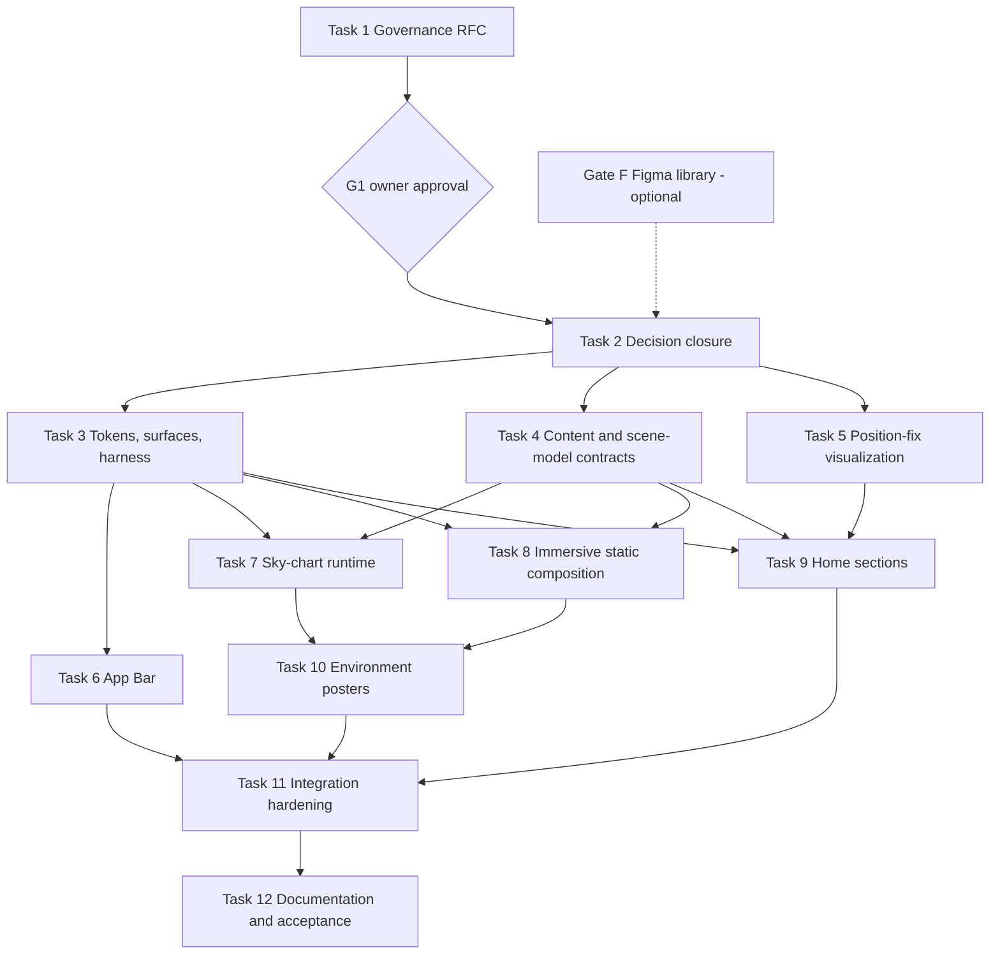

# Sky Chart Home and App Bar redesign — implementation plan v2

> **Status: APPROVED.** Gate G1 was passed when the repository owner approved and merged [`RFC-SKY-CHART-VISUAL-SYSTEM-V2`](../../rfcs/sky-chart-visual-system-v2.md) as Governance PR #77 (merge commit `70168e9`) on 2026-09-24. This Task 2 / PR 2 records the accepted decision in [`ADR-SKY-CHART-HOMEPAGE-RUNTIME`](../../decisions/sky-chart-homepage-runtime.md) and the approved `DESIGN-VISUAL`/`DESIGN-IX-A11Y`/`PAGE-HOME` sections, and sets this document's `status` to APPROVED. Implementation Wave 1 (Tasks 3, 4, 5) unlocks once this PR merges and checkpoint W0 (section 25) passes.

## 1. Plan metadata

| Field | Value |
| --- | --- |
| Plan ID | `PLAN-SKY-CHART-HOME-REDESIGN-V2` |
| Direction record | [`REVIEW-SKY-CHART-DIRECTION-2026-09-23`](../../reviews/sky-chart-direction-2026-09-23/index.md) |
| Normative visual reference | `docs/reviews/sky-chart-direction-2026-09-23/reference/sky-chart-reference.html` plus the numeric specification in sections 6 and 9–12 |
| Author | Planning session, Claude Opus 5.5, 2026-09-23 |
| Implementing providers | GPT-6 Luna and Claude Sonnet 5, assigned per task in section 18 |
| Orchestrator | The planning or harness session that dispatches tasks, owns this file's Progress section and runs the integration procedure in section 24 |
| Human authority | Repository owner: approves the RFC (G1), reviews and merges every PR, approves visual baselines |
| Branch model | One `codex/sky-chart-<task>` branch and one isolated worktree per task, based on the integration head named in its wave |
| Canonical gate | `npm run validate` (docs, Node tests, lint, typecheck, build), plus the task's listed Playwright projects and `npm run verify:static-export` |
| Scope | Home (`/` and `/en/`) and the global App Bar on every localized route |
| Stack boundary | Next.js 16 static export, React 18, Tailwind 3, Framer Motion 11, direct `three@0.186.0`. No new runtime dependency. |

## 2. Approved design direction

The owner chose **Direction A · Sky Chart** on 2026-09-23. C · Deployable Sheet's personalization applies to sections such as “When work is spread across tools”, and semi-transparent cards are preferred wherever they stay legible and original.

The resolved world is **a navigator's star atlas.**

- **Environment:** a full-viewport celestial sphere sits behind Home's content through the hero and the four chapters. Its named stars are FURLANICH's approved process vocabulary, and as the visitor scrolls they are revealed and joined into constellations. After the chapters the environment recedes to a dim ground.
- **Atlas plate:** a dark translucent surface with registration corner ticks and a plate number. It carries chapters, Services, Proof, Process and Founder.
- **Plotting sheet:** a translucent bone vellum with a plotting grid, a bearing label and a corner crease line. It carries Problems and the illustrative Position fix section. Problems uses a stepped three-sheet cascade, Direction C's gesture translated into navigation vocabulary. Each sheet has a “cocked hat” glyph: three bearings that fail to meet at one point.
- **Dawn:** the final CTA band moves from night to Bone, which returns the brand's canonical ground.
- **App Bar:** a floating “chart header” in atlas-plate material on every page. On Home it starts transparent and prints the current section as a mono readout.

## 3. Repository baseline

Facts verified on `main` at `36ab1bf`:

- **Routes and export:** the routes are fixed by [`ADR-STATIC-LOCALIZED-ROUTING`](../../decisions/static-localized-routing.md): Spanish at the root, English under `/en/`, trailing slashes, the optional `/Portfolio` base path, static export and GitHub Pages. `CommercialHomepage` composes `ImmersiveHomeSequence` followed by `HomeProblems`, `HomeServices`, `HomeProof`, `HomeProcess`, `HomeFounder` and `HomeCta`.
- **Immersive runtime** (per [`ADR-ADAPTIVE-IMMERSIVE-HOMEPAGE`](../../decisions/adaptive-immersive-homepage.md)): `components/homepage/immersive/ImmersiveEnhancement.tsx` is Home's only client boundary. It passes these gates in order: reduced motion, Save-Data, WebGL2, the session context-loss flag, near-viewport, then `load`. It then dynamically imports `runtime/create-instrument-scene.ts` and renders on demand from `lib/immersive-home/state.ts`. The fallback is four chapter posters in `public/brand/immersive/`, with a Pause control.
- **Tokens:** `tailwind.config.ts` exposes `identity` and `foundation` roles. Legacy `brand/ink/paper` scales are still used by four `components/core` primitives. Contrast is enforced by `scripts/design-tokens.test.mjs`.
- **App Bar:** `components/foundation/SiteHeader.tsx` is a sticky server component on a white Surface. Below 1024px, `NavigationDisclosure.tsx` provides a native `<details>` menu. `BrandSignature.tsx` renders the inline protected mark.
- **Tests:**
  - 34 `node --test` suites under `scripts/`.
  - Playwright projects in `playwright.config.ts`: three desktop engines; mobile Chromium and WebKit; 1024, 1440, 768 and 320 profiles; `accessibility-chromium`; `immersive-chromium` (SwiftShader); `visual-chromium`.
  - `scripts/verify-static-export.mjs`, which pins Home's chapter text, section order and poster files.
  - `measure:immersive` and `measure:home-vitals`.
- **Visual baselines** are element screenshots of `main` or `[data-instrument]`, per platform. Windows baselines are captured locally. Linux baselines are adopted from Ubuntu CI `actual` artifacts after owner approval, because Docker/WSL is unavailable on the owner's machine (precedent: PR #67).
- **Deferred items from the previous plan:** constrained-Android evidence, a real screen-reader spot check and the compact Pause-control placement. This plan closes all three (Tasks 7 and 11).
- **Prerequisite — resolved:** the canonical gate was red on `36ab1bf` (vendored-skill front matter from `f43938f`, and a stale Claude Code worktree scanned by the docs validator). The owner merged the fix as PR #76 (`d324e83`: “skip Claude Code worktree checkouts”, “integrity-lock vendored design Skills”). `npm run docs:check` and `npm run skills:check` now pass on `main`.
- **Figma mirror (Gate F) — completed 2026-09-23:** [FURLANICH · Sky Chart v2](https://www.figma.com/design/V6FD6Sq3gqqxeMw5Si7Dnx). Pages:
  - Foundations: 23 colour variables, 15 layout variables, 11 text styles.
  - Components: Button set, bone-on-azure mark tile, active star, three cocked-hat glyphs, Atlas plate, Plotting sheet, Pause pill, App bar set (Docked, Home top, Compact), compact menu panel.
  - Home: `Home · 1440 · EN` and `Home · 390 · ES`.

  The account is on the Figma Starter plan (about 20 MCP calls per month), so later Figma updates should be batched.

## 4. Goals

1. Replace the framed two-zone instrument with a full-viewport environmental Three.js layer behind Home's content, with textual process nodes.
2. Introduce two coherent translucent materials (atlas plate, plotting sheet), a validated environmental palette, and a larger display type scale on Home.
3. Personalize each Home section inside one world: plotting-sheet cascade for Problems, catalogue plates for Services, a Position fix figure, a log plate for Proof, an ecliptic for Process, and a dawn CTA.
4. Add one honest, illustrative business-impact visualization with no invented evidence.
5. Redesign the App Bar on every route as a floating chart header, with contextual docking on Home, active-location indication and an unchanged no-JS disclosure.
6. Preserve or improve semantics, keyboard use, contrast, motion preferences, static export, SEO text and performance budgets.

## 5. Non-goals

- Restyling Services, Projects, Studio, Founder, Contact or Privacy content. They receive only the new App Bar.
- A site-wide dark theme, theme switcher, CMS, backend, hosting change, React-major migration, React Three Fiber, Drei, GSAP, post-processing or any new npm dependency.
- The Connection film (still omitted), video, audio or generated imagery.
- Real client metrics, testimonials or case studies.
- Changing approved copy other than the additions listed in Appendix A.
- Changing routes, fragments (`#proceso`, `#process`, `#services`, `#problems`), the Contact demonstration or evidence rules.

## 6. Design decisions

These decisions are normative. Where the reference prototype and this section differ, this section wins.

**D-01 Layer model (Home only).** From back to front:

| z-index | Layer | Element |
| ---: | --- | --- |
| −3 | Environment ground | `EnvironmentGround` fixed layer: a radial gradient, plus the static poster when WebGL is not active |
| −2 | WebGL canvas | Fixed, full viewport, portaled to `document.body` |
| −1 | Contrast scrim | Fixed gradient |
| auto | Content | Transparent sections, plates, sheets |
| 50 | App Bar | Sticky |

No ancestor of the fixed layers may create a stacking context (no `transform`, `filter`, `opacity < 1`, `isolation` or positioned `z-index`) above `body`.

**D-02 Ground gradient.** `radial-gradient(120% 90% at 70% 10%, #0E2B4A 0%, #0A1E33 38%, #06121F 78%)`. The dawn CTA and the footer are opaque Bone and cover it.

**D-03 Scrim.**

- ≥768px: `linear-gradient(90deg, rgba(6,18,31,.78) 0%, rgba(6,18,31,.5) 34%, rgba(6,18,31,0) 62%)`.
- <768px: `linear-gradient(180deg, rgba(6,18,31,0) 0%, rgba(6,18,31,.55) 45%, rgba(6,18,31,.82) 100%)`.
- The scrim's opacity follows the canvas recede factor (D-24).

**D-04 Palette tokens.** These are added by Task 3. Measured contrast is recorded in the review and must be asserted by tests.

| Token | Value | Allowed use |
| --- | --- | --- |
| `sky.abyss` | `#06121F` | Ground vignette |
| `sky.deep` | `#0A1E33` | Primary ground |
| `sky.field` | `#0F2A45` | Raised ground |
| `sky.haze` | `#17385A` | Atmosphere only; never under text below 18.66px bold or 24px regular |
| `sky.lit` | `#6FA8E0` | Links, kickers and active lines on dark (≥4.5:1 on abyss, deep and field) |
| `sky.glow` | `#9CC4EC` | Focus ring and active glyph on dark |
| `sky.text-2` | `#B9C3CC` | Secondary text on dark and on atlas plates |
| `sky.mist` | `#8FA3B6` | Metadata on **opaque** dark only |
| `sky.plate` | `rgba(10,30,51,.74)` | Atlas plate fill |
| `sky.plate-line` | `rgba(249,246,238,.13)` | Atlas plate border and rules |
| `sky.sheet` | `rgba(249,246,238,.9)` | Plotting sheet fill |
| `sky.sheet-line` | `rgba(9,36,61,.12)` | Plotting sheet border |
| `sky.sheet-grid` | `rgba(0,69,137,.07)` | Plotting grid lines |
| `chart.context-dark` / `chart.signal-dark` | `#5E7185` / `#9CC4EC` | Chart pair on dark |
| `chart.context-light` / `chart.signal-light` | `#8FA3B6` / `#004589` | Chart pair on sheets; direct labels are mandatory |

Two rules apply to every pairing:

- Brand Azure `#004589` and Bone `#F9F6EE` keep their approved roles. Azure is never text on a `sky.*` ground.
- Primary actions stay Azure with Bone text (8.79:1). The hover state is `#0A55A3`.

**D-05 Atlas plate (`AtlasPlate`).**

- Fill `sky.plate` with `backdrop-filter: blur(14px) saturate(120%)`, a 1px `sky.plate-line` border and an 18px radius.
- Padding `clamp(24px, 3vw, 40px)`.
- Shadow `inset 0 1px 0 rgba(249,246,238,.06), 0 30px 60px -30px rgba(0,0,0,.6)`.
- Registration ticks: 14px corner brackets, top-left and bottom-right, 1px `rgba(156,196,236,.55)`, inset 10px.
- Optional plate number: top 18px, right 22px, mono 12px `sky.mist`, `aria-hidden`.
- Variant `blur={false}` sets fill `rgba(10,30,51,.88)` with no backdrop filter.
- Text on plates uses Bone for headings and `sky.text-2` for body. A plate is never interactive: no hover, cursor or focus.

**D-06 Plotting sheet (`PlottingSheet`).**

- Fill: `sky.sheet` under two `repeating-linear-gradient` grids (0° and 90°, 1px `sky.sheet-grid` every 24px).
- `backdrop-filter: blur(10px) saturate(110%)`, 1px `sky.sheet-line` border, 6px radius.
- Padding `clamp(22px, 2.6vw, 34px)`.
- Shadow `0 28px 60px -34px rgba(0,0,0,.75)`.
- Corner crease: a 56×56px top-right diagonal hairline, `linear-gradient(225deg, transparent 49.3%, rgba(0,69,137,.45) 50%, transparent 50.9%)`.
- Optional bearing label: top 10px, right 46px, mono 12px Azure, `aria-hidden`.
- Text is Ink for primary and Muted `#526473` for secondary. Focus inside a sheet uses the Ink ring.

**D-07 Material fallbacks** apply to both materials:

- `@supports not (backdrop-filter: blur(1px))`: plate fill `rgba(10,30,51,.92)`, sheet fill `rgba(249,246,238,.96)`.
- `@media (prefers-reduced-transparency: reduce)`: opaque plate `#0D243C`, opaque sheet `#F9F6EE`.
- `@media (forced-colors: active)`: `border: 1px solid CanvasText`, with no background images.

**D-08 Blur budget.** No viewport may intersect more than three content surfaces that use `backdrop-filter`; the App Bar is excluded. Process step plates therefore use `blur={false}`.

**D-09 Typography.** The families (Instrument Sans, IBM Plex Mono) and the 64-character mono limit are unchanged. New Tailwind `fontSize` tokens:

| Token | Value |
| --- | --- |
| `display-1` | `clamp(44px, 7.2vw, 96px)` / 0.98 / −0.025em / 700 |
| `display-2` | `clamp(32px, 4.2vw, 56px)` / 1.04 / −0.02em / 700 |
| `display-3` | `clamp(28px, 3vw, 40px)` / 1.1 / −0.015em / 700 |
| `lead` | `clamp(18px, 1.6vw, 21px)` / 1.55 |
| `body-lg` | 19px / 1.6 |
| `label` | 12px mono, 0.08em tracking, uppercase |

Headings use `text-wrap: balance`. Greek Bayer letters and degree labels use mono without the uppercase transform.

**D-10 Spacing.**

- Home section padding-block: `clamp(72px, 10vw, 140px)`.
- Chapter gap: 34vh at ≥1024, 28vh at 768–1023, 22vh below 768. Chapter span padding-block: `10vh 30vh`.
- Container and gutters: 1200px, 20/32/48px (unchanged).
- `--app-bar-height: 84px` (48px CTA + 2×8px inner padding + 2×10px outer padding). `scroll-padding-top: 96px`.

**D-11 Hero.**

- Pulled under the App Bar with `margin-top: calc(-1 * var(--app-bar-height))`.
- `min-height: 100svh`, content bottom-aligned (`align-content: end`).
- Padding-block: `calc(var(--app-bar-height) + 36px) 72px`.
- Source order: coordinate line (mono `label`, `sky.lit`: the approved eyebrow, then `34°36′S · 58°22′W` with `aria-hidden`), then H1 (`display-1`, max 13ch, Bone), lede (`lead`, `sky.text-2`, max 46ch), actions (primary then ghost, 12px gap, 32px top), trust row (40px top, 20px padding-top, 1px `sky.plate-line` top rule, 14px `sky.text-2`, trust line then availability, 28px gap).
- Below 480px the actions are full width.
- Content growth is never clipped; at 200% zoom the hero grows past 100svh.

**D-12 Chapters.**

- A container `div[data-instrument-chapters]` holds, first, the instrument label (mono `label`, `sky.lit`), then four `section[data-instrument-chapter]` elements. Each chapter is an `AtlasPlate` with max width 520px (full width below 768px), left-aligned in the container.
- Inside each plate: plate number `Plate 0N/04` (Appendix A), kicker (chapter verb, mono `sky.lit`), H2 (`display-3`, existing heading IDs kept), description (18px/1.6, `sky.text-2`).
- Chapter posters, `[data-instrument-artwork]` frames and `PhaseSpine` are removed.

**D-13 Problems (plotting-sheet cascade).**

- ≥1024: a 5/7 grid with a 48px gap. The head column is sticky at `top: calc(var(--app-bar-height) + 36px)`.
- The head contains the kicker (the approved `problems.introduction`, mono `sky.lit`), then H2 `problems.heading` (`display-2`, id `problems-heading`), `audienceStatement` (`body-lg`, `sky.text-2`) and the ghost action.
- The cascade is the existing `<ul>` of situations, one `PlottingSheet` per `li`. Each `li` is a 56px glyph column plus a text column with an 18px gap.
- Sheet layout: horizontal offsets 0, 56 and 112px at ≥1024 (0 below); vertical overlap −14px; stacking order increases down the list.
- Contents of each sheet:
  - Bayer letter α, β or γ: mono 15px Azure, no uppercase, `aria-hidden`.
  - Situation text: 19–23px (`clamp(19px, 1.7vw, 23px)`), Ink.
  - Bearing label 042°, 117° or 236°: `aria-hidden`.
  - Cocked-hat glyph: `aria-hidden` SVG using the path data in Appendix C.

**D-14 Services (catalogue plates).**

- ≥1024: a 7/5 grid with a 20px gap. The lead plate spans two rows, has a minimum height of 420px and bottom-aligns its content.
- Each plate: plate number `Cat. S·0N` (`aria-hidden`), category kicker (Appendix A), H3 (lead plate `clamp(28px, 3.2vw, 44px)`, others `clamp(22px, 2.2vw, 30px)`, 32px top margin), description (16px/1.6).
- Below 1024: a single column.
- The ghost action follows the grid.

**D-15 Position fix (new HOME-IMPACT section, between Services and Proof).**

- ≥1024: a 7/5 grid. The left `PlottingSheet` holds `PositionFixFigure`; the right `PlottingSheet` holds `ImpactCounts`. Below 1024 they stack.
- The section id is `impact` in both locales, heading id `impact-heading`.
- Details are in section 12.

**D-16 Proof (log plate).**

- ≥1024: a 7/5 grid with `align-items: end`. The left column has the kicker, H2 (existing), introduction and ghost action. The right column is an `AtlasPlate` with plate number `Log` and a `<ul>` of three log lines.
- Each log line is a 9ch mono `sky.lit` term column plus text, with 1px `sky.plate-line` top rules and mono 13px/1.5 `sky.text-2`.
- The list has an accessible name (Appendix A).

**D-17 Process (ecliptic).**

- Kicker, then H2 (existing id, `display-2`).
- ≥1024: a decorative SVG arc above the steps: path `M20 140 C 300 -20, 700 -20, 980 140`, `viewBox 0 0 1000 160`, `preserveAspectRatio="none"`, stroke `rgba(156,196,236,.45)`, dash `2 6`, `aria-hidden`.
- Steps stay an `<ol>` of four `AtlasPlate blur={false}` items with 24px padding. At ≥1024 they sit in four columns with top offsets 96, 36, 36 and 96px. Below 1024 they form one column with a 1px `rgba(156,196,236,.35)` left rule and 24px left padding.
- The quality statement follows (max 68ch, `sky.text-2`), then the primary action.

**D-18 Founder.** An 8/4 grid at ≥1024: kicker, H2 (existing) and biography, then the ghost action aligned to the end.

**D-19 Dawn CTA.**

- Background `linear-gradient(180deg, rgba(249,246,238,0) 0, #F9F6EE 200px)`, padding-top 220px, bottom 120px.
- H2 Ink, `demoStatement` Muted.
- Primary action (Azure) plus a ghost-on-light action (Azure border and text, Tint hover). The Ink focus ring applies.
- The footer is unchanged.

**D-20 Actions.**

- Primary: min-height 48px, radius 10px, Azure fill, Bone text, `inset 0 1px 0 rgba(249,246,238,.18)`, hover `#0A55A3`.
- Ghost on dark: 1px `rgba(156,196,236,.5)` border, Bone text, hover `rgba(111,168,224,.12)`.
- Hover changes colour only, over 160ms. There is no scale or translate; the approved rule stands and Emil Kowalski's press-scale recommendation is recorded as not adopted.

**D-21 Focus.** Dark contexts: `outline: 3px solid #9CC4EC; outline-offset: 3px`. Bone or sheet contexts: `outline: 3px solid #09243D`.

**D-22 App Bar** (every route).

- **Structure:** `div#site-top` is kept. `header[data-app-bar]` is sticky with `top: 0`, `z-index: 50`, 10px/12px outer padding, in normal flow.
- **Inner container:** max 1200px, flex, 16px gap, padding `8px 8px 8px 16px`, radius 14px, 1px border.
- **Docked state** (the default, and the only state without JS): fill `rgba(10,30,51,.82)`, `backdrop-filter: blur(16px) saturate(125%)`, border `sky.plate-line`. Without backdrop-filter support the fill is `.94`.
- **Home undocked state:** only after JavaScript sets `data-docked="false"` while `scrollY ≤ 24`. The fill is transparent and the border transparent. Background and border transition over 240ms with `--ease-out`.
- **Brand:** `BrandSignature variant="on-dark"`, a 32px Azure tile (radius 7px) with the Bone protected mark at 22px (the approved bone-on-azure variant) and a Bone 16px/700/0.08em wordmark.
- **Readout** (Home only, ≥1024, `aria-hidden`): mono 12px `sky.lit`, 14px left padding with a `sky.plate-line` left rule, min width 18ch. Text is `{NN} · {name}`, taken from the `data-readout` of the last section whose top is above 40% of the viewport.
- **Links** (≥1024): 14px/600 `sky.text-2`, Bone on hover, 44px targets. The active link is Bone with a 7px four-point star `clip-path: polygon(50% 0,62% 38%,100% 50%,62% 62%,50% 100%,38% 62%,0 50%,38% 38%)` in `sky.glow`, centred 4px from the bottom.
- **Language switch:** mono 12px, 1px `sky.plate-line` border, radius 8px, 44px.
- **CTA:** the primary action at 48px.
- **Below 1024:** brand, language switch and a 44×44 menu `<summary>` with a Bone icon. The panel keeps the approved centring and width `min(calc(100vw - 40px), 24rem)`, fill `rgba(10,30,51,.96)` without blur, radius 14px, padding 8px, 4px gap, 44px links and a full-width 48px CTA. It opens and closes instantly (no animation) and Escape behaviour is unchanged.
- **Active state:** a route link gets `aria-current="page"` when the normalized pathname matches. On Home, the Process link gets `aria-current="location"` while `#proceso` or `#process` crosses the 40% line.
- **Never:** hide, translate or auto-collapse on scroll.

**D-23 Environment static poster.** Locale-neutral WebP stills of the resolved scene state: graticule, field stars and all links, with **no labels**. Two sizes:

| File | Size | Budget |
| --- | --- | --- |
| `public/brand/sky-chart/environment-wide.webp` | 1920×1080 | ≤150 KiB |
| `public/brand/sky-chart/environment-compact.webp` | 900×1600 | ≤80 KiB |

They are shown by `EnvironmentGround` with `background-size: cover` and `background-position: 70% 30%` whenever `[data-immersive-mode="static"]`. This covers no JS, reduced motion, Save-Data, missing WebGL, failure and context loss.

**D-24 Recede.**

- `k = clamp((0.55·vh − chaptersBottom) / (0.5·vh), 0, 1)`.
- Canvas and scrim opacity: `1 − 0.84k`. Label opacity multiplier: `max(0, 1 − 2k)`.
- Rendering is suspended while `k = 1`, and the Pause control is hidden with the `hidden` attribute while `chaptersBottom < 0.3·vh`.

**D-25 Pause control** (closes the deferred placement item). It is fixed at `right: 16px; bottom: calc(16px + env(safe-area-inset-bottom))` at every width, inside a plate-material pill. The phase readout `Plate 0N of 04` shows at ≥768px only. The button is 44px high, uses `aria-pressed`, and swaps its Pause/Resume label.

Visibility: the pill is shown only while the chapter span is in view. It gets the `hidden` attribute while the hero's bottom edge is below 60% of the viewport, and again under the D-24 recede rule. At 390px the Figma mirror showed the pill covering the hero trust row. Hiding it during the hero never removes a focusable control while motion is visible: the canvas shows no chapter motion before Chapter 1.

**D-26 Copy.** Only the strings in Appendix A are new. Every other string is existing approved content.

**D-27 Compact hero label mask.** Below 768px, tier-2 input labels, their dots and their links render with opacity 0 while the hero's bottom edge is below 60% of the viewport. They follow the normal reveal once the hero has scrolled past that line. At ≥768px the D-03 left scrim already separates labels from hero text, so no mask applies. This rule comes from the Gate F mirror: at 390px, *Pedidos* and *Reservas* collided with the H1 and lede. It is implemented in `frameForProgress` (Task 4) as `inputOpacity × heroMask`, with `heroMask = width < 768 ? clamp((0.6·vh − heroBottom) / (0.2·vh), 0, 1) : 1`.

## 7. Technical decisions

- **T-01** No new dependencies. `package.json` and `package-lock.json` are locked (L-01).
- **T-02** Scene labels use `THREE.CanvasTexture` sprites. SDF text libraries, `TextGeometry` and DOM-projected labels are rejected (bundle, fonts, per-frame layout).
- **T-03** Before label textures are built, the runtime awaits `document.fonts.load('600 30px "<Plex family>"')` and `document.fonts.load('500 24px "<Instrument family>"')`. It uses the `next/font` CSS variable family names, read with `getComputedStyle(document.documentElement).getPropertyValue('--font-mono' | '--font-sans')`. If loading fails, labels still render in the fallback face and the failure is not surfaced to the user.
- **T-04** The canvas is created once by `ImmersiveEnhancement` after the existing gates, and portaled to `document.body` through `createPortal`. It is fixed and `aria-hidden`, with `tabIndex=-1` and `pointer-events: none`.
- **T-05** Progress keeps `progressFromChapterRects` from `lib/immersive-home/state.ts`. Scroll input keeps Framer Motion `useScroll` or `useMotionValueEvent` (ADR boundary retained).
- **T-06** Rendering is demand-driven. Each rAF moves `t += (target − t) × 0.12`, snaps when `|Δ| < 0.0005`, then stops. There is no idle loop, and no rendering while paused or fully receded.
- **T-07** DPR is capped at 1.5 on wide and 1.25 on compact or constrained devices (as today). Field stars: 520 wide, 260 compact, 160 when compact and constrained.
- **T-08** `EnvironmentGround` and the scrim are server-rendered and part of the static document.
- **T-09** `AppBarBehavior` is a `'use client'` leaf that renders `null` and binds to `closest('[data-app-bar]')`. `SiteHeader` stays a server component (the existing test is kept).
- **T-10** `PositionFixFigure` is server-rendered as two small-multiple figures. The `'use client'` leaf `PositionFixToggle` upgrades it to one figure with a segmented control.
- **T-11** Visual baselines: Windows baselines are captured locally. Linux baselines are adopted from the PR's Ubuntu CI `actual` artifact only after the owner approves in the PR. Snapshots are never updated just to make CI green ([`TEST-VISUAL-REGRESSION`](../../testing/visual-regression.md)).
- **T-12** Directory names stay: `components/homepage/immersive/` and `lib/immersive-home/`. “Sky Chart” is the design name, not a path rename.

## 8. Architecture impact

- **Superseded by a new ADR (Task 2):** `ADR-ADAPTIVE-IMMERSIVE-HOMEPAGE`'s C2 composition coupling, the four-poster fallback and the framed canvas stage. The new ADR (working id `ADR-SKY-CHART-HOMEPAGE-RUNTIME`) keeps its gates, budgets, direct Three.js, the Framer Motion boundary, demand rendering, one-shot initialization and session context-loss handling. It adds: the full-viewport fixed canvas portal, sprite text labels, recede and suspend, and the locale-neutral poster pair. It also records two removals: the derived Azure chevron sculpture is no longer part of the scene, and the permission for one optional Connection film is withdrawn. All budgets are retained, including the main-thread interaction task <50 ms.
- **Unchanged:** routing, static export, localization, content ownership (`app/**/_content/*.ts`), the Contact demonstration, evidence publication.
- **New client leaves:** `AppBarBehavior` (every route) and `PositionFixToggle` (Home). `ImmersiveEnhancement` stays Home's only WebGL boundary.

## 9. Design-system changes

| Area | Change | Owner |
| --- | --- | --- |
| Color | `sky.*` and `chart.*` tokens (D-04) in `tailwind.config.ts`, mirrored as CSS custom properties `--sky-*` in `app/globals.css` | Task 3 |
| Motion | `--ease-out: cubic-bezier(.23,1,.32,1)`, `--dur-1: 120ms`, `--dur-2: 160ms`, `--dur-3: 240ms` | Task 3 |
| Layout | `--app-bar-height: 84px`, `scroll-padding-top: 96px` | Task 3 |
| Type | D-09 `fontSize` tokens | Task 3 |
| Surfaces | `components/surfaces/AtlasPlate.tsx`, `PlottingSheet.tsx`, `surfaces.module.css` | Task 3 |
| Brand | `BrandSignature` `variant="on-dark"` | Task 6 |
| Graph primitives | `lib/impact/position-fix.ts` geometry, `PositionFixFigure`, `ImpactCounts` | Task 5 |
| Navigation | App Bar materials and states (D-22) | Task 6 |

Legacy `brand/ink/paper` scales are untouched (still consumed by `components/core`).

## 10. Three.js architecture

- **Module layout:**
  - `components/homepage/immersive/runtime/create-sky-chart-scene.ts` (factory)
  - `sky-chart-geometry.ts` (graticule, field stars, link segments)
  - `sky-chart-labels.ts` (CanvasTexture sprite builder)
  - `dispose-sky-chart-scene.ts`
  - The old `create-instrument-scene.ts`, `instrument-*.ts` and `dispose-instrument-scene.ts` are deleted in Task 7.
- **Handle interface:**

  ```ts
  type SkyChartSceneHandle = {
    canvas: HTMLCanvasElement;
    prepare(): Promise<void>;
    resize(w: number, h: number): void;
    render(frame: SkyChartFrame): void;
    setLabelOpacity(multiplier: number): void;
    dispose(): void;
  };
  ```

- **Scene contents:**
  - Camera at the origin inside a sphere of R = 40. FOV 55° at ≥1024, 70° below.
  - Graticule: meridians every 15°, parallels −60° to 60° every 15°, radius 42, `#6FA8E0` at opacity 0.07.
  - Field stars: seeded LCG (seed 7, multiplier 16807, modulus 2147483647), radius 44, `PointsMaterial` size 1.4, `sizeAttenuation: false`, `#B9C3CC` at 0.55.
- **Named nodes:** 20 nodes from Appendix B. Position is `dir(yaw, pitch) × 40`, with `dir(y, p) = (cos p·sin y, sin p, −cos p·cos y)`.
- **Label textures:** a 64px-high canvas, width = text width + 56.
  - Tier 1: `600 30px` Plex Mono, uppercase via `toLocaleUpperCase(locale)`, Bone, an 8px dot and a 14px ring stroke 2 in `rgba(156,196,236,.8)`, world height 2.1.
  - Tier 2: `500 26px` Instrument Sans, `#9CC4EC`, 5px dot, height 1.7.
  - Tier 3: `500 22px` Instrument Sans, `#B9C3CC`, 5px dot, height 1.7, opacity × 0.8.
  - Sprite `center = (14/w, 0.5)`, `depthWrite: false`, `colorSpace = SRGBColorSpace`.
- **Links:** one `LineSegments`, `#6FA8E0` at opacity 0.75, in this order:
  1. inputs → Understand
  2. each activity → its phase
  3. Understand → Define → Build & review → Hand over

  The draw range is `floor(count × clamp((t − 0.30) / 0.55)) / 2 × 2`.
- **Frame mapping (`SkyChartFrame`, pure, Task 4):** `t` is the progress.
  - `yaw = 34° + 146°·t − (wide ? 18° : 0)`
  - `pitch = 6° + 4°·sin(π·t)`
  - Group reveal: `clamp((t − g + 0.12) / 0.14)`, with g = 0 (inputs), 0.22 (Understand), 0.40 (Define), 0.58 (Build & review), 0.74 (Hand over).
  - Input label opacity: `max(0.9 − 0.4·t, 0.5)`.
  - Tier visibility: all tiers at ≥1024; tiers 1–2 at 360–1023; tier 1 only below 360.
- **Lifecycle:** create once after the gates, `prepare()` via `compileAsync`, mount, resize, first render, then set `data-immersive-mode="webgl"` (the poster hides). Resize comes from a `ResizeObserver` on `documentElement` and recalculates from the document. Unmount calls `cancelAnimationFrame` and `dispose()`, which disposes every geometry, material and texture, calls `renderer.dispose()` and `forceContextLoss()`, and removes the canvas.
- **Failure paths:** context loss marks the session flag, disposes and reverts to static. An import or initialization error reverts to static quietly.
- **Testing seams:** pure mapping in `lib/immersive-home/state.ts`. DOM hooks: `data-immersive-mode`, `data-rendered-chapter`, `data-sky-chart-canvas`, `data-recede`. The `window.__FURLANICH_SKY_CHART__` debug hook is test-only, gated by `process.env.NODE_ENV !== 'production'`, and exposes `{frame, labelCount, disposeCount}`.

## 11. Animation and motion architecture

| Motion | Trigger | Spec | Reduced motion |
| --- | --- | --- | --- |
| Scene bearing, reveals, links | Scroll (Framer Motion) | Damped 0.12 per frame; stops when settled | Not initialized; static poster |
| Recede | Scroll | Opacity 1 → 0.16 over 0.5vh (canvas and scrim), CSS `transition: opacity 240ms linear` | Instant |
| App Bar dock | `scrollY > 24` (Home) | Background and border, 240ms `--ease-out` | Instant |
| Position fix toggle | Click or keyboard | Layer crossfade opacity plus `blur(2px)`, 240ms `--ease-out` | Instant, no blur |
| Hover | Pointer | Colour only, 160ms | Removed (global rule) |
| Menu panel | `<details>` | None | None |

Content has no entrance animation or scroll reveal. Every animation uses only `opacity`, `filter` or `transform`.

## 12. Business-visualization architecture

- **Geometry (`lib/impact/position-fix.ts`)**, in a 600×300 viewBox:
  - `SOURCES = [whatsapp (70,70), book (300,34), spreadsheet (540,80), email (560,250), call (60,250)]`
  - `MISSES = [(284,150), (318,142), (330,166), (296,178), (276,168)]`. Separate-state line ends extend each miss by 25% beyond the miss point.
  - `EXACT_FIX = (300,160)`
  - `DOUBT = ellipse(304, 160, 44, 30)`
  - `counts = { separate: SOURCES.length, connected: 1 }`
- **`PositionFixFigure` (server):** a `<figure>` containing two SVGs. Separate: `chart.context-light` lines 1.5px, Muted markers, a dashed doubt ellipse and the label “Area of doubt”. Connected: `chart.signal-light` lines to `EXACT_FIX`, an Azure fix marker and ring, and the label “Exact fix”. Each SVG has `role="img"` with a `<title>` and a `<desc>` from content. Below them is a visible `<ul>` of sources with their notes (the text equivalent). Label font size is 12 user units at ≥768 and 24 below, via CSS on `.fixLabel`.
- **`PositionFixToggle` (client):** after hydration it renders a segmented control (`role="group"`, accessible name, two `button`s with `aria-pressed`). It hides the inactive SVG with `hidden`, announces the new state in a polite live region using `announcement`, and adds pointer-only hover tooltips (not focusable; the list is the accessible equivalent). Without JS, both SVGs show stacked.
- **`ImpactCounts` (server):** a title, then two rows. Each row has a label, a decorative bar (`aria-hidden`; width proportional to the count; context-light for separate, signal-light for connected) and the count as text. A caption follows.
- **Honesty rules:** every visual carries a visible “Illustrative scenario” tag. Counts must be computed from `SOURCES`. No percentages, durations, currency or client names. The static-export forbidden patterns stay intact, so no `metric-card`, `case-study` or `testimonial` identifiers are used.

## 13. Accessibility strategy

- The canvas, ground, scrim, glyphs, bearings, plate numbers, readout, arc and Bayer letters are all `aria-hidden`. All meaning stays in HTML in the approved order.
- Heading hierarchy: one H1, chapter H2s, section H2s, H3s inside Services and Process. Landmark count is unchanged.
- Contrast: every text pair in D-04, D-05, D-06 and D-19 is asserted by `scripts/design-tokens.test.mjs`, including worst-case composites (plate over `#9CC4EC`; sheet over `sky.field`).
- Keyboard: tab order is App Bar, hero actions, Problems action, Services action, Position fix toggle buttons, Proof action, Process action, Founder action, CTA actions, then the Pause control when present. Focus is always visible (D-21), and the sticky bar never hides a focused element (scroll-padding-top 96px).
- Motion: `prefers-reduced-motion` initializes no canvas. The Pause control supplements it.
- Transparency and forced colours: D-07.
- Zoom and reflow: 320px with no horizontal scroll, and 200% text zoom with content growth. The hero exceeds 100svh when needed.
- Targets: at least 44px, with 48px for the primary CTA.
- Screen readers: a real NVDA + Firefox check and a VoiceOver iOS spot check (Task 11 manual QA). The previous plan deferred this.

## 14. Performance strategy

| Gate | Limit | Measured by |
| --- | --- | --- |
| Incremental immersive JavaScript (runtime chunk plus three) | ≤120 KiB Brotli | `npm run measure:immersive` |
| Client JS added by `AppBarBehavior` and `PositionFixToggle` | ≤6 KiB Brotli combined | Build output comparison against `main` |
| Environment posters | ≤150 KiB wide, ≤80 KiB compact | `scripts/immersive-media-manifest.test.mjs` |
| Canvas DPR | ≤1.5 wide, ≤1.25 compact or constrained | Unit test plus debug hook |
| Draw calls per frame | ≤28 (1 graticule + 1 stars + 1 links + ≤20 sprites + margin) | Debug hook `renderer.info.render.calls` |
| Label textures | ≤20, each ≤1024×64 | Debug hook |
| Scroll frame interval p95 | ≤20 ms | `measure:immersive` |
| LCP p75 (synthetic lab) | ≤2.5 s; the LCP element must be the H1 | `measure:home-vitals` |
| INP p75 | ≤200 ms | `measure:home-vitals` |
| Layout shift from the enhancement | 0 | Playwright `PerformanceObserver` |
| Backdrop-filter surfaces per viewport | ≤3 (App Bar excluded) | E2E DOM scan at each section |
| Idle rendering | 0 frames after settle | Debug hook frame counter |
| Main-thread interaction task (retained ADR gate) | <50 ms | `measure:immersive` long-task observer |

Loading order: HTML and CSS first, then fonts (Instrument preloaded). After `load`, near the viewport and past the gates, `three` and the runtime load in one dynamic chunk. The posters use CSS `background-image` and are not preloaded.

## 15. Testing strategy

| Layer | Tool | Scope |
| --- | --- | --- |
| Pure logic | `node --test` | Frame mapping, recede, tier visibility, vocabulary integrity, position-fix geometry and counts, token contrast, poster budgets |
| Source contracts | `node --test` on source text (existing pattern) | Server/client boundaries, `aria-hidden` on decorations, no forbidden identifiers, no hover styles on plates |
| Content | `scripts/homepage-content.test.mjs` | Appendix A parity (ES/EN keys, placeholders, 64-character mono limit) |
| Static export | `npm run verify:static-export` | Home order including `impact`, required text, posters, no forbidden patterns |
| Browser behaviour | Playwright projects (registered by Task 3) | App Bar, Home sections, the runtime and its fallbacks, keyboard, reduced motion, no JS, WebGL failure, context loss, console errors |
| Accessibility | `@axe-core/playwright` (`accessibility-chromium` plus acceptance) | Home ES/EN with enhancement on and off, App Bar open and closed on three routes |
| Visual | `visual-chromium` (reduced motion) | `[data-instrument]` at 5 widths × 2 locales (Task 8); Home sections `main` at 1440 and 390 × 2 locales (Task 11) |
| Performance | `measure:immersive`, `measure:home-vitals` | Section 14 gates |
| Manual | Section 26 | Real devices and screen readers |

Canvas pixels are never compared: the visual project runs with reduced motion and asserts the static poster state.

## 16. Task dependency DAG



## 17. Execution waves

| Wave | Tasks | Concurrency | Base | Unlock condition |
| --- | --- | --- | --- | --- |
| 0 | Prerequisite (met, PR #76). Gate F (done). Then Task 1, G1 and Task 2. | Sequential | `main` | Task 2 merged |
| 1 | Tasks 3, 4, 5 | Parallel (disjoint) | `main` after Task 2 | All three merged and checkpoint W1 passed |
| 2 | Tasks 6, 7, 8, 9 | Parallel (disjoint) | `main` after W1 | All four merged and checkpoint W2 passed |
| 3 | Task 10, then Task 11 | Sequential | `main` after W2, then after Task 10 | Task 11 merged and checkpoint W3 passed |
| 4 | Task 12 | Single | `main` after W3 | Definition of done |

## 18. Provider assignment matrix

| Task | Provider | Complexity | Justification |
| --- | --- | --- | --- |
| 1 Governance RFC | GPT-6 Luna | Low–moderate | Documentation with a fully specified supersession list (section 21) |
| 2 Decision closure | GPT-6 Luna | Low | Deterministic record updates after human approval |
| 3 Tokens, surfaces, harness | GPT-6 Luna | Moderate | Token and styling work with exact values and contrast tests |
| 4 Content and scene contracts | GPT-6 Luna | Moderate | Typed content plus pure functions with numeric specs |
| 5 Position-fix visualization | GPT-6 Luna | Moderate | Bounded component and geometry with a small client leaf |
| 6 App Bar | Claude Sonnet 5 | High | Global client and server boundary, scroll state, `aria-current` semantics, no-JS parity and baseline refresh across pages |
| 7 Sky-chart runtime | Claude Sonnet 5 | High | Performance-sensitive WebGL lifecycle, portal layering, font-loading races and failure paths |
| 8 Immersive static composition | GPT-6 Luna | Moderate | Specified server layout; Sonnet reviews stacking-context risk |
| 9 Home sections | GPT-6 Luna | Moderate | Server components with precise compositions |
| 10 Environment posters | GPT-6 Luna | Moderate | A scripted capture pipeline with byte budgets |
| 11 Integration hardening | Claude Sonnet 5 | High | Cross-component debugging, the full matrix, performance and a11y regressions after integration |
| 12 Docs and acceptance | GPT-6 Luna | Low | Record synchronization |

## 19. File and ownership matrix

A path is writable only by its owner task, or by the next listed owner after the previous owner has merged. Everything not listed is forbidden to every task.

| Path | Owner(s), in order |
| --- | --- |
| `docs/rfcs/sky-chart-visual-system-v2.md` (new), `docs/rfcs/index.md`, `docs/reviews/sky-chart-direction-2026-09-23/**` | Task 1 |
| `docs/decisions/sky-chart-homepage-runtime.md` (new), `docs/decisions/index.md`, `docs/decisions/adaptive-immersive-homepage.md` (status note only), `docs/design/visual-language.md`, `docs/design/interaction-responsive-accessibility.md`, `docs/product/pages/home.md`, `docs/governance/status-register.md` | Task 2, then Task 12 |
| `docs/plans/active/sky-chart-home-redesign-v2.md`, `docs/plans/index.md` | Task 1 (initial), Task 2 (status), orchestrator (Progress), Task 12 (completion move) |
| `tailwind.config.ts`, `app/globals.css`, `scripts/design-tokens.test.mjs`, `components/surfaces/**` (new), `scripts/surfaces.test.mjs` (new), `playwright.config.ts` | Task 3 |
| `components/homepage/content-types.ts`, `lib/immersive-home/types.ts`, `lib/immersive-home/state.ts`, `lib/immersive-home/sky-chart-model.ts` (new), `app/(es)/_content/home.ts`, `app/(en)/en/_content/home.ts`, `scripts/homepage-content.test.mjs`, `scripts/immersive-home-state.test.mjs`, `scripts/sky-chart-model.test.mjs` (new) | Task 4 |
| `lib/impact/position-fix.ts` (new), `components/homepage/impact/**` (new), `scripts/position-fix.test.mjs` (new) | Task 5 |
| `components/foundation/SiteHeader.tsx`, `components/foundation/NavigationDisclosure.tsx`, `components/foundation/LanguageSwitch.tsx`, `components/foundation/AppBarBehavior.tsx` (new), `components/brand/BrandSignature.tsx`, `scripts/site-header.test.mjs`, `scripts/brand-assets.test.mjs` (BrandSignature assertions only), `tests/e2e/app-bar.spec.ts` (new), `tests/e2e/marketing-navigation.spec.ts`, `tests/e2e/accessibility.spec.ts` (banner assertions only), snapshots under `tests/e2e/visual/{studio,founder,services-projects}.visual.spec.ts-snapshots/` | Task 6 |
| `components/homepage/immersive/runtime/**`, `components/homepage/immersive/ImmersiveEnhancement.tsx`, `components/homepage/immersive/PauseMotionControl.tsx`, `lib/immersive-home/capability.ts`, `scripts/sky-chart-runtime.test.mjs` (new), `tests/e2e/immersive-home.spec.ts`, `tests/e2e/immersive-home-acceptance.spec.ts`, `tests/e2e/immersive-home-smoke.spec.ts` | Task 7 |
| `components/homepage/immersive/ImmersiveHomeSequence.tsx`, `ImmersiveChapter.tsx`, `ImmersiveEditorialAnchor.tsx`, `PhaseSpine.tsx` (delete), `ImmersiveStaticArtwork.tsx` (delete), `EnvironmentGround.tsx` (new), `immersive-home.module.css`, `tests/e2e/immersive-home-static.spec.ts`, `tests/e2e/responsive.spec.ts`, `tests/e2e/visual/immersive-home-static.visual.spec.ts` plus its snapshots, `scripts/verify-static-export.mjs` | Task 8, then Task 10 (`EnvironmentGround.tsx`, `immersive-home.module.css`, `verify-static-export.mjs`), then Task 11 (`verify-static-export.mjs`) |
| `components/homepage/CommercialHomepage.tsx`, `HomeProblems.tsx`, `HomeServices.tsx`, `HomeProof.tsx`, `HomeProcess.tsx`, `HomeFounder.tsx`, `HomeCta.tsx`, `HomeImpact.tsx` (new), `tests/e2e/home-sections.spec.ts` (new), `tests/e2e/smoke.spec.ts` | Task 9 |
| `lib/immersive-home/media-manifest.ts`, `scripts/immersive-media-manifest.test.mjs`, `public/brand/sky-chart/**` (new), `public/brand/immersive/**` (delete), `scripts/render-sky-chart-posters.mjs` (new, dev-only) | Task 10 |
| `tests/e2e/sky-chart-acceptance.spec.ts` (new), `tests/e2e/visual/home-sections.visual.spec.ts` (new) plus snapshots, `scripts/measure-immersive-production.mjs`, `scripts/measure-home-web-vitals.mjs`, `tests/e2e/support/**` | Task 11 |
| `ARCHITECTURE.md`, `docs/architecture/current-system.md`, `docs/index.md`, `docs/reviews/sky-chart-acceptance-v2/**` (new), `docs/plans/completed/sky-chart-home-redesign-v2.md` | Task 12 |

**Always forbidden:** `package.json`, `package-lock.json`, `next.config.js`, `.github/**`, `app/**/layout.tsx` (no changes needed: the header renders from layouts unchanged), all non-Home page components, `data/**`, `public/` outside the paths listed above, and `.agents/**`.

## 20. Exclusive locks

| Lock | Resource | Holder |
| --- | --- | --- |
| L-01 | `package.json`, `package-lock.json` | Nobody (no dependency change) |
| L-02 | `tailwind.config.ts`, `app/globals.css` | Task 3 only; read-only afterwards |
| L-03 | `playwright.config.ts` | Task 3 only. It pre-registers `app-bar.spec.ts`, `home-sections.spec.ts` and `sky-chart-acceptance.spec.ts` (see Task 3). |
| L-04 | `scripts/verify-static-export.mjs` | Task 8, then Task 10, then Task 11, strictly sequential |
| L-05 | `components/homepage/immersive/immersive-home.module.css`, `EnvironmentGround.tsx` | Task 8, then Task 10 |
| L-06 | Home content files and `content-types.ts` | Task 4 only |
| L-07 | Visual baselines | Per-spec owner (Task 6: non-Home specs; Task 8: instrument spec; Task 11: new Home-sections spec) |
| L-08 | This plan file | Orchestrator, except the named status edits |

## 21. Task N / PR N packets

Every packet also inherits these rules:

- `AGENTS.md` and the skills [`frontend-implementation`](../../../.agents/skills/frontend-implementation/SKILL.md), [`test-driven-development`](../../../.agents/skills/test-driven-development/SKILL.md), [`playwright-qa`](../../../.agents/skills/playwright-qa/SKILL.md) (UI tasks), [`verification-before-completion`](../../../.agents/skills/verification-before-completion/SKILL.md) and [`pr-readiness`](../../../.agents/skills/pr-readiness/SKILL.md).
- A task never edits a path it does not own.
- A task never updates a snapshot without owner approval in its PR.
- Every PR body links this plan and its task ID, contains the completion receipt (Appendix D), and ends with the attribution the harness requires.

### Task 1 / PR 1 – Governance RFC for the Sky Chart visual system

- **Objective:** propose the redesign for approval without implementing it.
- **Rationale:** [`GOV-ENGINEERING-LIFECYCLE`](../../governance/engineering-lifecycle.md) classes the change as consequential, and APPROVED records conflict with it.
- **Scope:** create `docs/rfcs/sky-chart-visual-system-v2.md` (`id: RFC-SKY-CHART-VISUAL-SYSTEM-V2`, `status: PROPOSED`) with these sections: Context, Proposal (sections 2 and 6 of this plan, by reference), Supersession list, Runtime changes, New copy (Appendix A by reference), Alternatives (directions B and C with their verdicts), Risks, Decision requested. The supersession list must name each of these as PROPOSED to supersede:
  1. DESIGN-VISUAL “UI gradients, neon and glass remain excluded” (Home and App Bar only; neon remains excluded).
  2. Light-only and no dark theme (Home environment only; not a site theme).
  3. IMMERSIVE-HOME-V1.1 C2 composition, the four posters and the phase spine.
  4. DESIGN-VISUAL and DESIGN-IX-A11Y Global app bar Surface/Border treatment (sticky, normal flow and no-hide are retained).
  5. “Do not force a viewport-height hero” (Home only).
  6. The Home Canvas/Surface section alternation.
  7. The Home card rules for radius and shadow.
  8. The exclusion of “floating telemetry, particle fields” (textual process stars and ≤520 dim field stars are allowed; continuous rotation remains excluded).
  9. The new HOME-IMPACT section.
  10. The commercial homepage section baseline's “Do not introduce gradients, glass effects, decorative shadows, or additional accent colors for these sections”. Home sections use the two materials and the D-02, D-03, D-06 and D-19 gradients; no accent hue outside the D-04 blues is added.
  11. The Home section rhythm (64/80/96px) and the Home type scale (hero H1 and section H2 sizes). D-09 and D-10 replace them on Home only.
  12. The Home grid rules: equal content-driven card tracks and the per-section column counts in DESIGN-VISUAL and DESIGN-IX-A11Y. D-13, D-14 and D-17 replace them on Home.
  13. VISUAL-IDENTITY-V1's “cards remain reserved for genuine comparison, bounded evidence and controls”. On Home, chapters, Proof, Process and Founder use atlas plates.
  14. **The derived Azure sculpture as the scene's identity element** (VISUAL-IDENTITY-V1 Precision Assembly, IMMERSIVE-HOME-V1.1 WebGL enhancement, ADR-ADAPTIVE-IMMERSIVE-HOMEPAGE). The star-atlas scene has no sculpture. The protected mark stays in the App Bar and brand assets. The RFC must ask the owner to accept this removal explicitly.
  15. The Action-tint final CTA band on Home. D-19's dawn band replaces it; other pages keep their Action-tint endings.
  16. The Pause control placed “beside instrument status” and the IMMERSIVE-HOME-V1.1 responsive choreography table. D-25 and the section 10 responsive rules replace them.
  17. The ADR's permission for one optional Connection film, which is withdrawn (section 5). All ADR budgets, including the main-thread interaction task <50 ms, are retained.
  18. PAGE-HOME's approved section order and narrative. `impact` is inserted between Services and Proof.

  The RFC must quote each rule accurately, from the record and section that actually own it. It must also state that the App Bar keeps the approved prohibition on hiding, translating or animating based on scroll direction; the Home dock transition, keyed to scroll position, is the only scroll-linked change. The RFC must not claim that nothing outside the list changes. It must name any further conflict it finds rather than assert completeness.

  Also: add the RFC to `docs/rfcs/index.md`, commit the review folder and this plan, and add the plan under Active in `docs/plans/index.md`.
- **Dependencies:** none. **Wave:** 0.
- **Provider:** GPT-6 Luna. **Complexity:** low–moderate.
- **Skills:** `project-knowledge-maintenance`, `architecture-governance`, `pr-readiness`.
- **Owned paths:** see section 19. **Forbidden:** all code.
- **Locks:** L-08 (initial commit).
- **Expected behaviour:** no runtime change.
- **TDD:** not applicable (documentation). `npm run docs:check` is the gate.
- **RED/GREEN/REFACTOR:** not applicable. Record “documentation-only” in the receipt.
- **Playwright, a11y, responsive, progressive-enhancement, performance:** not applicable.
- **Commands:** `npm run docs:check`, `npm run validate`.
- **Evidence:** the docs-check output, and a link to the reference prototype and screenshots.
- **Documentation impact:** RFC and plan indexes.
- **Reviewer:** Claude Sonnet 5 (supersession completeness), then the owner.
- **Acceptance:** the RFC lists all eighteen supersessions, each with an accurate citation, plus the runtime changes; it makes no blanket completeness claim; validate is green; the owner approves or requests changes (gate G1).
- **Receipt:** Appendix D, with the TDD block marked N/A.

### Gate F – Figma design library (non-PR, optional)

- **Precondition:** the owner signs in to the `plugin:figma:figma` connector with `/mcp`.
- **Owner:** the orchestrator (Claude Opus 5.5), using `figma:figma-use`, `figma:figma-generate-library` and `figma:figma-generate-design`.
- **Output:** a Figma file with variables for D-04, D-09 and D-10; components for the atlas plate, plotting sheet, App Bar (docked, undocked, compact open) and actions; and frames for Home at 1440 and 390 in both locales, built from the reference prototype.
- **Recording:** the file URL goes into the review record through Task 2.
- **Authority:** Figma is a mirror. If it disagrees with this plan, the plan wins. Implementation never waits on Gate F.

### Task 2 / PR 2 – Decision closure: ADR, approved design sections and Home copy

- **Objective:** turn the approved RFC into authoritative records.
- **Rationale:** implementation PRs must trace to APPROVED requirements.
- **Scope:**
  - Create `docs/decisions/sky-chart-homepage-runtime.md` (`id: ADR-SKY-CHART-HOMEPAGE-RUNTIME`, `supersedes: ADR-ADAPTIVE-IMMERSIVE-HOMEPAGE`), carrying section 8's retained and added boundaries and section 14's gates.
  - Add a status note to the superseded ADR.
  - Add APPROVED sections `SKY-CHART-V2` to DESIGN-VISUAL (D-01 to D-27) and DESIGN-IX-A11Y (D-22 to D-25 and D-27, plus sections 11 and 13).
  - Add `HOME-IMPACT` and Appendix A's strings to PAGE-HOME, and update its approved section order.
  - In DESIGN-VISUAL and DESIGN-IX-A11Y, mark every rule named anywhere in the supersession list (items 1–8, the item-3 C2 sections, and items 10–16) as superseded by `SKY-CHART-V2` within its stated boundary, keeping the original text as history. In the new ADR, record the sculpture removal and the withdrawn Connection-film permission (items 14 and 17).
  - Update the status register.
  - Set this plan's `status` to APPROVED.
  - Record the Figma URL if Gate F has run.
- **Dependencies:** G1. **Wave:** 0.
- **Provider:** GPT-6 Luna. **Complexity:** low.
- **Skills:** `project-knowledge-maintenance`, `architecture-governance`.
- **Owned paths:** see section 19. **Forbidden:** code. **Locks:** L-08 (status field).
- **TDD, Playwright and other validation:** not applicable (documentation).
- **Commands:** `npm run docs:check`, `npm run validate`.
- **Evidence:** diff summary.
- **Documentation impact:** as scoped.
- **Reviewer:** Claude Sonnet 5, then the owner.
- **Acceptance:** every record links the RFC; no APPROVED text outside the approved scope changes; validate is green.
- **Receipt:** Appendix D with TDD N/A.

### Task 3 / PR 3 – Environmental tokens, surface primitives and test harness registration

- **Objective:** deliver the shared design-system layer and register the future Playwright specs.
- **Rationale:** every Wave 2 task consumes these tokens, surfaces and project registrations, and none of them may touch the locked config.
- **Scope:**
  - D-04 tokens in `tailwind.config.ts` (`sky`, `chart`).
  - D-09 `fontSize` tokens.
  - In `app/globals.css`: `--sky-*` custom properties, motion variables, `--app-bar-height`, `scroll-padding-top: 96px`, and the D-07 media queries as reusable classes. Body colours stay unchanged.
  - `components/surfaces/AtlasPlate.tsx`. Props: `as?: 'article' | 'div' | 'li' | 'section'`, `plateNumber?: string`, `blur?: boolean` (default true), `className?`, `children`.
  - `components/surfaces/PlottingSheet.tsx`. Props: `as?`, `bearing?: string`, `className?`, `children`.
  - `components/surfaces/surfaces.module.css` implementing D-05 to D-08.
  - `playwright.config.ts`:
    - `app-bar.spec.ts` → chromium-desktop, firefox-desktop, webkit-desktop, mobile-chromium, mobile-webkit, tablet-chromium, compact-320-chromium, tablet-portrait-chromium.
    - `home-sections.spec.ts` → chromium-desktop, firefox-desktop, webkit-desktop, mobile-chromium, tablet-chromium, compact-320-chromium.
    - `sky-chart-acceptance.spec.ts` → immersive-chromium.
    - The visual regex already matches.
- **Dependencies:** Task 2. **Wave:** 1.
- **Provider:** GPT-6 Luna. **Complexity:** moderate.
- **Skills:** `frontend-implementation`, `test-driven-development`.
- **Owned paths:** see section 19. **Forbidden:** every component outside `components/surfaces/`. **Locks:** L-02, L-03.
- **Expected behaviour:** no visible change on any page (no consumer yet).
- **RED tests:**
  - `design-tokens.test.mjs` asserts these exact values and minimum ratios, which fail until the tokens exist: `sky.lit` ≥4.5 on abyss, deep and field; Bone ≥7 on `sky.plate` composited over `#9CC4EC`; `sky.text-2` ≥4.5 on that same composite; Ink ≥7 and Muted ≥4.5 on `sky.sheet` composited over `sky.field`; Bone ≥7 on `#0A55A3`.
  - `surfaces.test.mjs` asserts: no `'use client'`; decorative spans are `aria-hidden`; no `hover:`, `cursor-pointer` or `onClick`; the D-07 `@supports`, `prefers-reduced-transparency` and `forced-colors` blocks exist; blur is absent when `blur={false}`.
  - A config assertion in `surfaces.test.mjs` checks that the three spec names are registered in the named projects.
- **GREEN:** minimal tokens, CSS and components.
- **REFACTOR:** one source of hex values (a `const sky` object) shared by the Tailwind config and the test.
- **Playwright:** none. Run `npm run test:e2e -- --project=chromium-desktop` to prove no regression.
- **Accessibility, responsive, progressive enhancement:** covered by the contrast assertions and the fallbacks.
- **Performance:** CSS only. Record the CSS size delta.
- **Commands:** `npm test`, `npm run lint`, `npm run typecheck`, `npm run validate`, `npm run verify:static-export`.
- **Evidence:** RED and GREEN test output.
- **Documentation impact:** none (Task 2 already recorded the design).
- **Reviewer:** Claude Sonnet 5.
- **Acceptance:** all tests green, no rendered change, config registrations present.
- **Receipt:** Appendix D.

### Task 4 / PR 4 – Home content and scene-model contracts

- **Objective:** add every approved string and the pure scene model.
- **Rationale:** a single owner for content and pure logic removes collisions in Wave 2.
- **Scope:**
  - Type changes in `components/homepage/content-types.ts`:
    - `HomeProblemsContent`: unchanged.
    - `HomeServicesSectionContent.services` becomes `(HomepageItem & { category: string })[]`, plus `kicker: string`.
    - `HomeProofContent`: add `kicker` and `log: { term: string; text: string }[]` (length 3) and `logLabel: string`.
    - `HomeProcessContent`: add `kicker`.
    - `HomeFounderSectionContent`: add `kicker`.
    - New `HomeImpactContent`, exactly as in section 12 plus Appendix A: `kicker`, `heading`, `introduction`, `illustrativeTag`, `toggle {groupLabel, separateLabel, connectedLabel, announcement}`, `figure {title, separateDescription, connectedDescription, doubtLabel, fixLabel}`, `sources: {id, name, note}[5]`, `connectedNoteTemplate`, `counts {title, separateLabel, connectedLabel, caption}`.
    - `HomePageContent`: add `impact` and `readout: Record<'home'|'problems'|'services'|'impact'|'proof'|'process'|'founder'|'contact', string>`.
  - In `lib/immersive-home/types.ts`: add `SkyChartNodeId` (the 20 ids in Appendix B) and, in `HomeInstrumentContent`, `plateLabel`, `coordinates`, `nodes: Record<SkyChartNodeId, string>` and per-chapter `kicker`. The `statusLabel` value changes per Appendix A.
  - Fill both locale files from Appendix A.
  - `lib/immersive-home/sky-chart-model.ts`: `SKY_CHART_NODES` (Appendix B: id, group, tier, yaw, pitch), `GROUP_REVEAL`, `frameForProgress(t, {wide, width})` returning `{yaw, pitch, groupOpacity, linkFraction, inputOpacity, visibleTiers}`, `recedeFactor(chaptersBottom, vh)`, `labelOpacityMultiplier(k)`.
  - Keep `mapProgressToInstrumentState` and `progressFromChapterRects` unchanged.
- **Dependencies:** Task 2. **Wave:** 1.
- **Provider:** GPT-6 Luna. **Complexity:** moderate.
- **Skills:** `test-driven-development`.
- **Owned paths:** see section 19. **Forbidden:** components. **Locks:** L-06.
- **Expected behaviour:** no rendered change. Existing components ignore the new fields; TypeScript must still compile.
- **RED tests:**
  - `sky-chart-model.test.mjs`: yaw at t = 0 is 16° wide / 34° compact; yaw at t = 1 is 162° wide; `groupOpacity.define` is 0 at t = 0.27 and 1 at t = 0.42; `linkFraction` is 0 at t ≤ 0.30 and 1 at t ≥ 0.85; `recedeFactor` is 0, 0.5 and 1 at bottoms of 0.55vh, 0.30vh and 0.05vh; `visibleTiers` is [1,2,3], [1,2] and [1] at 1440, 768 and 320; there are exactly 20 unique ids; each phase has 3 activities; the D-27 `heroMask` is 0 at width 390 with heroBottom = 0.8vh, 1 at width 390 with heroBottom = 0.4vh, and 1 at width 1440 for any heroBottom.
  - `homepage-content.test.mjs`: ES and EN have identical key sets; `impact.sources` has 5 entries in the fixed id order; the `{current}`, `{source}` and `{state}` placeholders are present in both locales; every mono label is ≤64 characters; no string contains `%`, `x faster` or a currency symbol.
- **GREEN:** minimal implementation.
- **REFACTOR:** derive reveal thresholds from one table.
- **Playwright:** none.
- **Commands:** `npm test`, `npm run typecheck`, `npm run validate`, `npm run verify:static-export`.
- **Evidence:** RED and GREEN output.
- **Documentation impact:** none.
- **Reviewer:** Claude Sonnet 5.
- **Acceptance:** tests green, no rendered diff.
- **Receipt:** Appendix D.

### Task 5 / PR 5 – Position-fix illustrative visualization

- **Objective:** build the section 12 geometry and components, independent of page placement.
- **Rationale:** an isolated, testable graph primitive.
- **Scope:**
  - `lib/impact/position-fix.ts`.
  - `components/homepage/impact/PositionFixFigure.tsx` (server). Its props type is declared locally and is structurally identical to `HomeImpactContent` minus `kicker`, `heading` and `introduction`.
  - `PositionFixToggle.tsx` (client).
  - `ImpactCounts.tsx` (server).
  - `position-fix.module.css`.
- **Dependencies:** Task 2. **Wave:** 1.
- **Provider:** GPT-6 Luna. **Complexity:** moderate.
- **Skills:** `frontend-implementation`, `test-driven-development`, `dataviz`.
- **Owned paths:** see section 19. **Forbidden:** content files and `HomeImpact.tsx`.
- **Expected behaviour:** the components are unused until Task 9.
- **RED tests** in `position-fix.test.mjs`:
  - `counts.separate === SOURCES.length === 5`.
  - Every miss point lies within the doubt ellipse.
  - All connected lines end at `EXACT_FIX`.
  - Every coordinate is inside `0..600 × 0..300` with a 20-unit margin for labels.
  - Source contract: `PositionFixToggle` is the only `'use client'` file; SVGs have `role="img"` with `<title>` and `<desc>`; the toggle buttons use `aria-pressed`; the live region is `aria-live="polite"`; no identifier matches `metric-card|case-study|testimonial`; the chart colours are the D-04 chart tokens.
- **GREEN:** minimal components.
- **REFACTOR:** share line and marker renderers between the two states.
- **Playwright:** deferred to Task 9's `home-sections.spec.ts` (the component needs a page).
- **Accessibility:** a visible source list; no information only in hover.
- **Progressive enhancement:** without JS both states render.
- **Commands:** `npm test`, `npm run lint`, `npm run typecheck`, `npm run validate`.
- **Evidence:** RED and GREEN output, and the dataviz validator output for both chart pairs.
- **Reviewer:** Claude Sonnet 5.
- **Acceptance:** tests green; the validator passes normal-vision and CVD separation.
- **Receipt:** Appendix D.

### Task 6 / PR 6 – App Bar chart header on every route

- **Objective:** implement D-22 on every localized route.
- **Rationale:** global navigation consistency with the Home world.
- **Scope:**
  - Restyle `SiteHeader` to D-22 and keep it a server component.
  - Add `BrandSignature` `variant="on-dark"`; the default variant is unchanged for any other consumer.
  - Restyle the `NavigationDisclosure` panel.
  - Restyle `LanguageSwitch`.
  - Add the `AppBarBehavior` client leaf: Home docking, readout from `[data-readout]`, `aria-current` (page and location), a rAF-throttled passive scroll listener and an IntersectionObserver, with full cleanup on unmount.
- **Dependencies:** Task 3. **Wave:** 2.
- **Provider:** Claude Sonnet 5. **Complexity:** high.
- **Skills:** `frontend-implementation`, `test-driven-development`, `playwright-qa`, `visual-qa`, `emil-design-eng`.
- **Owned paths:** see section 19. **Forbidden:** Home components, content and config. **Locks:** L-07 (non-Home baselines).
- **Expected behaviour:**
  - Docked dark chart header on every route without JS.
  - With JS on Home: transparent at the top, docked after 24px.
  - The readout updates on Home at ≥1024.
  - The correct `aria-current` value applies.
  - The disclosure works with and without JS.
- **RED tests:**
  - `site-header.test.mjs`: `data-app-bar`; no `window` or `document` in `SiteHeader`; `AppBarBehavior` has `'use client'` and returns `null`; `BrandSignature` `on-dark` keeps the canonical polylines and `aria-hidden`; the default rendered state is docked.
  - `app-bar.spec.ts`:
    1. A no-JS context on `/` and `/en/services/` shows the docked background.
    2. On Home, scrollY 0 gives `data-docked="false"` and scrollY 200 gives `"true"`.
    3. Readout text equals `03 · Position fix` when `#impact` crosses 40% (EN, 1440).
    4. The Process link has `aria-current="location"` at `#process`; the Services link has `aria-current="page"` on `/en/services/`.
    5. The compact panel is centred within the viewport with ≥20px gutters at 320 and 390; Escape closes it and focuses the summary.
    6. Targets are ≥44px and the CTA ≥48px.
    7. No horizontal overflow at 320.
    8. The header never translates (its `boundingClientRect.top` stays constant while scrolling).
    9. No console errors.
- **GREEN:** as scoped.
- **REFACTOR:** extract the normalized-path helper (base path and trailing slash) into `AppBarBehavior` with a unit test.
- **Playwright:** all projects registered for `app-bar.spec.ts`, plus `marketing-navigation.spec.ts` updated for the new styles without weakening assertions.
- **Accessibility:** axe on `/`, `/en/services/` and `/contacto/` with the menu open and closed. Banner assertions in `accessibility.spec.ts` are kept.
- **Responsive:** 320, 390, 768, 1024, 1440.
- **Progressive enhancement:** no-JS docked state; disclosure without JS.
- **Performance:** `AppBarBehavior` ≤3 KiB Brotli; no layout reads inside the scroll handler except `scrollY` and one cached `getBoundingClientRect` per rAF.
- **Visual:** refresh the studio, founder and services-projects baselines only if they diff. Windows baselines locally; Linux baselines from CI actuals after owner approval (T-11).
- **Commands:** `npm run validate`, `npx playwright test tests/e2e/app-bar.spec.ts tests/e2e/marketing-navigation.spec.ts`, `npm run test:a11y`, `npm run verify:static-export`.
- **Evidence:** RED and GREEN output; screenshots at 1440 and 390 on Home (top and docked) and on `/en/services/`.
- **Documentation impact:** none.
- **Reviewer:** GPT-6 Luna (spec conformance) plus an orchestrator visual check against the reference.
- **Acceptance:** all expected behaviour verified; no regression in existing navigation specs.
- **Receipt:** Appendix D.

### Task 7 / PR 7 – Sky-chart WebGL runtime and enhancement lifecycle

- **Objective:** replace the instrument scene with the section 10 runtime.
- **Rationale:** this is the core environmental experience.
- **Scope:**
  - New runtime modules; delete the old ones.
  - Rewrite `ImmersiveEnhancement`: same gates and one-shot activation; portal the canvas to `document.body` with z −2; read the node labels, locale and `plateLabel` from props that `ImmersiveHomeSequence` passes (Task 8 passes the Task 4 content); load fonts per T-03; wire `frameForProgress`, `recedeFactor` and `labelOpacityMultiplier`; suspend at `k = 1`; resize; handle context loss.
  - `PauseMotionControl` per D-25.
  - `capability.ts`: the star-count rule from T-07.
- **DOM contract** (consumed without editing Task 8 files): the root `[data-instrument]`; four `section[data-instrument-chapter]`; the container `[data-instrument-chapters]`; the root's `data-immersive-mode` is set by this task.
- **Dependencies:** Tasks 3 and 4. **Wave:** 2.
- **Provider:** Claude Sonnet 5. **Complexity:** high.
- **Skills:** `frontend-implementation`, `test-driven-development`, `playwright-qa`, `systematic-debugging`, `emil-design-eng`.
- **Owned paths:** see section 19. **Forbidden:** `ImmersiveHomeSequence.tsx` and CSS (Task 8).
- **Expected behaviour:**
  - The canvas exists only in webgl mode.
  - Labels are readable and in the correct locale.
  - The bearing sweep is reversible.
  - Links draw during Connect.
  - The environment recedes after the chapters; rendering stops once settled and while receded.
  - Pause freezes rendering; Resume recalculates.
  - Every failure path is quiet and static.
- **RED tests:**
  - `sky-chart-runtime.test.mjs`: the quality rule (520, 260, 160); the dispose contract (source asserts `.dispose()` for geometry, material and texture, plus `forceContextLoss`); the fonts are awaited before `new CanvasTexture`; the portal target is `document.body`; no `setAnimationLoop`.
  - `immersive-home.spec.ts` (immersive-chromium), updated:
    1. `data-sky-chart-canvas` is present and `data-immersive-mode="webgl"` after load.
    2. The debug hook shows 20 labels (≥1024) in the locale's text.
    3. Scrolling to each chapter gives the expected `data-rendered-chapter`, and reversing restores it.
    4. The frame counter stops increasing 1 s after scrolling stops.
    5. `data-recede="1"` and zero frames while at `#services`.
    6. Pause stops frames; Resume recalculates.
    7. Reduced motion, Save-Data, no WebGL2, a failing import, a failing renderer and forced context loss each give static mode with no canvas and no console error.
    8. Unmounting (client navigation to `/en/services/` and back) leaves one canvas and a dispose count of 1.
  - `immersive-home-acceptance.spec.ts`: keyboard reaches Pause after the chapters' last focusable element; Pause has the `hidden` attribute at scrollY 0 at 390 and 1440 (D-25) and when receded; at 390 the debug hook reports input-label opacity 0 at scrollY 0 (D-27); axe passes with the enhancement on.
- **GREEN:** as scoped.
- **REFACTOR:** a single `SkyChartController` class owning rAF, pause and suspend state.
- **Playwright:** `immersive-chromium`, `chromium-desktop` (smoke).
- **Accessibility:** canvas `aria-hidden`, `tabIndex -1`, no pointer events; the Pause control (D-25).
- **Responsive:** tier visibility verified at 1440, 768 and 320 through the debug hook.
- **Progressive enhancement:** all fallback paths above.
- **Performance:** `npm run build` then `npm run measure:immersive`: ≤120 KiB Brotli, p95 ≤20 ms, draw calls ≤28, DPR caps.
- **Commands:** `npm run validate`, `npx playwright test --project=immersive-chromium`, `npm run measure:immersive`, `npm run verify:static-export`.
- **Evidence:** RED and GREEN output, the measurement JSON, and a 1440 capture per chapter.
- **Documentation impact:** none (Task 12).
- **Reviewer:** GPT-6 Luna (lifecycle checklist) plus the orchestrator (visual fidelity against the reference).
- **Acceptance:** every expected behaviour and budget passes.
- **Receipt:** Appendix D.

### Task 8 / PR 8 – Immersive static composition: hero, chapters, ground and scrim

- **Objective:** implement D-01 to D-03, D-10 to D-12 and the static half of D-23 on Home's hero and chapters.
- **Rationale:** a complete static document that the enhancement layers onto.
- **Scope:**
  - `ImmersiveHomeSequence`: hero pulled up, chapter plates, instrument label; passes runtime props to `ImmersiveEnhancement` (the call-site signature is agreed in this packet: `labels`, `plateLabel`, `statusLabel`, `pauseLabel`, `resumeLabel`, `locale`, `sequences`).
  - `ImmersiveChapter` as an `AtlasPlate`.
  - `ImmersiveEditorialAnchor`: hero per D-11.
  - `EnvironmentGround`: ground gradient, a poster slot (empty until Task 10) and the scrim.
  - Delete `PhaseSpine` and `ImmersiveStaticArtwork`.
  - Rewrite `immersive-home.module.css`.
  - Add `data-readout` to the hero root and to each chapter (value `readout.home`).
  - `verify-static-export.mjs`: remove the four-poster requirement and add a check that `EnvironmentGround` is present.
  - Update `responsive.spec.ts` (chapter overlap assertions become plate/viewport assertions).
  - Rewrite `immersive-home-static.spec.ts`.
  - Refresh the instrument visual baselines.
- **Dependencies:** Tasks 3 and 4. **Wave:** 2.
- **Provider:** GPT-6 Luna. **Complexity:** moderate.
- **Skills:** `frontend-implementation`, `test-driven-development`, `playwright-qa`, `visual-qa`.
- **Owned paths:** see section 19. **Forbidden:** runtime files and `ImmersiveEnhancement.tsx`. **Locks:** L-04, L-05, L-07 (instrument baselines).
- **Expected behaviour:** without JS the hero sits under a docked App Bar over the dark ground; chapters are plates; there is no framed stage.
- **RED tests** (`immersive-home-static.spec.ts`, reduced motion, ES and EN):
  1. The hero top equals the header top (pulled up) at 1440 and 390.
  2. The H1 font-size is 96px at 1440 and ≥44px at 320.
  3. Four `section[data-instrument-chapter]` elements, each inside a plate, with no `[data-instrument-artwork]` present.
  4. Chapter plate width ≤520px at ≥768 and equal to the container at 390.
  5. `EnvironmentGround` is fixed, z-index −3, `aria-hidden`, and none of its ancestors create a stacking context (checked with `getComputedStyle`).
  6. The scrim uses the D-03 gradient at 1440 and at 390.
  7. No horizontal overflow at 320.
  8. JS disabled: the complete document renders and the H1 is the LCP candidate.
  9. At 200% zoom the hero grows beyond the viewport and no text is clipped.
- **GREEN:** as scoped.
- **REFACTOR:** remove dead poster props.
- **Playwright:** chromium-desktop, responsive projects, visual-chromium.
- **Accessibility:** heading order unchanged; axe on the static Home.
- **Responsive:** five widths.
- **Progressive enhancement:** static-first.
- **Performance:** no JS added.
- **Visual:** instrument baselines at 5 widths × 2 locales. Windows baselines locally, Linux baselines from CI actuals after owner approval.
- **Commands:** `npm run validate`, `npx playwright test tests/e2e/immersive-home-static.spec.ts tests/e2e/responsive.spec.ts`, `npx playwright test --project=visual-chromium`, `npm run verify:static-export`.
- **Evidence:** RED and GREEN output; baseline diff images attached to the PR.
- **Documentation impact:** none.
- **Reviewer:** Claude Sonnet 5 (stacking-context and fallback review).
- **Acceptance:** all tests green; the owner approves the baselines.
- **Receipt:** Appendix D.

### Task 9 / PR 9 – Home sections: Problems, Services, Position fix, Proof, Process, Founder, Dawn

- **Objective:** implement D-13 to D-20 and place `HomeImpact`.
- **Rationale:** personalized sections within one world.
- **Scope:**
  - Restyle the six existing section components (transparent backgrounds, materials, compositions) and keep all ids and `aria-labelledby` values.
  - New `HomeImpact.tsx` composing Task 5's components inside `PlottingSheet`s.
  - `CommercialHomepage`: insert `HomeImpact` after Services and add `data-readout` to every section.
  - `smoke.spec.ts`: the section count becomes 8.
  - New `home-sections.spec.ts`.
- **Dependencies:** Tasks 3, 4 and 5. **Wave:** 2.
- **Provider:** GPT-6 Luna. **Complexity:** moderate.
- **Skills:** `frontend-implementation`, `test-driven-development`, `playwright-qa`, `visual-qa`, `dataviz`.
- **Owned paths:** see section 19. **Forbidden:** `immersive/**`, content files, `verify-static-export.mjs` (the impact entry is added by Task 11).
- **Expected behaviour:** sections render per D-13 to D-19, in both locales, without JS, at five widths.
- **RED tests** (`home-sections.spec.ts`):
  1. Section order is problems, services, impact, proof, process or proceso, founder, cta.
  2. Problems: three `li` sheets; horizontal offsets 0, 56 and 112px at 1440 and 0 at 390; each has an `aria-hidden` glyph and Bayer letter; the situation text is exact.
  3. Services: the lead plate is ≥420px high and spans two rows at 1440.
  4. Impact: both SVGs are visible without JS. With JS the toggle switches `hidden`, `aria-pressed` and the live-region text. The source list shows 5 items. Rendered label font size is ≥12px at 390. The visible “Illustrative scenario” tag appears twice. The counts are 5 and 1.
  5. Proof: the log list has an accessible name and 3 items.
  6. Process: an `<ol>` of 4; the arc is visible only at ≥1024 and is `aria-hidden`.
  7. Dawn: the Ink focus ring.
  8. At most 3 intersecting backdrop-filter surfaces at each section (computed-style scan).
  9. Every `[data-readout]` value comes from content.
  10. Keyboard tab order matches section 13.
  11. No console errors.
  12. Forced colours: surfaces have a `CanvasText` border (Chromium `forcedColors: 'active'`).
- **GREEN:** as scoped.
- **REFACTOR:** a shared section shell (`HomeSection` with `id`, `readout` and `kicker`) inside `components/homepage/`.
- **Playwright:** the projects registered for `home-sections.spec.ts`, plus `smoke.spec.ts`.
- **Accessibility:** axe on Home in ES and EN (static); a manual check of the keyboard order.
- **Responsive:** five widths.
- **Progressive enhancement:** without JS the toggle is absent and both figures show.
- **Performance:** `PositionFixToggle` ≤3 KiB Brotli.
- **Commands:** `npm run validate`, `npx playwright test tests/e2e/home-sections.spec.ts tests/e2e/smoke.spec.ts`, `npm run test:a11y`, `npm run verify:static-export`.
- **Evidence:** RED and GREEN output; captures at 1440 and 390 per section.
- **Documentation impact:** none.
- **Reviewer:** Claude Sonnet 5 plus an orchestrator visual check against the reference.
- **Acceptance:** all tests green; the visual check matches the reference within D-13 to D-19.
- **Receipt:** Appendix D.

### Task 10 / PR 10 – Environment static posters and fallback wiring

- **Objective:** produce the D-23 posters and show them in every static path.
- **Rationale:** the fallback must be final art, not an empty gradient.
- **Scope:**
  - `scripts/render-sky-chart-posters.mjs`: a dev-only Playwright script that starts `next dev`, opens `/` with a query-free test hook `window.__FURLANICH_SKY_CHART_POSTER__ = true` set by `page.addInitScript`, renders the resolved state (t = 1, labels hidden, no scrim), and writes the WebP files through `canvas.toDataURL('image/webp', q)` with q stepping down until the budget is met.
  - The runtime honours that poster flag only when `NODE_ENV !== 'production'`. The runtime file is owned by Task 7, which has merged, so Task 10 receives a lock transfer for `create-sky-chart-scene.ts`, limited to the poster flag branch.
  - `media-manifest.ts`: replace the four entries with `environment-wide` and `environment-compact`, classification brand-motion, `evidence: false`, `decorative: true`, with byte budgets.
  - `EnvironmentGround` poster layer with `image-set` and a `(max-width: 767px)` source switch.
  - `verify-static-export.mjs`: require both posters and forbid the old poster paths.
  - Delete `public/brand/immersive/`.
- **Dependencies:** Tasks 7 and 8. **Wave:** 3.
- **Provider:** GPT-6 Luna. **Complexity:** moderate.
- **Skills:** `test-driven-development`, `playwright-qa`.
- **Owned paths:** see section 19, plus the lock transfer above. **Locks:** L-04, L-05.
- **Expected behaviour:** reduced motion, no JS, WebGL failure and context loss show the poster; webgl mode hides it after the first frame.
- **RED tests:**
  - `immersive-media-manifest.test.mjs`: two entries; files exist; byte sizes ≤150 and ≤80 KiB; dimensions are 1920×1080 and 900×1600 (read from the WebP header).
  - `immersive-home-static.spec.ts` gets one added test here, with a lock transfer from Task 8 for this file only: the computed `background-image` of the poster layer contains `environment-wide.webp` at 1440 and `environment-compact.webp` at 390 in static mode.
- **GREEN:** as scoped.
- **REFACTOR:** none expected.
- **Playwright:** chromium-desktop, mobile-chromium, immersive-chromium (fallback tests).
- **Accessibility:** the poster is a CSS background with no alt text needed (decorative).
- **Performance:** poster budgets; posters are not preloaded.
- **Commands:** `node scripts/render-sky-chart-posters.mjs`, `npm run validate`, `npm run verify:static-export`, `npx playwright test tests/e2e/immersive-home-static.spec.ts`.
- **Evidence:** the poster files, byte sizes, and the script log.
- **Reviewer:** Claude Sonnet 5.
- **Acceptance:** tests green; the owner approves the poster art in the PR.
- **Receipt:** Appendix D.

### Task 11 / PR 11 – Integration hardening: acceptance matrix, accessibility, performance, visual baselines

- **Objective:** prove the integrated Home and App Bar against every gate.
- **Rationale:** independently green branches are not proof of an integrated whole.
- **Scope:**
  - `sky-chart-acceptance.spec.ts`: ES and EN × 1440, 1024, 768, 390, 320. Forward and reverse traversal; resize and orientation; keyboard; 200% zoom; reduced motion; reduced transparency (Chromium emulation); Save-Data; no JS; WebGL failure; context loss; root and `/Portfolio` base paths; layout shift 0; axe with the enhancement on and off; no console errors.
  - `home-sections.visual.spec.ts`: reduced motion, `main` at 1440 and 390 × ES and EN.
  - `verify-static-export.mjs`: add the `impact` section to Home's required order with the exact headings.
  - `measure-immersive-production.mjs` and `measure-home-web-vitals.mjs`: add the draw-call, label-count, idle-frame and backdrop-count metrics.
  - Fix any integration defect, with a lock transfer from the original owner recorded in the PR.
- **Dependencies:** Tasks 6, 9 and 10. **Wave:** 3.
- **Provider:** Claude Sonnet 5. **Complexity:** high.
- **Skills:** `playwright-qa`, `visual-qa`, `systematic-debugging`, `verification-before-completion`, `design:accessibility-review`.
- **Owned paths:** see section 19. **Locks:** L-04, L-07 (new Home-sections baselines).
- **Expected behaviour:** everything in sections 13 and 14 holds together.
- **RED tests:**
  - The acceptance spec written against the integrated build first. Expect initial failures only where integration defects exist; each is fixed with a failing test first.
  - `verify-static-export.mjs` impact requirement: RED until the entry is added, run against a fixture HTML without the section, which must fail.
- **GREEN:** fixes.
- **REFACTOR:** consolidate test helpers into `tests/e2e/support/sky-chart.ts`.
- **Playwright:** the full `npm run test:e2e` matrix on both base paths (`NEXT_PUBLIC_BASE_PATH=/Portfolio`).
- **Accessibility:** axe plus the manual keyboard pass.
- **Responsive:** five widths × two locales.
- **Progressive enhancement:** all paths.
- **Performance:** all section 14 gates recorded in the PR.
- **Commands:** `npm run validate`, `npm run test:e2e`, `NEXT_PUBLIC_BASE_PATH=/Portfolio npm run test:e2e`, `npm run test:a11y`, `npm run verify:static-export`, `npm run measure:immersive`, `npm run measure:home-vitals`.
- **Evidence:** the matrix report, measurement JSON, and baseline diffs for owner approval.
- **Reviewer:** GPT-6 Luna (checklist completeness) plus the owner.
- **Acceptance:** zero failing projects; all gates within limits; baselines approved.
- **Receipt:** Appendix D.

### Task 12 / PR 12 – Documentation synchronization and acceptance record

- **Objective:** make the repository describe what was built.
- **Scope:**
  - `ARCHITECTURE.md` CURRENT and APPROVED immersive sections.
  - `docs/architecture/current-system.md`.
  - `docs/index.md`.
  - `docs/reviews/sky-chart-acceptance-v2/index.md`: automated evidence plus the section 26 manual results, including real-device and screen-reader results (PASS/FAIL/DEFERRED, stated honestly).
  - Move this plan to `completed/` with Progress and Deviations filled in; update the plan index.
  - Mark DESIGN records IMPLEMENTED where the repo convention does so.
- **Dependencies:** Task 11. **Wave:** 4.
- **Provider:** GPT-6 Luna. **Complexity:** low.
- **Skills:** `project-knowledge-maintenance`, `pr-readiness`.
- **TDD:** not applicable. **Commands:** `npm run docs:check`, `npm run validate`.
- **Reviewer:** Claude Sonnet 5, then the owner.
- **Acceptance:** docs-check green; no claim exceeds the recorded evidence.
- **Receipt:** Appendix D with TDD N/A.

## 22. TDD evidence requirements

Every behaviour-bearing task (3–11) records three entries in its receipt:

1. **RED:** the exact command, the failing test names, and the failure message showing the expected reason (a missing token or element, a wrong value). A failure caused by a syntax, import or configuration error is not valid RED.
2. **GREEN:** the same command passing, with the minimal diff summary.
3. **REFACTOR:** what changed and the unchanged passing output.

Commits must show a test commit before or together with its implementation. A test added after the implementation is recorded as a deviation, never as TDD. Purely visual CSS values that no stable assertion can express are listed as “visual-only exceptions”, with a screenshot as evidence.

## 23. Independent review strategy

- An implementing provider never reviews its own task. Luna tasks are reviewed by Sonnet 5; Sonnet tasks are reviewed by Luna.
- The orchestrator performs a design-fidelity review against the reference prototype for Tasks 6, 7, 8, 9 and 10, using `visual-qa`.
- The reviewer checks: owned paths only, the RED/GREEN/REFACTOR receipt, the listed commands re-run fresh, the acceptance criteria, no weakened assertion, no unapproved snapshot change, and no new dependency.
- The owner reviews and merges every PR. Agents never merge or push to `main`.

## 24. Sequential integration procedure

For each wave:

1. The orchestrator dispatches the wave's tasks on branches cut from the current `main`, each in its own worktree.
2. Each PR passes its own checks and its independent review. Failures are fixed on the originating branch only.
3. The owner merges in this order: Wave 1 (3, 4, 5); Wave 2 (8, then 7, then 9, then 6: static composition before runtime, sections before the global bar); Wave 3 (10, then 11).
4. After each merge, the next PR in the wave is rebased onto the new `main` and re-runs `npm run validate` plus its Playwright command before its own merge.
5. After the wave's last merge, the orchestrator runs the wave checkpoint (section 25) on `main` and records it in Progress.
6. The next wave unlocks only after a green checkpoint. A red checkpoint opens a fix task owned by the task whose paths contain the defect.

## 25. Wave verification checkpoints

| Checkpoint | Commands on `main` | Pass condition |
| --- | --- | --- |
| W0 | `npm run docs:check` | RFC and ADR records resolve; plan APPROVED |
| W1 | `npm run validate`; `npm run test:e2e -- --project=chromium-desktop`; `npm run verify:static-export` | No rendered change to any page; new tests green |
| W2 | `npm run validate`; `npm run test:e2e`; `NEXT_PUBLIC_BASE_PATH=/Portfolio npm run test:e2e`; `npm run test:a11y`; `npm run measure:immersive` | All projects green; JS budget ≤120 KiB; manual 1440 and 390 look against the reference |
| W3 | All W2 commands plus `npm run measure:home-vitals` and the full acceptance spec | Every section 14 gate within limits; baselines approved |
| W4 | `npm run validate` | Documentation reflects implementation; plan moved to completed |

## 26. Manual QA protocol

Performed after W3. Results are recorded honestly in Task 12's acceptance record.

1. **Browsers:** Chrome, Firefox and Safari (macOS if available) at 1440 and 1024. A walk through Home in both locales: forward, reverse, Pause, Resume and the Position fix toggle.
2. **Real devices:** one constrained Android device (≤4 cores; closes the previous plan's deferral) and one iPhone. Check scroll smoothness, heat after three full traversals, label legibility, blur cost and the compact menu.
3. **Screen readers:** NVDA with Firefox (Windows) and VoiceOver on iOS. Check landmarks, heading list, Problems list, both Position fix figures (title and description), the live-region announcement, the Proof log list, and that the Pause button's state is announced.
4. **Preferences:** reduced motion, reduced transparency (macOS), forced colours (Windows High Contrast), 200% zoom, and a 320px viewport.
5. **Content truth:** every illustrative element shows its tag; no number is presented as a measurement.
6. **Design fidelity:** side-by-side with `sky-chart-reference.html` at 1440 and 390, section by section, using `visual-qa`. Record any deviation with its reason.

## 27. Documentation updates

| Record | Change | Task |
| --- | --- | --- |
| `docs/rfcs/` | New RFC and index entry | 1 |
| `docs/reviews/sky-chart-direction-2026-09-23/` | Committed evidence | 1 |
| `docs/decisions/` | New ADR, index entry, supersession note | 2 |
| DESIGN-VISUAL, DESIGN-IX-A11Y, PAGE-HOME, status register | Approved sections and copy | 2 |
| ARCHITECTURE, current-system, docs index, acceptance review, plan index and completion | Implementation facts | 12 |

## 28. Rollback and failure considerations

- **Per-PR revert:** each PR is independently revertible. Reverting in reverse merge order restores the previous state; Wave 1 PRs have no rendered effect.
- **Runtime failure in production:** the static poster path is always complete. A defective runtime can be neutralized by reverting Task 7 alone, which returns Home to the poster and ground without layout change.
- **Budget breach:** if `measure:immersive` exceeds 120 KiB, stop and return to governance (ADR rule). Do not raise the budget inside an implementation PR.
- **Accessibility or contrast regression:** a blocking defect; fix on the owning branch before merge.
- **Visual baseline disagreement:** the owner's decision in the PR is final. If rejected, the task revises the design within D-rules or escalates to an RFC amendment.
- **Governance rejection at G1:** the plan stays PROPOSED and no code task starts.

## 29. Definition of done

- Tasks 1–12 are merged by the owner, and checkpoints W0–W4 are green and recorded.
- Every section 14 gate is within limits on the production build, on both base paths.
- Home in ES and EN matches D-01 to D-27 at 320, 390, 768, 1024 and 1440, verified by automated tests and the manual protocol.
- The App Bar matches D-22 on every localized route, with and without JS.
- No invented evidence; every illustrative element is labelled.
- Records are synchronized (section 27); the plan is in `completed/` with Progress and Deviations.
- The acceptance record states the real-device and screen-reader results honestly.

## 30. Open risks and explicitly deferred items

- **OPEN — Real-device thermal behaviour** of a full-viewport canvas plus backdrop-filter on low-end Android. Mitigation: DPR caps, star counts, blur budget, recede suspension, and the manual protocol in section 26.
- **RISK — Figma drift.** The mirror is a snapshot of this plan (Gate F). If implementation changes a D-rule through an approved deviation, update Figma in one batched call, or record the drift in the acceptance review.
- **OPEN — Press-scale feedback** (Emil Kowalski recommendation). Not adopted, because it conflicts with the approved no-scale rule; it would need a separate design decision.
- **DEFERRED — Services, Projects, Studio, Founder, Contact and Privacy restyling** into the new materials. They get only the App Bar.
- **WITHDRAWN (proposed, decided at G1) — the Connection film and any video.** The runtime ADR's permission for one optional film is withdrawn (supersession item 17). Reintroducing video requires a new governance decision.
- **RISK — Linux baselines** depend on CI actuals and owner approval (T-11).
- **RISK — Spanish strings are ~30% longer.** Every layout test runs in both locales; if a string wraps badly, the fix is a layout change, never shrinking type below the D-09 minimums.

## Appendix A — New bilingual strings

All other strings are existing approved content. Mono labels are ≤64 characters. Strings marked *(decorative)* are rendered `aria-hidden`.

| Key | English | Spanish |
| --- | --- | --- |
| `instrument.coordinates` *(decorative)* | 34°36′S · 58°22′W | 34°36′S · 58°22′W |
| `instrument.plateLabel` *(decorative)* | Plate {current}/04 | Lámina {current}/04 |
| `instrument.statusLabel` *(decorative)* | Plate {current} of 04 | Lámina {current} de 04 |
| `instrument.chapters[].kicker` | Recognize · Fragment · Connect · Coordinate | Reconocer · Fragmentar · Conectar · Coordinar |
| `servicesSection.kicker` | Services | Servicios |
| `servicesSection.services[].category` | Build · Connect · Improve | Construir · Conectar · Mejorar |
| `proof.kicker` | Accountability | Responsabilidad técnica |
| `proof.logLabel` | Where accountability applies | Dónde se aplica la responsabilidad |
| `proof.log` | Define: Problem and scope agreed · Decide: Technical decisions led by Samuel · Review: Work reviewed before handover | Definir: Problema y alcance acordados · Decidir: Decisiones técnicas a cargo de Samuel · Revisar: Trabajo revisado antes de la entrega |
| `process.kicker` | Process | Proceso |
| `founderSection.kicker` | Founder | Fundador |
| `readout` | Home · Problems · Services · Position fix · Accountability · Process · Founder · Contact | Inicio · Problemas · Servicios · Posición · Responsabilidad · Proceso · Fundador · Contacto |
| `impact.kicker` | Position fix | Fijar la posición |
| `impact.heading` | Fewer places to check before you know where an order stands | Menos lugares que revisar para saber en qué estado está un pedido |
| `impact.introduction` | An illustrative scenario, not a client result. A navigator fixes a position from several bearings; when the sources disagree, the fix becomes an area of doubt. | Un escenario ilustrativo, no un resultado de clientes. Un navegante fija su posición con varias marcaciones; cuando las fuentes no coinciden, la posición se vuelve una zona de duda. |
| `impact.illustrativeTag` | Illustrative scenario | Escenario ilustrativo |
| `impact.toggle.groupLabel` | Scenario | Escenario |
| `impact.toggle.separateLabel` | Separate sources | Fuentes separadas |
| `impact.toggle.connectedLabel` | Connected record | Registro conectado |
| `impact.toggle.announcement` | Showing: {state} | Mostrando: {state} |
| `impact.figure.title` | Where one order stands, according to its sources | Dónde está un pedido, según sus fuentes |
| `impact.figure.separateDescription` | Five bearings from a WhatsApp thread, a paper order book, a spreadsheet, an email and a phone call cross in different places, leaving an area of doubt. | Cinco marcaciones desde un chat de WhatsApp, un cuaderno de pedidos, una planilla, un correo y una llamada se cruzan en lugares distintos y dejan una zona de duda. |
| `impact.figure.connectedDescription` | Every source reads one connected record, so all bearings meet at one exact point. | Todas las fuentes leen un mismo registro conectado, así que todas las marcaciones coinciden en un punto exacto. |
| `impact.figure.doubtLabel` | Area of doubt | Zona de duda |
| `impact.figure.fixLabel` | Exact fix | Posición exacta |
| `impact.sources` (name: note) | WhatsApp thread: “Confirmed” in the chat · Paper order book: Written down, not yet paid · Spreadsheet: Updated yesterday evening · Email: Customer asked to change the date · Phone call: Promised for Friday | Chat de WhatsApp: “Confirmado” en el chat · Cuaderno de pedidos: Anotado, todavía sin pagar · Planilla: Actualizada ayer a la tarde · Correo: El cliente pidió cambiar la fecha · Llamada: Prometido para el viernes |
| `impact.connectedNoteTemplate` | {source}: reads the connected record | {source}: lee el registro conectado |
| `impact.counts.title` | Places checked to confirm one order | Lugares revisados para confirmar un pedido |
| `impact.counts.separateLabel` / `connectedLabel` | Separate sources / Connected record | Fuentes separadas / Registro conectado |
| `impact.counts.caption` | Counts come from this example: a WhatsApp thread, a paper order book, a spreadsheet, an email and a phone call. They are not measurements. | Los números salen de este ejemplo: un chat de WhatsApp, un cuaderno de pedidos, una planilla, un correo y una llamada. No son mediciones. |
| `instrument.nodes` | See Appendix B | See Appendix B |

The source ids, in fixed order, are `whatsapp`, `book`, `spreadsheet`, `email` and `call`.

## Appendix B — Scene nodes

Yaw and pitch are in degrees. Groups: `inputs` (reveal g = 0), `understand` (0.22), `define` (0.40), `build-review` (0.58), `hand-over` (0.74).

| id | Group | Tier | Yaw | Pitch | English | Spanish |
| --- | --- | ---: | ---: | ---: | --- | --- |
| orders | inputs | 2 | 28 | 14 | Orders | Pedidos |
| bookings | inputs | 2 | 40 | −6 | Bookings | Reservas |
| messages | inputs | 2 | 18 | −16 | Messages | Mensajes |
| tasks | inputs | 2 | 48 | 12 | Tasks | Tareas |
| understand | understand | 1 | 78 | 10 | Understand | Entender |
| process | understand | 3 | 70 | 20 | Process | Proceso |
| constraints | understand | 3 | 88 | 22 | Constraints | Restricciones |
| diagnosis | understand | 3 | 84 | −2 | Diagnosis | Diagnóstico |
| define | define | 1 | 112 | 4 | Define | Definir |
| scope | define | 3 | 104 | 16 | Scope | Alcance |
| responsibilities | define | 3 | 122 | 14 | Responsibilities | Responsabilidades |
| validation-criteria | define | 3 | 116 | −10 | Validation criteria | Criterios de validación |
| build-review | build-review | 1 | 146 | 8 | Build & review | Construir y revisar |
| integrate | build-review | 3 | 138 | 20 | Integrate | Integrar |
| technical-review | build-review | 3 | 156 | 20 | Technical review | Revisión técnica |
| functional-tests | build-review | 3 | 150 | −6 | Functional tests | Pruebas funcionales |
| hand-over | hand-over | 1 | 180 | 2 | Hand over | Entregar |
| documentation | hand-over | 3 | 172 | 14 | Documentation | Documentación |
| journeys-validated | hand-over | 3 | 190 | 14 | Journeys validated | Recorridos validados |
| maintain | hand-over | 3 | 186 | −10 | Maintain | Mantener |

**Sources and rejected terms.** The vocabulary comes from HOME-PROCESS, Studio principles, Services and the Process quality statement. Strategy, Observe, Deploy, Iterate, Prototype and AI are rejected: they are absent from the approved offer or conflict with the AI positioning.

## Appendix C — Cocked-hat glyph paths

Each glyph is a 56×56 `viewBox`, stroke Azure 1.5, no fill; the triangle is filled `rgba(0,69,137,.14)`.

| Sheet | Lines path | Triangle path |
| --- | --- | --- |
| α | `M6 44 50 20M10 12l32 38M4 30h48` | `M21 30 31 25 27 36Z` |
| β | `M4 40 52 24M14 6l24 46M8 14l40 30` | `M22 34 30 28 30 38Z` |
| γ | `M4 22h48M20 4l14 48M6 50 48 8` | `M24 22 29 22 26 31Z` |

## Appendix D — Completion receipt template

```text
Task N / PR N – <title>
Provider: <GPT-6 Luna | Claude Sonnet 5>    Reviewer: <other provider>
Branch/worktree: codex/sky-chart-<task>      Base: <main SHA>
Owned paths touched: <list>  (must be a subset of section 19)
Locks held/released: <list>
RED:      <command> → <failing test names + expected-reason excerpt>
GREEN:    <command> → <passing summary>
REFACTOR: <what changed> → <command> still passing
Validation (fresh): npm run validate → <result>; <Playwright commands> → <result>;
          verify:static-export → <result>; measure:* → <numbers, if applicable>
Accessibility: <axe results + manual checks>
Responsive: <widths checked>   Progressive enhancement: <paths checked>
Visual evidence: <paths>   Baseline changes: <none | files + owner approval link>
Deviations: <none | description + reason>
Documentation impact: <none | records>
```

## Progress

- 2026-09-23 — Plan authored after owner selection of Direction A with plotting-sheet personalization.
- 2026-09-23 — Prerequisite met: the owner merged PR #76 and the canonical gate is green.
- 2026-09-23 — Gate F complete: [Figma mirror](https://www.figma.com/design/V6FD6Sq3gqqxeMw5Si7Dnx), built with the Figma MCP (`figma-use`, `figma-generate-library`, `figma-generate-design`) in 7 write calls. Findings folded into the plan: D-25 (Pause hidden during the hero) and the new D-27 (compact hero label mask). Task 2 records the file URL in the review.
- 2026-09-24 — Task 1 complete and gate G1 passed. Governance PR #77 (`RFC-SKY-CHART-VISUAL-SYSTEM-V2`, 18 supersession items) went through two independent review rounds (CHANGES REQUESTED, then minor). The owner merged it as `70168e9`. That accepts the redesign and its three explicit decisions: removing the derived Azure sculpture, adding HOME-IMPACT, and withdrawing the optional Connection film. Checkpoint W0 is pending Task 2.

## Important implementation decisions

- None yet. The orchestrator records decisions made during execution here.

## Deviations discovered during execution

- **Task 1 provider substitution (2026-09-23).** Task 1 was dispatched from a Claude Code orchestrator that cannot route work to GPT-6 Luna. Because the task is documentation-only and low-risk, Claude Sonnet 5 implements it. To keep implementation and review separate, the reviewer is an independent Claude Opus 5.5 agent with a fresh context, followed by the owner. The routing for Tasks 2–12 in section 18 is unchanged; the orchestrator re-evaluates the same constraint at each dispatch.
- **Supersession list incomplete (2026-09-24, found by the Task 1 independent review).** The plan's original nine-item list for Task 1 missed approved Home rules that the D-rules change. The biggest omission was the removal of the derived Azure sculpture. The RFC had turned that gap into a “nothing outside it changes” assurance. The orchestrator extended the Task 1 packet to eighteen items, banned completeness claims, and extended Task 2's scope and section 8 to match. It also restored the retained ADR main-thread gate in section 14, reordered D-26 before D-27, and removed a working-tree-dependent file count from section 3. Apart from one item, the plan now only states consequences it had left implicit. The exception is the withdrawal of the ADR's optional Connection-film permission (item 17). That is a real architecture decision, surfaced to the owner at G1 rather than taken by the plan. The second review round also aligned Task 2's scope with the whole supersession list and relabelled the film in section 30.
- **Task 2 provider substitution and RFC lock transfer (2026-09-24).** The GPT-6 Luna constraint still applies, so Claude Sonnet 5 implements Task 2 under the same Task 1 arrangement, and an independent Claude Opus 5.5 agent reviews it. Following repository convention for accepted RFCs, Task 2 also takes a lock transfer for `docs/rfcs/sky-chart-visual-system-v2.md` and `docs/rfcs/index.md`, limited to recording acceptance (status APPROVED plus a dated approval line). Task 1 has merged.
