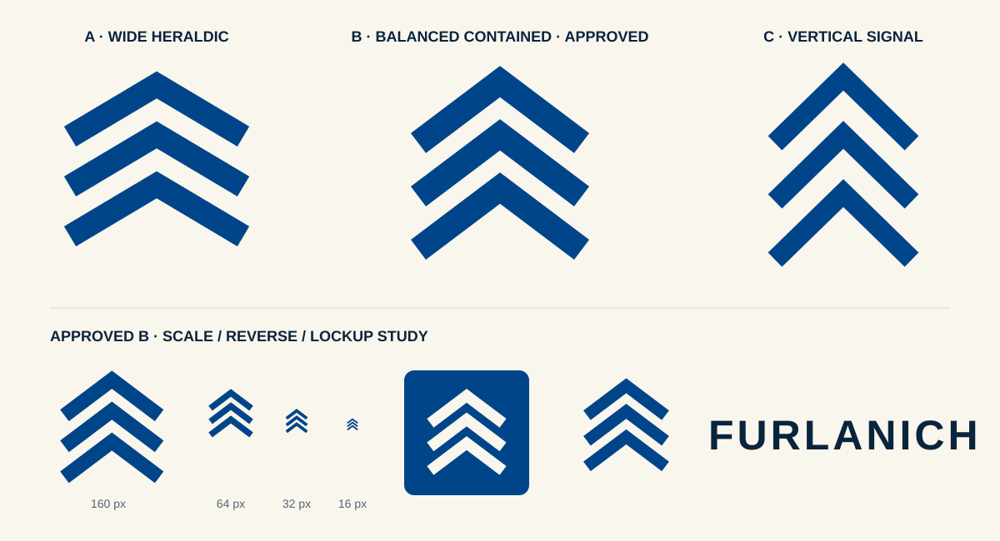

# Contained Master and immersive chapter gate closure

## Boundary

This review closes the two pre-implementation gates named by
[PLAN-VISUAL-IDENTITY-ADAPTIVE-IMMERSIVE-V1](../../plans/active/visual-identity-adaptive-immersive-v1.md):

- G0: exact Contained Master optical construction;
- G1: exact bilingual immersive chapter interface copy.

It changes documentation and review assets only. It adds no production brand asset, font, static homepage artwork, Three.js runtime, video or application code.

## Human disposition

**APPROVED — 2026-09-20.**

The repository owner explicitly approved:

> Geometry B — Balanced Contained + Copy 1 — Operational Clarity

The terminal response is the decision source. The local interactive comparison was a review aid; repository owners below are authoritative.

## G0 result

Geometry B — **Balanced Contained** is the protected master construction.

[DESIGN-VISUAL](../../design/visual-language.md#contained-master-g0-optical-closure-approved) owns its exact view box, centerlines, stroke construction, clear space, lockup gap, minimum sizes, variants and invalid uses.

Review evidence:

The comparison lockup uses a schematic system-font wordmark only to assess scale and spacing. [DESIGN-VISUAL](../../design/visual-language.md#contained-master-g0-optical-closure-approved) owns the production Instrument Sans treatment.

Candidate A was rejected because its shallow, broad cadence increases roof, mountain and rank-insignia readings. Candidate C was rejected because its narrow, steep construction loses too much of the supplied family-symbol character and reads more like a navigation glyph.

The supplied raster reference remains private design input. It is not copied into this package, is not a production asset and is not claimed as an exact heraldic source.

## G1 result

Copy 1 — **Operational Clarity** is the approved bilingual chapter voice.

[PAGE-HOME](../../product/pages/home.md#immersive-home-g1-operational-clarity-copy-approved) owns the exact Spanish and English public strings. The chapter copy explains the progression from a real business process through fragmentation, connection and coordination without naming a product, implying project evidence or asserting a measured outcome.

The static chapter artwork remains decorative because adjacent HTML carries the complete meaning. A later Connection film still requires its own media classification, caption/transcript decision and asset review.

Copy 2 — System Logic was rejected because it is more abstract and technical for the primary SMB buyer. Copy 3 — Precision Movement was rejected because its short verbs cannot carry the explanation without relying on animation.

## Gate effect

G0 and G1 no longer block the implementation plan.

The implementation plan itself remains **PROPOSED** until separately approved. Production identity, fonts, static artwork and WebGL remain unchanged by this review.

The following remain OPEN:

- approval of the versioned implementation plan;
- the exact optional Connection-film asset, shot list, production tool, codec and rendition ladder;
- final static poster execution within the accepted budgets;
- whether 768 px benefits from a short local sticky interval after real-device testing;
- analytics or conversion measurement.
