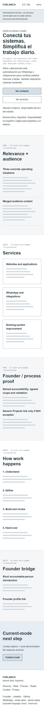
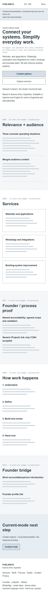
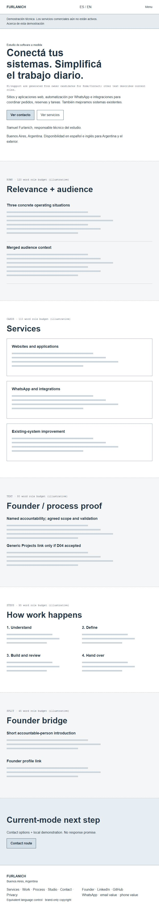
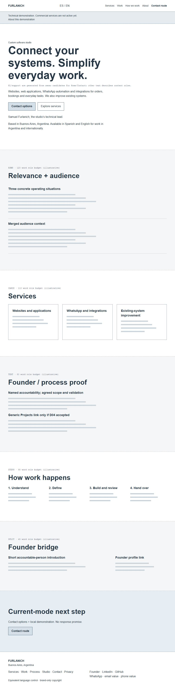
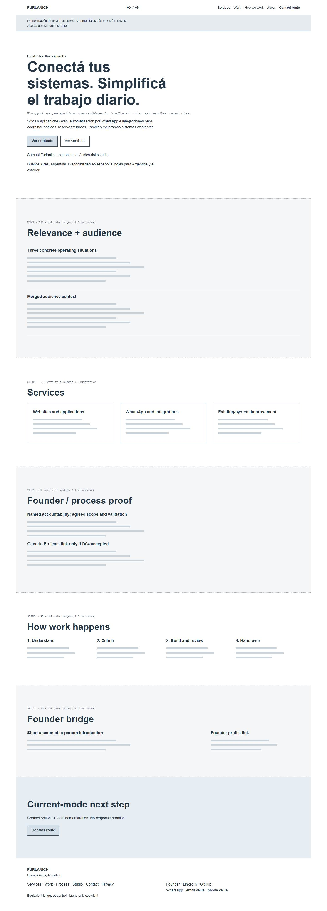
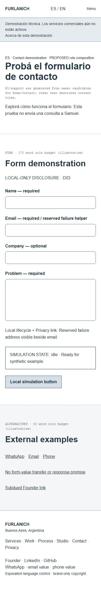
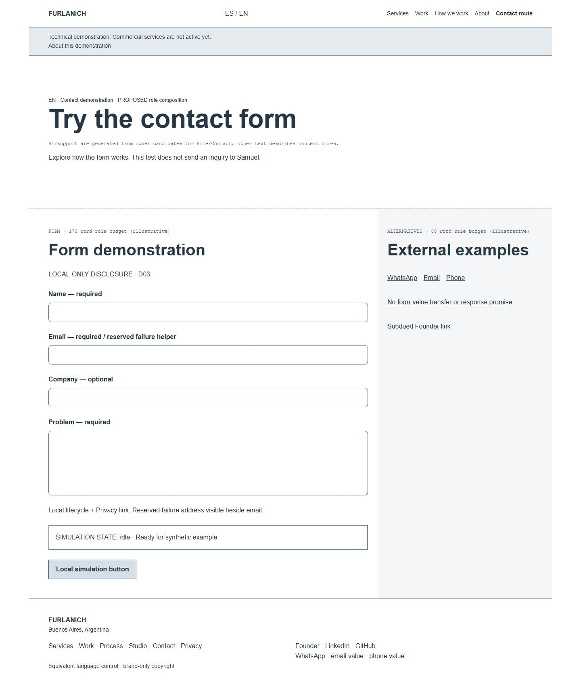
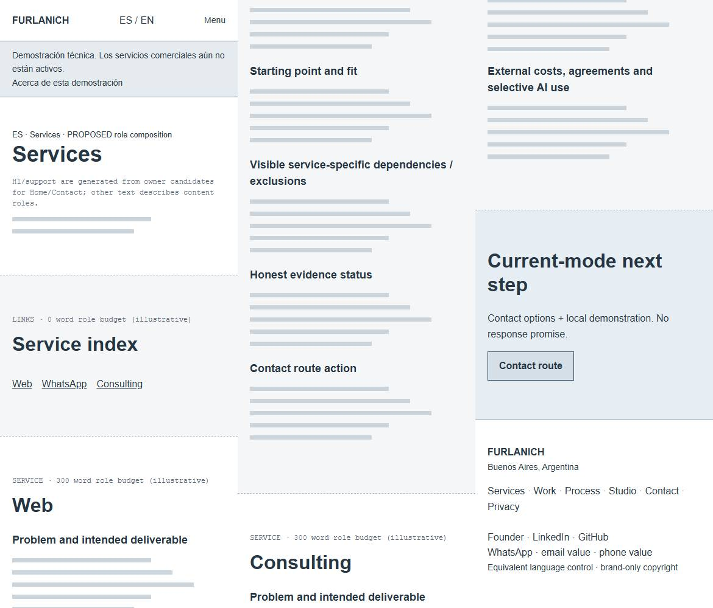
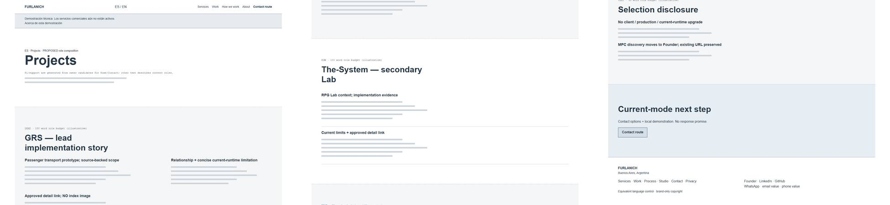
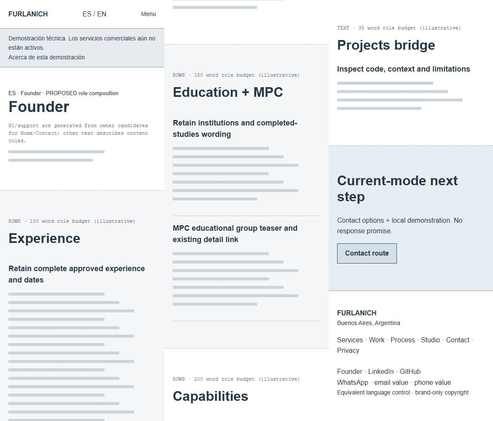

# Page outlines and low-fidelity layout studies — R1

[Decision package](index.md) · [Visual owner](../../design/visual-language.md#mkt-d07-vis-r1-restrained-marketing-composition-proposed) · [Interaction owner](../../design/interaction-responsive-accessibility.md#mkt-d07-ix-r1-marketing-navigation-and-demo-interactions-proposed)

## How to review

Open the adjacent standalone file layout-study.html in a browser. It has controls for nine page templates, both locale structures, five CSS widths, compact-menu composition and four Contact state annotations. It runs locally with no external dependencies, production assets, forms, real contact actions or network submission. The page is documentation, not deployable application UI.

Home/Contact headlines, support and the global notice are generated previews of the owning candidate tables. Other content uses annotated roles and gray density lines, not finished copy. All annotations are intentionally in English; the locale control changes the exact candidate samples. Full bilingual copy is reviewed in the owner tables, not inferred from annotation wrapping. The same semantic structure applies to both locales.

Dashed boundaries and role labels are review annotations, not proposed cards. Solid comparison boxes are used for Home service summaries; line-separated rows and unboxed text carry most other ideas. Gray lines indicate approximate density and do not establish final page height. Existing source-owned text, facts and permissions remain authoritative.

The viewer provides a menu-open composition and state diagrams, not production interaction emulation. No focus management, form validation or real navigation is proved by the sketch. The audit's deployed evidence remains separate. Do not mistake the grayscale study for a proposed palette or system-font replacement.

## Page outlines

All templates begin with the same header and in-flow demonstration notice and end with the compact footer. Contact has no redundant final Contact CTA. Privacy copy and not-found content remain unchanged except the global notice and shared labels.

| Page | Proposed source order | Main change | Retained facts / dependencies |
| --- | --- | --- | --- |
| Home | Hero → relevance/audience → three services → founder/process proof → four-step process → Founder bridge → demo-aware action | Remove standalone audience-card section; proof becomes unboxed | No project names/cards/media. Generic index bridge requires D04 |
| Services | Intro/index → Web → WhatsApp → Consulting → shared working boundaries + retained commercial block → demo-aware action | Consistent problem/work/start/fit/boundary/evidence/action scan | Provider limits, all exclusions and full existing commercial-terms block remain visible |
| Projects | Intro → GRS lead → secondary Lab entry → selection disclosure → demo-aware action | Asymmetric editorial priority | No index imagery, production claim or new Lab route; MPC moves to Founder discovery |
| GRS detail | Short header + conceptual visual → modeled context → source-backed scope → evidence/limits/publication scope → service/Founder links → demo action | Four meaningful groups replace many short bands | No verified demo, payment, adoption, uptime or outcome claim |
| Lab detail | Short header + conceptual visual → RPG context → permitted code scope → evidence/limits → service/Founder links → demo action | Access/workflow relevance, openly secondary Lab | No working billing or planned scenes/assets/notes/collaboration claims |
| MPC detail | Short header + conceptual visual → educational context → source-backed scope → evidence/limits → Founder return → demo action | Educational context governs the entire story | Existing route preserved; group work, fictional factory, no sole authorship/runtime/outcomes |
| Studio | Model intro/accountability/collaborators → four principles → location/Founder bridge → demo action | Explain responsibility once | No permanent team, offices, sector footprint or employer endorsement |
| Founder | Short header → existing experience → full biography in paragraphs → education/MPC → capabilities → secondary professional links → Projects → demo action | Buyer background precedes CV | Every factual date/institution preserved; employment remains narrative-only |
| Contact | Brief intro → local form disclosure → four fields/helpers → state/action → external examples → Founder link | Remove current-mode response promise and introductory burden | Local memory only; WhatsApp/email/phone order; exact validation behavior retained |

## Five-width review matrix

| Width | Header and layout | Critical review question |
| --- | --- | --- |
| 320px | Compact native menu, 20px gutters, one column, stacked actions | Does disclosure remain legible without consuming the whole first screen? Can every label wrap without clipping? |
| 390px | Same structure with more comfortable text measure | Is the next action understandable before a long scroll? Are limitations still visible? |
| 768px | Native menu; 32px gutters; process two columns; Services/Contact stacked | Does tablet feel composed rather than enlarged mobile? |
| 1024px | Inline header, 48px gutters; wide grid; Contact 8/4 | Do actual long bilingual nav labels fit with target sizes? Do side columns retain reading order? |
| 1440px | Max 1200px container; wide editorial composition | Does whitespace establish emphasis without inflating thin project content? |

The exact proposed visual numbers and authority are in VIS-R1. The sketches show the direction and representative copy wrapping; they do not close real-browser UI acceptance, 200% text zoom, assistive-technology behavior, font loading or performance. Those belong to the later approved implementation work.

## Comparison to the deployed audit

| Audited weakness | Proposed composition response | What this does not solve |
| --- | --- | --- |
| Eleven Home cards before proof | Three plain situation rows plus three service summaries; no audience cards | Stronger project evidence still needs independent verification |
| Services longer than 19,500px at 390px | Fewer repeated panel groups, scan layer and shared boundaries | No promised final height or permission to delete necessary qualifications |
| Project details spread short statements across full bands | Group context, scope and evidence/limits | Does not turn source code into functional or client proof |
| CV strongest Founder button | Secondary links after complete background | Does not change experience dates or imply seniority |
| Contact intro promises review before a local-only test | Short demo-first introduction and data-use contract | Does not activate a provider or imply actual replies |
| Menu remains open on anchor selection | Deliberate selection/Escape closure specified in IX-R1 | Sketch viewer is not proof of implemented keyboard behavior |

## Retained example captures

These images are non-approved layout evidence. The interactive file contains every template/width; raw execution screenshots remain ignored local QA output. The JSON file evidence/layout-checks.json records the renderer matrix and limitations; it is not a production test report.

### Home — 320px Spanish candidate

### Home — 390px English candidate

### Home — 768px Spanish candidate

### Home — 1024px English candidate

### Home — 1440px Spanish candidate

### Contact — 390px Spanish candidate

### Contact — 1440px English candidate

### Services — 390px Spanish structure

Initial, middle and ending samples, left to right. Role annotations are not public copy.

### Projects — 1440px Spanish structure

### Founder — 390px Spanish structure

## Renderer verification and limits

The final Chromium renderer pass covered 9 templates × 5 widths × 2 locale selections = 90 combinations, with no recorded script errors or horizontal overflow. Home/Contact candidate samples change with locale; most other page content is role annotation, so this does not prove that every full translated production paragraph fits. A slash-joined Lab annotation initially overflowed at 320px and was corrected before the final pass. Isolated captures replaced the first iframe captures, whose viewer toolbar obscured the top of the sketch.

Visual review checked corrected Home samples at compact/tablet/wide sizes, Contact wide composition, Services scan samples, Projects emphasis and Founder ordering. This remains judgment-based low-fidelity review, not product acceptance, a production accessibility scan or a conversion result.
