# Browser evidence and complete CTA inventory

[Main audit](index.md) · [Findings](findings.md)

## Reproduction and limits

FACT: Windows / installed Playwright Chromium; public https://furlanich.github.io/Portfolio/ at source 5af49a6 and observed gh-pages deployment eec0f3b. Capture date 2026-09-15. Normal locale-specific content; no authenticated/admin pages. 20 routes at 320×900, 390×844, 768×1024, 1024×768 and 1440×900; device scale 1. Desktop and responsive boards combine captured screenshots and are not alternative designs. Full-page shots can reposition the sticky header in stitching; do not interpret that artifact as actual header motion.

Captured source: local ignored test-results/marketing-audit/ contains matrix.json, content.txt, anchors.json, interactions.json, journeys-verified.json and 100 initial/full pairs. Maintained review copies below remain in this documentation PR. Scripts used installed Playwright/Sharp; no production source was changed. Network was the real deployment, not a local dev server.

To reproduce: visit each route at the table widths; capture initial and full page; inspect initial/first scroll/middle/end. At 390px open navigation with Enter, press Escape, then reopen and select Process on the same homepage; wait for scrolling to settle and inspect overlay. On Contact, submit empty, then use synthetic name/message with failure@example.invalid; confirm failure, preservation and status focus. Replace email with audit@example.invalid and retry; confirm explicit simulated success and reset. Never activate the external channels or a real processor. Inspect links by region and await final URL after client-side navigation.

## Viewport matrix

Every row includes both initial and full-page captures at all five widths. All 100 requests returned 200; no observed horizontal overflow, console/page errors or broken content images. Heights are page CSS pixels, not load times.

| Route under /Portfolio/ | 320 | 390 | 768 | 1024 | 1440 |
| --- | ---: | ---: | ---: | ---: | ---: |
| `/` | 10585 | 9361 | 6821 | 6681 | 6307 |
| `en/` | 10361 | 9181 | 6769 | 6771 | 6425 |
| `servicios/` | 23630 | 20110 | 14052 | 12464 | 12022 |
| `en/services/` | 22876 | 19574 | 13674 | 12448 | 12090 |
| `proyectos/` | 4399 | 3989 | 2989 | 2871 | 2795 |
| `en/work/` | 4307 | 3881 | 2909 | 2843 | 2743 |
| `estudio/` | 6369 | 5637 | 4253 | 3902 | 3782 |
| `en/about/` | 6193 | 5505 | 4149 | 3762 | 3670 |
| `estudio/samuel-furlanich/` | 6596 | 5988 | 4145 | 4149 | 4093 |
| `en/about/samuel-furlanich/` | 6468 | 5868 | 4053 | 4141 | 4029 |
| `contacto/` | 3833 | 3473 | 2733 | 2465 | 2417 |
| `en/contact/` | 3713 | 3393 | 2733 | 2417 | 2417 |
| `privacidad/` | 4336 | 3739 | 2883 | 2887 | 2887 |
| `en/privacy/` | 4091 | 3479 | 2819 | 2727 | 2727 |
| `proyectos/general-reservation-system/` | 5066 | 4650 | 4357 | 4132 | 3980 |
| `proyectos/the-system/` | 5042 | 4654 | 4373 | 4112 | 3972 |
| `proyectos/mpc-administracion/` | 4805 | 4401 | 4152 | 3867 | 3751 |
| `en/work/general-reservation-system/` | 4842 | 4538 | 4333 | 4108 | 3928 |
| `en/work/the-system/` | 4914 | 4610 | 4381 | 4064 | 3976 |
| `en/work/mpc-administracion/` | 4717 | 4453 | 4184 | 3899 | 3807 |

Machine-readable summary: `evidence/viewport-results.json`. These checks do not establish real-device, cross-browser, text-zoom or screen-reader conformance.

## Interaction evidence

- es: empty-submit focus contact-name; failure focus contact-es-status; synthetic message retained; successful retry focus contact-es-status; name reset true. Observed request methods: HEAD, GET. Recorded traffic was same-site route prefetch, not submission POST. The collector did not comprehensively instrument every possible storage/transmission channel.
- en: empty-submit focus contact-name; failure focus contact-en-status; synthetic message retained; successful retry focus contact-en-status; name reset true. Observed request methods: HEAD, GET. Recorded traffic was same-site route prefetch, not submission POST. The collector did not comprehensively instrument every possible storage/transmission channel.
- Menu opens through keyboard Enter in ES/EN; Escape and Process selection leave it open. This is a disclosure, not a modal; classify as journey friction rather than automatically a WCAG failure.
- Corrected journey run reached all 10 requested language/journey combinations using exact URLs; 20 language-switch operations reached equivalent routes. The first exploratory journey log had matching/wait defects and is not the authority for arrival outcomes.
- 36 unique inspected internal/source/CV destinations returned HTTP success, with existing IDs for tested fragments. WhatsApp/email/phone were checked as hrefs only; no message, call or email sent. LinkedIn content/availability was not independently verified.
- 20 desktop default-state axe scans, selected WCAG 2 A/AA + 2.1 A/AA tags: no violations. Two Founder scans reported aria-valid-attr-value incomplete items. Focused DOM/source review confirmed capability group IDs and aria-labelledby references contain spaces; ARIA interprets those references as multiple ID tokens, so the intended heading is not resolved (MKT-A11Y-001). This is not a whole-site accessibility pass or certification.

### Unthrottled performance samples

| Route | Width | FCP observed (ms) | Layout shift sum during sample |
| --- | ---: | ---: | ---: |
| `/` | 390 | 44 | 0 |
| `en/` | 390 | 48 | 0 |
| `servicios/` | 390 | 56 | 0 |
| `contacto/` | 390 | 104 | 0 |
| `en/contact/` | 320 | 52 | 0 |
| `/` | 1440 | 40 | 0 |

These warmed lab samples do not establish cold-load mobile performance, field Core Web Vitals, INP, latency or an SLA. No speed score is inferred from them.

## Screenshot evidence

| ID | Content | Use |
| --- | --- | --- |
| E01 | Home ES 1440 initial — `evidence/E01-home-wide.jpg` | Observed current website, not approved redesign |
| E02 | Home EN 320/390/768/1024 initials — `evidence/E02-home-en-responsive.jpg` | Observed current website, not approved redesign |
| E03 | Home ES full page, sequential tiles left-to-right then next row — `evidence/E03-home-rhythm.jpg` | Observed current website, not approved redesign |
| E04 | Services ES full page, sequential tiles — `evidence/E04-services-rhythm.jpg` | Observed current website, not approved redesign |
| E05 | Projects ES full page — `evidence/E05-projects-rhythm.jpg` | Observed current website, not approved redesign |
| E06 | Studio ES full page — `evidence/E06-studio-rhythm.jpg` | Observed current website, not approved redesign |
| E07 | Contact ES full page — `evidence/E07-contact-wide.jpg` | Observed current website, not approved redesign |
| E08 | Contact ES 390 first scroll/middle/pre-footer/footer — `evidence/E08-contact-mobile.jpg` | Observed current website, not approved redesign |
| E09 | GRS localized limitations and raw limited — `evidence/E09-internal-token.jpg` | Observed current website, not approved redesign |
| E10 | Settled mobile Process navigation with disclosure open — `evidence/E10-menu-process.jpg` | Observed current website, not approved redesign |
| E11 | Home ES 390 first scroll/middle/end/footer — `evidence/E11-home-mobile-ending.jpg` | Observed current website, not approved redesign |
| E12 | Founder ES responsive initial views — `evidence/E12-founder-mobile.jpg` | Observed current website, not approved redesign |
| E13 | Services ES 390 scroll samples — `evidence/E13-services-mobile.jpg` | Observed current website, not approved redesign |
| E14-ES | ES invalid/failure/success samples — `evidence/E14-contact-es-states.jpg` | Observed current website, not approved redesign |
| E14-EN | EN invalid/failure/success samples — `evidence/E14-contact-en-states.jpg` | Observed current website, not approved redesign |

## Complete visible-link / CTA map

This inventories links actually visible in the wide default state. Hidden duplicate mobile links use the same destinations; menu state was separately exercised. Internal paths retain the deployed base path. All main-page anchors appear below, including nonconversion evidence/utility links. Primary commercial inquiry routes currently lead to a demonstration. Contact button states are listed after links.

### Shared footer (all 20 routes)

#### Spanish footer

| Label | Destination |
| --- | --- |
| FURLANICH | `/Portfolio/` |
| Servicios | `/Portfolio/servicios/` |
| Proyectos | `/Portfolio/proyectos/` |
| Proceso | `/Portfolio/#proceso` |
| El estudio | `/Portfolio/estudio/` |
| Contacto | `/Portfolio/contacto/` |
| Privacidad | `/Portfolio/privacidad/` |
| Escribir por WhatsApp | `https://wa.me/5491150117565` |
| Enviar un correo | `mailto:samuelfurlanich@gmail.com` |
| Llamar | `tel:+5491150117565` |
| Samuel Furlanich | `/Portfolio/estudio/samuel-furlanich/` |
| LinkedIn | `https://www.linkedin.com/in/samuel-furlanich/` |
| GitHub | `https://github.com/Furlanich` |
#### English footer

| Label | Destination |
| --- | --- |
| FURLANICH | `/Portfolio/en/` |
| Services | `/Portfolio/en/services/` |
| Work | `/Portfolio/en/work/` |
| Process | `/Portfolio/en/#process` |
| About | `/Portfolio/en/about/` |
| Contact | `/Portfolio/en/contact/` |
| Privacy | `/Portfolio/en/privacy/` |
| Write on WhatsApp | `https://wa.me/5491150117565` |
| Send an email | `mailto:samuelfurlanich@gmail.com` |
| Call | `tel:+5491150117565` |
| Samuel Furlanich | `/Portfolio/en/about/samuel-furlanich/` |
| LinkedIn | `https://www.linkedin.com/in/samuel-furlanich/` |
| GitHub | `https://github.com/Furlanich` |

### Headers and main-page actions by route

#### `/`

| Region | Label | Destination |
| --- | --- | --- |
| header | FURLANICH | `/Portfolio/#site-top` |
| header | EN | `/Portfolio/en/` |
| header | Servicios | `/Portfolio/servicios/` |
| header | Proyectos | `/Portfolio/proyectos/` |
| header | Proceso | `/Portfolio/#proceso` |
| header | El estudio | `/Portfolio/estudio/` |
| header | Contacto | `/Portfolio/contacto/` |
| header | Contanos sobre tu proyecto | `/Portfolio/contacto/` |
| main | Contanos sobre tu proyecto | `/Portfolio/contacto/` |
| main | Ver servicios | `/Portfolio/servicios/` |
| main | Ver cómo podemos ayudarte | `/Portfolio/servicios/` |
| main | Ver todos los servicios | `/Portfolio/servicios/` |
| main | Contanos cómo funciona tu negocio | `/Portfolio/contacto/` |
| main | Conocer la trayectoria de Samuel | `/Portfolio/estudio/samuel-furlanich/` |
| main | Empezar una consulta | `/Portfolio/contacto/` |
| main | Hablemos de tu proyecto | `/Portfolio/contacto/` |
| main | Conocer a Samuel | `/Portfolio/estudio/samuel-furlanich/` |
| main | Contanos sobre tu proyecto | `/Portfolio/contacto/` |
| main | Escribir por WhatsApp | `https://wa.me/5491150117565` |

#### `en/`

| Region | Label | Destination |
| --- | --- | --- |
| header | FURLANICH | `/Portfolio/en/#site-top` |
| header | ES | `/Portfolio/` |
| header | Services | `/Portfolio/en/services/` |
| header | Work | `/Portfolio/en/work/` |
| header | Process | `/Portfolio/en/#process` |
| header | About | `/Portfolio/en/about/` |
| header | Contact | `/Portfolio/en/contact/` |
| header | Tell us about your project | `/Portfolio/en/contact/` |
| main | Tell us about your project | `/Portfolio/en/contact/` |
| main | View services | `/Portfolio/en/services/` |
| main | See how we can help | `/Portfolio/en/services/` |
| main | View all services | `/Portfolio/en/services/` |
| main | Tell us how your business works | `/Portfolio/en/contact/` |
| main | View Samuel's background | `/Portfolio/en/about/samuel-furlanich/` |
| main | Start an inquiry | `/Portfolio/en/contact/` |
| main | Let's talk about your project | `/Portfolio/en/contact/` |
| main | Meet Samuel | `/Portfolio/en/about/samuel-furlanich/` |
| main | Tell us about your project | `/Portfolio/en/contact/` |
| main | Write on WhatsApp | `https://wa.me/5491150117565` |

#### `servicios/`

| Region | Label | Destination |
| --- | --- | --- |
| header | FURLANICH | `/Portfolio/#site-top` |
| header | EN | `/Portfolio/en/services/` |
| header | Servicios | `/Portfolio/servicios/` |
| header | Proyectos | `/Portfolio/proyectos/` |
| header | Proceso | `/Portfolio/#proceso` |
| header | El estudio | `/Portfolio/estudio/` |
| header | Contacto | `/Portfolio/contacto/` |
| header | Escribir por WhatsApp | `/Portfolio/contacto/` |
| main | Sitios y aplicaciones web | `/Portfolio/servicios/#web` |
| main | WhatsApp e integraciones | `/Portfolio/servicios/#whatsapp` |
| main | Mantenimiento y consultoría | `/Portfolio/servicios/#consultoria` |
| main | Contanos qué necesitás resolver en la web | `/Portfolio/contacto/` |
| main | Conversemos sobre tu flujo por WhatsApp | `/Portfolio/contacto/` |
| main | Contanos qué pasa con tu sistema | `/Portfolio/contacto/` |
| main | Iniciar una consulta | `/Portfolio/contacto/` |

#### `en/services/`

| Region | Label | Destination |
| --- | --- | --- |
| header | FURLANICH | `/Portfolio/en/#site-top` |
| header | ES | `/Portfolio/servicios/` |
| header | Services | `/Portfolio/en/services/` |
| header | Work | `/Portfolio/en/work/` |
| header | Process | `/Portfolio/en/#process` |
| header | About | `/Portfolio/en/about/` |
| header | Contact | `/Portfolio/en/contact/` |
| header | Write on WhatsApp | `/Portfolio/en/contact/` |
| main | Websites and web applications | `/Portfolio/en/services/#web` |
| main | WhatsApp and integrations | `/Portfolio/en/services/#whatsapp` |
| main | Maintenance and consulting | `/Portfolio/en/services/#consulting` |
| main | Tell us what you need to solve on the web | `/Portfolio/en/contact/` |
| main | Discuss your WhatsApp workflow | `/Portfolio/en/contact/` |
| main | Tell us what is happening with your system | `/Portfolio/en/contact/` |
| main | Start an enquiry | `/Portfolio/en/contact/` |

#### `proyectos/`

| Region | Label | Destination |
| --- | --- | --- |
| header | FURLANICH | `/Portfolio/#site-top` |
| header | EN | `/Portfolio/en/work/` |
| header | Servicios | `/Portfolio/servicios/` |
| header | Proyectos | `/Portfolio/proyectos/` |
| header | Proceso | `/Portfolio/#proceso` |
| header | El estudio | `/Portfolio/estudio/` |
| header | Contacto | `/Portfolio/contacto/` |
| header | Escribir por WhatsApp | `/Portfolio/contacto/` |
| main | Ver proyecto | `/Portfolio/proyectos/general-reservation-system/` |
| main | Ver proyecto | `/Portfolio/proyectos/the-system/` |
| main | Ver proyecto | `/Portfolio/proyectos/mpc-administracion/` |
| main | Hablar sobre tu proyecto | `/Portfolio/contacto/` |

#### `en/work/`

| Region | Label | Destination |
| --- | --- | --- |
| header | FURLANICH | `/Portfolio/en/#site-top` |
| header | ES | `/Portfolio/proyectos/` |
| header | Services | `/Portfolio/en/services/` |
| header | Work | `/Portfolio/en/work/` |
| header | Process | `/Portfolio/en/#process` |
| header | About | `/Portfolio/en/about/` |
| header | Contact | `/Portfolio/en/contact/` |
| header | Write on WhatsApp | `/Portfolio/en/contact/` |
| main | View project | `/Portfolio/en/work/general-reservation-system/` |
| main | View project | `/Portfolio/en/work/the-system/` |
| main | View project | `/Portfolio/en/work/mpc-administracion/` |
| main | Discuss your project | `/Portfolio/en/contact/` |

#### `estudio/`

| Region | Label | Destination |
| --- | --- | --- |
| header | FURLANICH | `/Portfolio/#site-top` |
| header | EN | `/Portfolio/en/about/` |
| header | Servicios | `/Portfolio/servicios/` |
| header | Proyectos | `/Portfolio/proyectos/` |
| header | Proceso | `/Portfolio/#proceso` |
| header | El estudio | `/Portfolio/estudio/` |
| header | Contacto | `/Portfolio/contacto/` |
| header | Contanos qué necesitás resolver | `/Portfolio/contacto/` |
| main | Contanos qué necesitás resolver | `/Portfolio/contacto/` |
| main | Conocer a Samuel | `/Portfolio/estudio/samuel-furlanich/` |
| main | Conocer a Samuel | `/Portfolio/estudio/samuel-furlanich/` |
| main | Iniciar una consulta | `/Portfolio/contacto/` |

#### `en/about/`

| Region | Label | Destination |
| --- | --- | --- |
| header | FURLANICH | `/Portfolio/en/#site-top` |
| header | ES | `/Portfolio/estudio/` |
| header | Services | `/Portfolio/en/services/` |
| header | Work | `/Portfolio/en/work/` |
| header | Process | `/Portfolio/en/#process` |
| header | About | `/Portfolio/en/about/` |
| header | Contact | `/Portfolio/en/contact/` |
| header | Tell us what you need to solve | `/Portfolio/en/contact/` |
| main | Tell us what you need to solve | `/Portfolio/en/contact/` |
| main | Meet Samuel | `/Portfolio/en/about/samuel-furlanich/` |
| main | Meet Samuel | `/Portfolio/en/about/samuel-furlanich/` |
| main | Start an enquiry | `/Portfolio/en/contact/` |

#### `estudio/samuel-furlanich/`

| Region | Label | Destination |
| --- | --- | --- |
| header | FURLANICH | `/Portfolio/#site-top` |
| header | EN | `/Portfolio/en/about/samuel-furlanich/` |
| header | Servicios | `/Portfolio/servicios/` |
| header | Proyectos | `/Portfolio/proyectos/` |
| header | Proceso | `/Portfolio/#proceso` |
| header | El estudio | `/Portfolio/estudio/` |
| header | Contacto | `/Portfolio/contacto/` |
| header | Iniciar una consulta | `/Portfolio/contacto/` |
| main | Descargar CV | `/Portfolio/Samuel-Furlanich-CV.pdf` |
| main | LinkedIn | `https://www.linkedin.com/in/samuel-furlanich/` |
| main | GitHub | `https://github.com/Furlanich` |
| main | Ver proyectos seleccionados | `/Portfolio/proyectos/` |
| main | Iniciar una consulta | `/Portfolio/contacto/` |

#### `en/about/samuel-furlanich/`

| Region | Label | Destination |
| --- | --- | --- |
| header | FURLANICH | `/Portfolio/en/#site-top` |
| header | ES | `/Portfolio/estudio/samuel-furlanich/` |
| header | Services | `/Portfolio/en/services/` |
| header | Work | `/Portfolio/en/work/` |
| header | Process | `/Portfolio/en/#process` |
| header | About | `/Portfolio/en/about/` |
| header | Contact | `/Portfolio/en/contact/` |
| header | Start an enquiry | `/Portfolio/en/contact/` |
| main | Download CV | `/Portfolio/Samuel-Furlanich-CV.pdf` |
| main | LinkedIn | `https://www.linkedin.com/in/samuel-furlanich/` |
| main | GitHub | `https://github.com/Furlanich` |
| main | View selected work | `/Portfolio/en/work/` |
| main | Start an enquiry | `/Portfolio/en/contact/` |

#### `contacto/`

| Region | Label | Destination |
| --- | --- | --- |
| header | FURLANICH | `/Portfolio/#site-top` |
| header | EN | `/Portfolio/en/contact/` |
| header | Servicios | `/Portfolio/servicios/` |
| header | Proyectos | `/Portfolio/proyectos/` |
| header | Proceso | `/Portfolio/#proceso` |
| header | El estudio | `/Portfolio/estudio/` |
| header | Contacto | `/Portfolio/contacto/` |
| header | Contanos sobre tu proyecto | `/Portfolio/contacto/` |
| main | Política de privacidad | `/Portfolio/privacidad/` |
| main | Escribir por WhatsApp | `https://wa.me/5491150117565` |
| main | Enviar un correo | `mailto:samuelfurlanich@gmail.com` |
| main | Llamar | `tel:+5491150117565` |
| main | Conocer la trayectoria de Samuel | `/Portfolio/estudio/samuel-furlanich/` |

#### `en/contact/`

| Region | Label | Destination |
| --- | --- | --- |
| header | FURLANICH | `/Portfolio/en/#site-top` |
| header | ES | `/Portfolio/contacto/` |
| header | Services | `/Portfolio/en/services/` |
| header | Work | `/Portfolio/en/work/` |
| header | Process | `/Portfolio/en/#process` |
| header | About | `/Portfolio/en/about/` |
| header | Contact | `/Portfolio/en/contact/` |
| header | Tell us about your project | `/Portfolio/en/contact/` |
| main | Privacy Policy | `/Portfolio/en/privacy/` |
| main | Write on WhatsApp | `https://wa.me/5491150117565` |
| main | Send an email | `mailto:samuelfurlanich@gmail.com` |
| main | Call | `tel:+5491150117565` |
| main | View Samuel's background | `/Portfolio/en/about/samuel-furlanich/` |

#### `privacidad/`

| Region | Label | Destination |
| --- | --- | --- |
| header | FURLANICH | `/Portfolio/#site-top` |
| header | EN | `/Portfolio/en/privacy/` |
| header | Servicios | `/Portfolio/servicios/` |
| header | Proyectos | `/Portfolio/proyectos/` |
| header | Proceso | `/Portfolio/#proceso` |
| header | El estudio | `/Portfolio/estudio/` |
| header | Contacto | `/Portfolio/contacto/` |
| header | Contanos sobre tu proyecto | `/Portfolio/contacto/` |
| main | Ver la declaración de privacidad de GitHub | `https://docs.github.com/en/site-policy/privacy-policies/github-privacy-statement` |

#### `en/privacy/`

| Region | Label | Destination |
| --- | --- | --- |
| header | FURLANICH | `/Portfolio/en/#site-top` |
| header | ES | `/Portfolio/privacidad/` |
| header | Services | `/Portfolio/en/services/` |
| header | Work | `/Portfolio/en/work/` |
| header | Process | `/Portfolio/en/#process` |
| header | About | `/Portfolio/en/about/` |
| header | Contact | `/Portfolio/en/contact/` |
| header | Tell us about your project | `/Portfolio/en/contact/` |
| main | View GitHub's privacy statement | `https://docs.github.com/en/site-policy/privacy-policies/github-privacy-statement` |

#### `proyectos/general-reservation-system/`

| Region | Label | Destination |
| --- | --- | --- |
| header | FURLANICH | `/Portfolio/#site-top` |
| header | EN | `/Portfolio/en/work/general-reservation-system/` |
| header | Servicios | `/Portfolio/servicios/` |
| header | Proyectos | `/Portfolio/proyectos/` |
| header | Proceso | `/Portfolio/#proceso` |
| header | El estudio | `/Portfolio/estudio/` |
| header | Contacto | `/Portfolio/contacto/` |
| header | Escribir por WhatsApp | `/Portfolio/contacto/` |
| main | Repositorio público aprobado (enlace externo) | `https://github.com/Furlanich/GeneralReservationSystem` |
| main | Conocer a Samuel | `/Portfolio/estudio/samuel-furlanich/` |
| main | Sitios y aplicaciones web comerciales | `/Portfolio/servicios/#web` |
| main | Hablar sobre tu proyecto | `/Portfolio/contacto/` |

#### `proyectos/the-system/`

| Region | Label | Destination |
| --- | --- | --- |
| header | FURLANICH | `/Portfolio/#site-top` |
| header | EN | `/Portfolio/en/work/the-system/` |
| header | Servicios | `/Portfolio/servicios/` |
| header | Proyectos | `/Portfolio/proyectos/` |
| header | Proceso | `/Portfolio/#proceso` |
| header | El estudio | `/Portfolio/estudio/` |
| header | Contacto | `/Portfolio/contacto/` |
| header | Escribir por WhatsApp | `/Portfolio/contacto/` |
| main | Repositorio público aprobado (enlace externo) | `https://github.com/Furlanich/The-System` |
| main | Conocer a Samuel | `/Portfolio/estudio/samuel-furlanich/` |
| main | Sitios y aplicaciones web comerciales | `/Portfolio/servicios/#web` |
| main | Hablar sobre tu proyecto | `/Portfolio/contacto/` |

#### `proyectos/mpc-administracion/`

| Region | Label | Destination |
| --- | --- | --- |
| header | FURLANICH | `/Portfolio/#site-top` |
| header | EN | `/Portfolio/en/work/mpc-administracion/` |
| header | Servicios | `/Portfolio/servicios/` |
| header | Proyectos | `/Portfolio/proyectos/` |
| header | Proceso | `/Portfolio/#proceso` |
| header | El estudio | `/Portfolio/estudio/` |
| header | Contacto | `/Portfolio/contacto/` |
| header | Escribir por WhatsApp | `/Portfolio/contacto/` |
| main | Repositorio público aprobado (enlace externo) | `https://github.com/Furlanich/MilkyPantsCheese-Administracion-` |
| main | Sitios y aplicaciones web comerciales | `/Portfolio/servicios/#web` |
| main | Hablar sobre tu proyecto | `/Portfolio/contacto/` |

#### `en/work/general-reservation-system/`

| Region | Label | Destination |
| --- | --- | --- |
| header | FURLANICH | `/Portfolio/en/#site-top` |
| header | ES | `/Portfolio/proyectos/general-reservation-system/` |
| header | Services | `/Portfolio/en/services/` |
| header | Work | `/Portfolio/en/work/` |
| header | Process | `/Portfolio/en/#process` |
| header | About | `/Portfolio/en/about/` |
| header | Contact | `/Portfolio/en/contact/` |
| header | Write on WhatsApp | `/Portfolio/en/contact/` |
| main | Approved public repository (external link) | `https://github.com/Furlanich/GeneralReservationSystem` |
| main | Meet Samuel | `/Portfolio/en/about/samuel-furlanich/` |
| main | Commercial websites and web applications | `/Portfolio/en/services/#web` |
| main | Discuss your project | `/Portfolio/en/contact/` |

#### `en/work/the-system/`

| Region | Label | Destination |
| --- | --- | --- |
| header | FURLANICH | `/Portfolio/en/#site-top` |
| header | ES | `/Portfolio/proyectos/the-system/` |
| header | Services | `/Portfolio/en/services/` |
| header | Work | `/Portfolio/en/work/` |
| header | Process | `/Portfolio/en/#process` |
| header | About | `/Portfolio/en/about/` |
| header | Contact | `/Portfolio/en/contact/` |
| header | Write on WhatsApp | `/Portfolio/en/contact/` |
| main | Approved public repository (external link) | `https://github.com/Furlanich/The-System` |
| main | Meet Samuel | `/Portfolio/en/about/samuel-furlanich/` |
| main | Commercial websites and web applications | `/Portfolio/en/services/#web` |
| main | Discuss your project | `/Portfolio/en/contact/` |

#### `en/work/mpc-administracion/`

| Region | Label | Destination |
| --- | --- | --- |
| header | FURLANICH | `/Portfolio/en/#site-top` |
| header | ES | `/Portfolio/proyectos/mpc-administracion/` |
| header | Services | `/Portfolio/en/services/` |
| header | Work | `/Portfolio/en/work/` |
| header | Process | `/Portfolio/en/#process` |
| header | About | `/Portfolio/en/about/` |
| header | Contact | `/Portfolio/en/contact/` |
| header | Write on WhatsApp | `/Portfolio/en/contact/` |
| main | Approved public repository (external link) | `https://github.com/Furlanich/MilkyPantsCheese-Administracion-` |
| main | Commercial websites and web applications | `/Portfolio/en/services/#web` |
| main | Discuss your project | `/Portfolio/en/contact/` |

### Contact button/action state map

| State | ES | EN | Behavior observed |
| --- | --- | --- | --- |
| Ready | Simular envío | Simulate submission | Validates three required fields, company optional |
| Loading | Simulando… | Simulating… | Local asynchronous simulation; no commercial submission |
| Failure | Intentar nuevamente | Try again | Retains synthetic values; retry available |
| Success | Demostración completada. | Demonstration complete. | Explicit no-send/no-inquiry outcome; fields reset |

### CTA evaluation

Primary intention: inquiry. Current primary interaction: local demonstration. Secondary evaluation: Services, selected work, details and Founder. External alternatives: WhatsApp then email then phone; professional exits: repositories, GitHub, LinkedIn, CV. Header WhatsApp labels on Services/Projects/details incorrectly name an action different from their Contact href. Contextual service buttons lead to the generic Contact route with no service selection. Home's main body has no Work link; shared navigation/footer supplies it. All detailed projects link to the relevant Web anchor, but Services' evidence paragraph has no contextual project link. Footer and navigation repeat Contact and evaluation destinations. No inspected page lacks routes onward, but source-only proof is a persuasion dead end for nontechnical buyers.

## Screenshot gallery

The filenames in the inventory refer to the embedded review images below.

### E01-home-wide

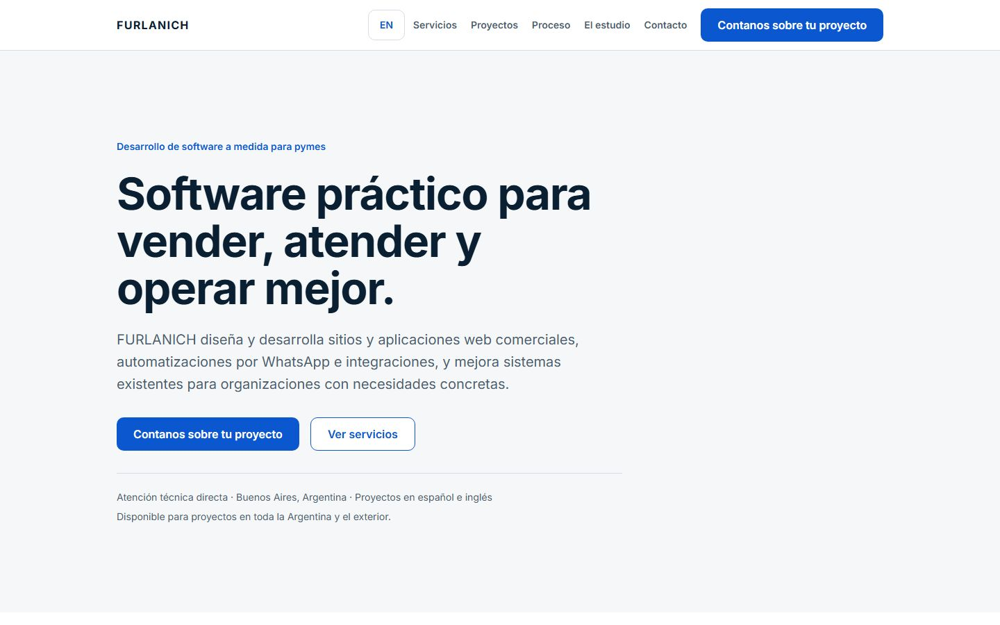

### E02-home-en-responsive

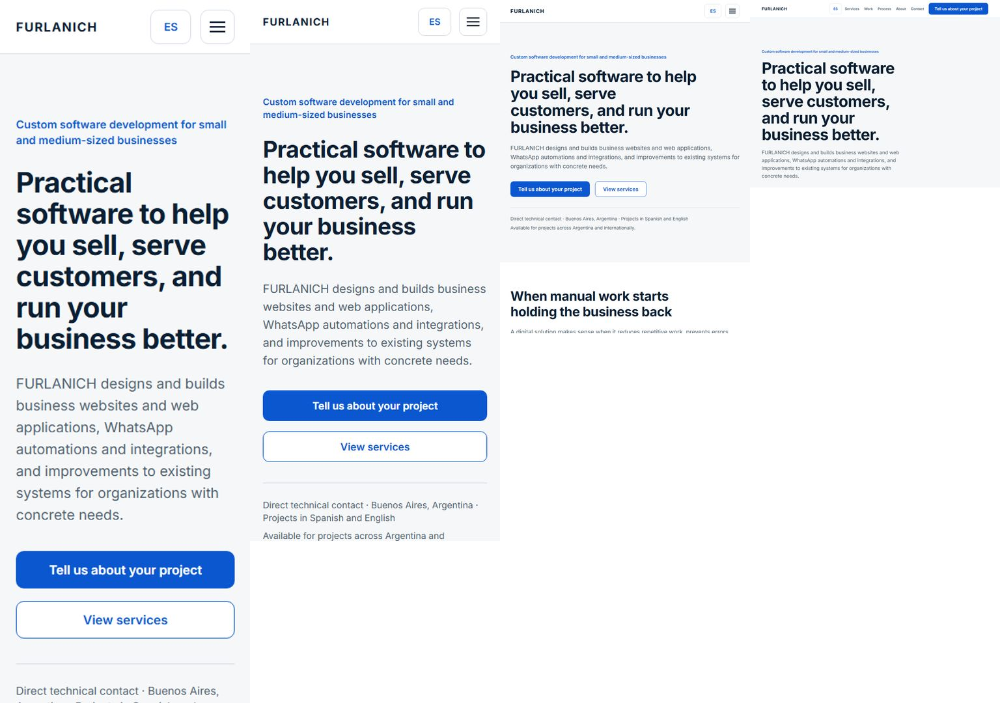

### E03-home-rhythm

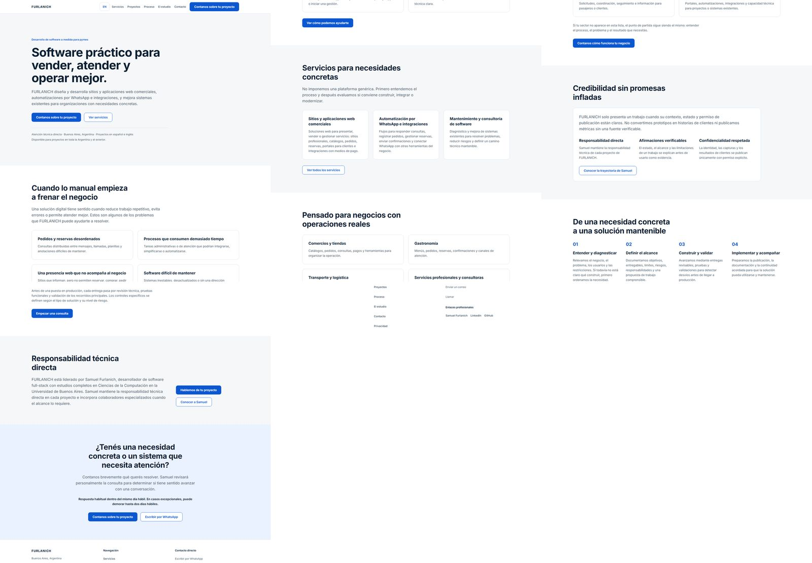

### E04-services-rhythm

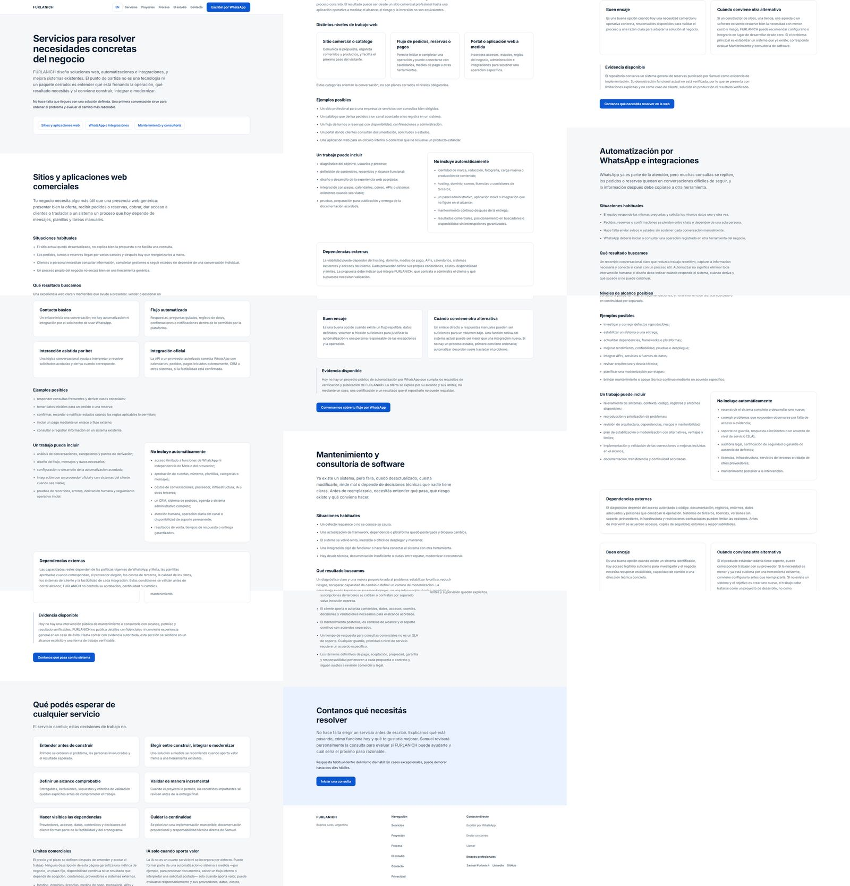

### E05-projects-rhythm

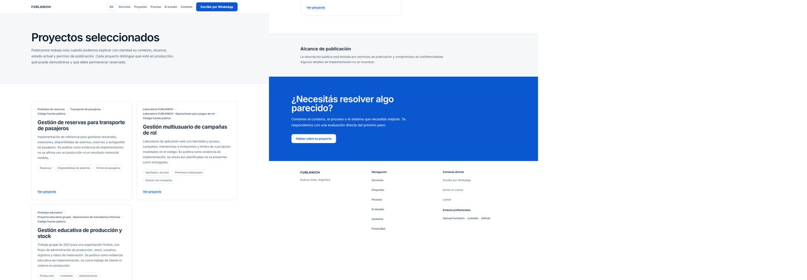

### E06-studio-rhythm

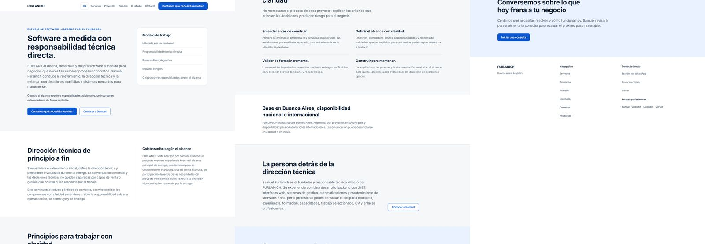

### E07-contact-wide

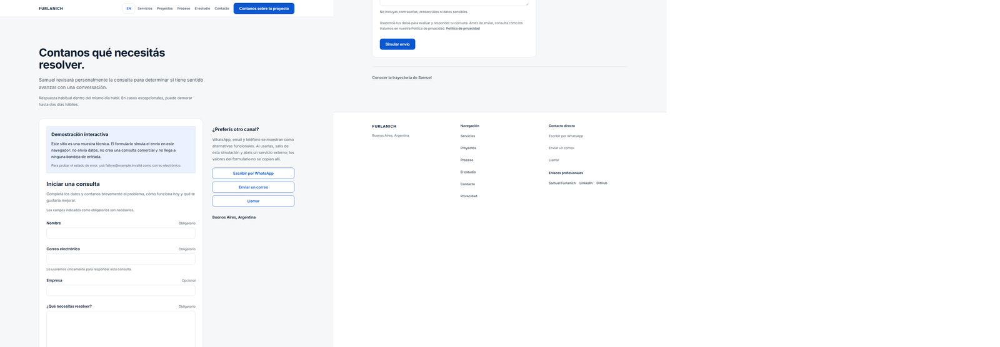

### E08-contact-mobile

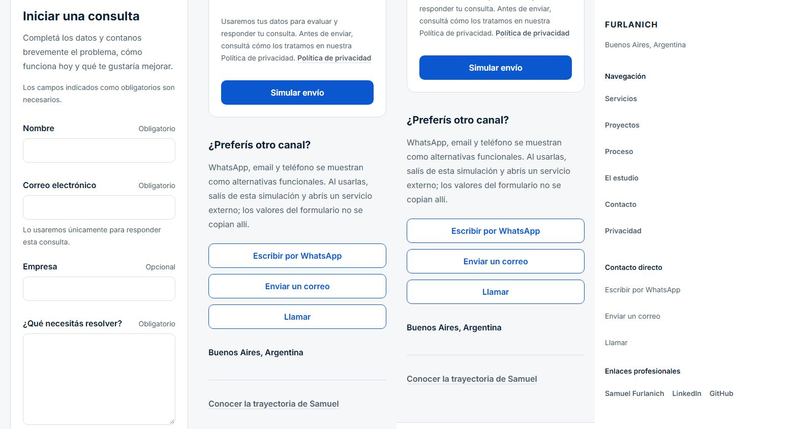

### E09-internal-token

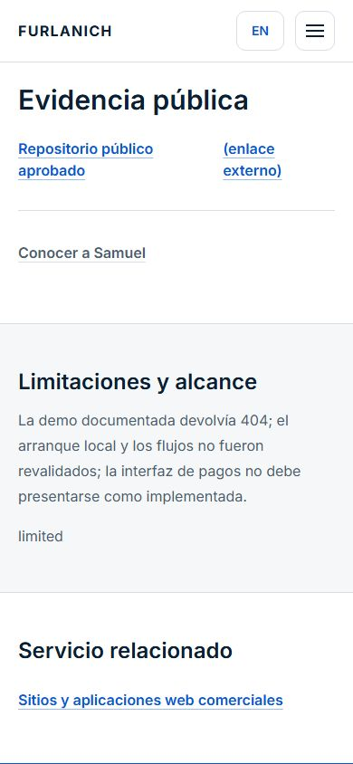

### E10-menu-process

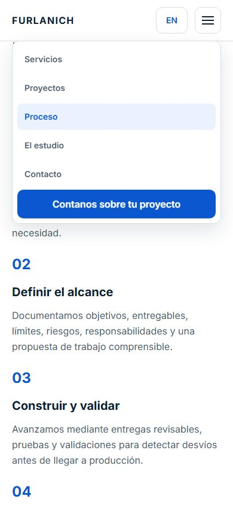

### E11-home-mobile-ending

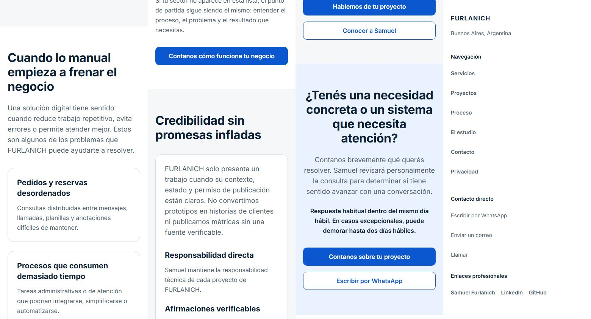

### E12-founder-mobile

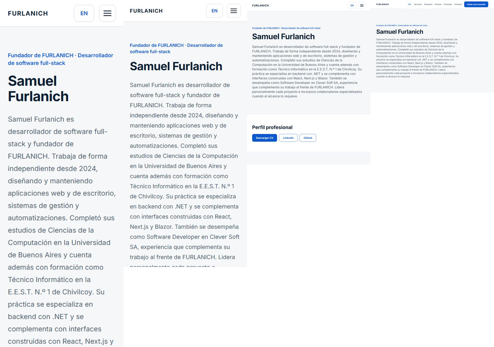

### E13-services-mobile

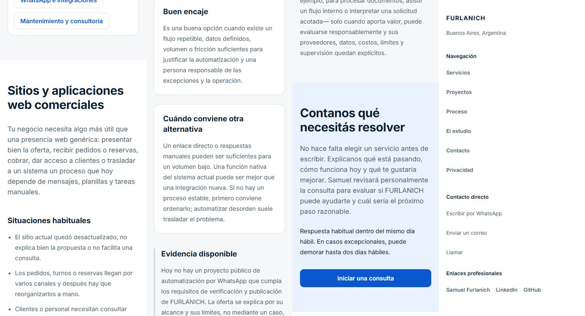

### E14-contact-es-states

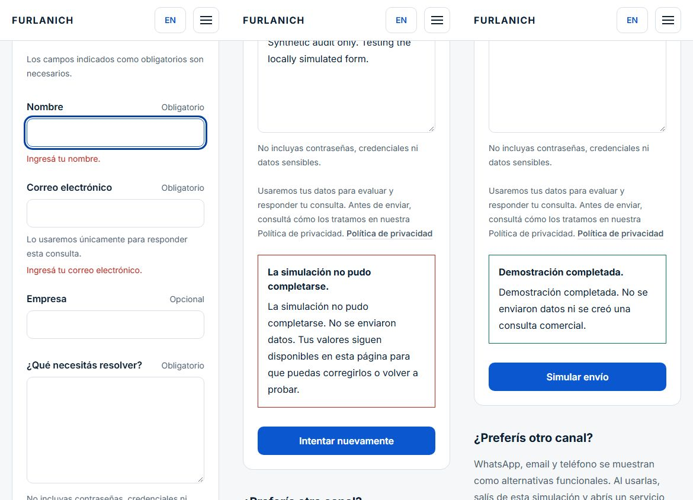

### E14-contact-en-states

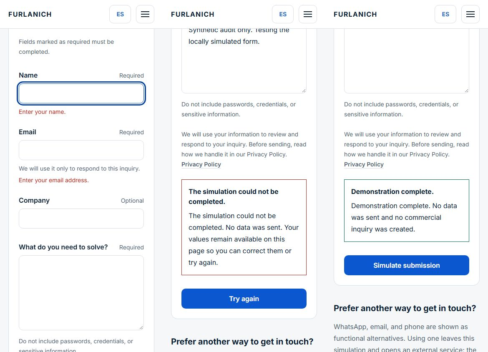
