# Inspectable visual references

These are disposable design studies, not production acceptance. [Review](../index.md) and [proposed specification](../../../design/services-projects-footer-v1.md) define their context. The lab/header scaffolding is not a proposed public-header replacement.

## Revision 5 Services wide

## Revision 5 Projects wide

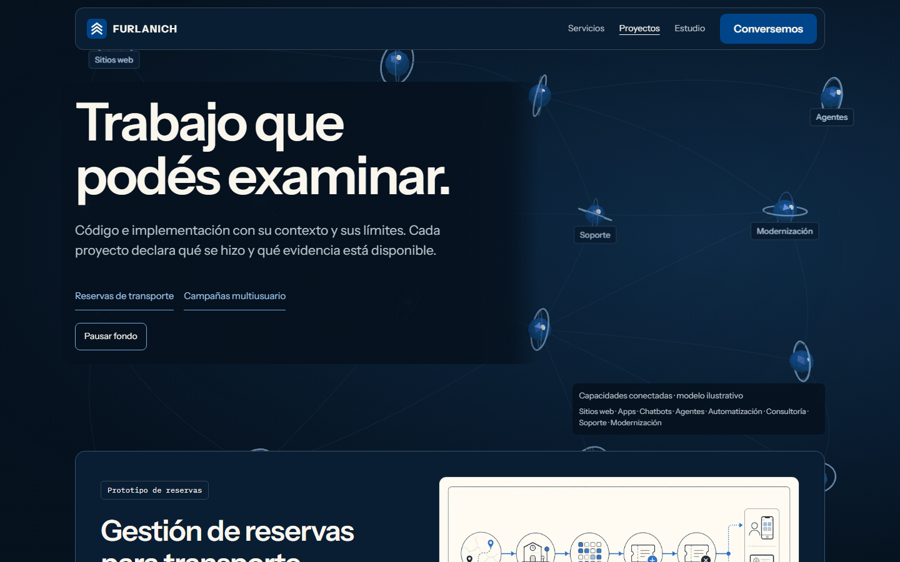

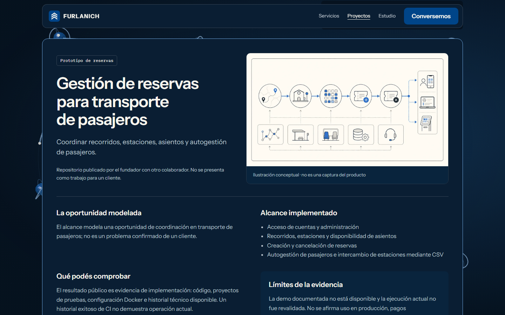

## Revision 5 compact

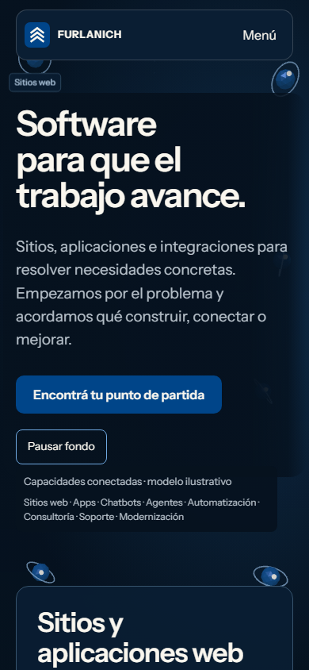

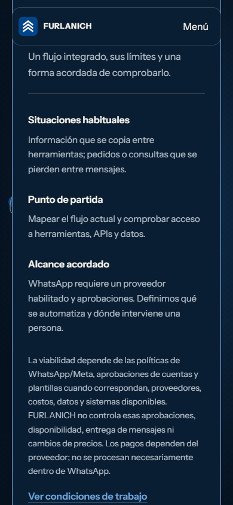

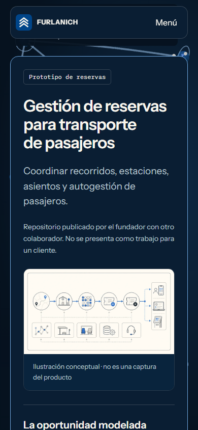

## Revision 5 motion

Adjacent media files `revision5-services-motion.webm` and `revision5-projects-motion.webm` show slow rotation at entry, first-scroll response, progressive connections, hover and the Footer. These are software-rendered design studies, not hardware timing evidence. The live prototype supports actual inspection and reversible interaction.

## Revision 4 Services compact

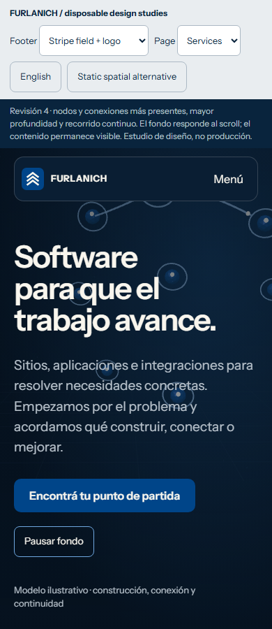

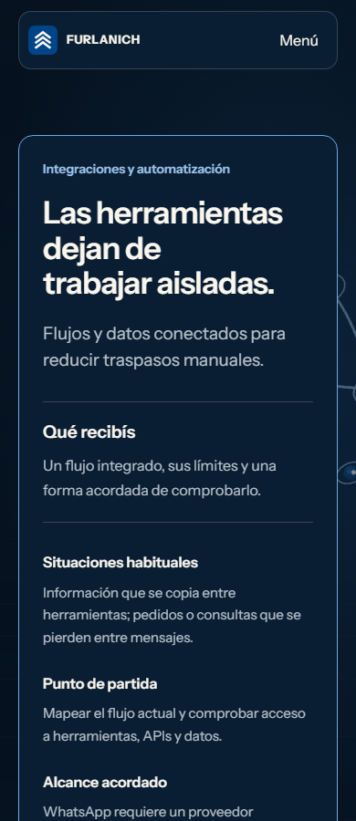

## Revision 4 Projects compact

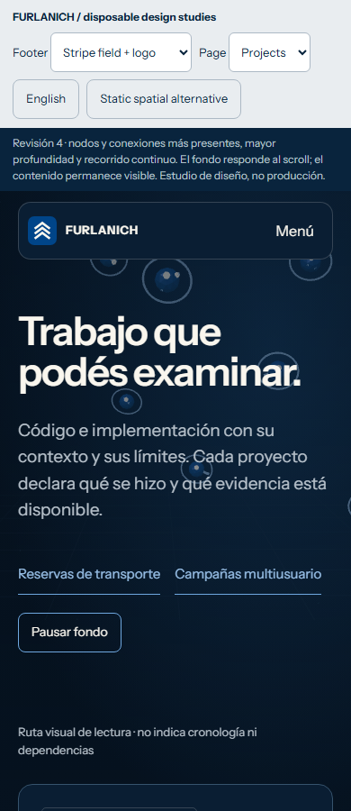

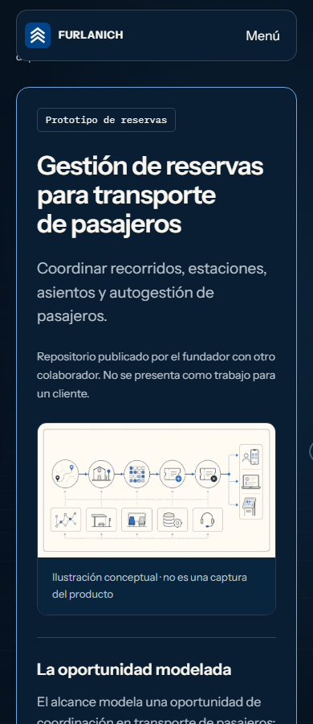

## Footer wide

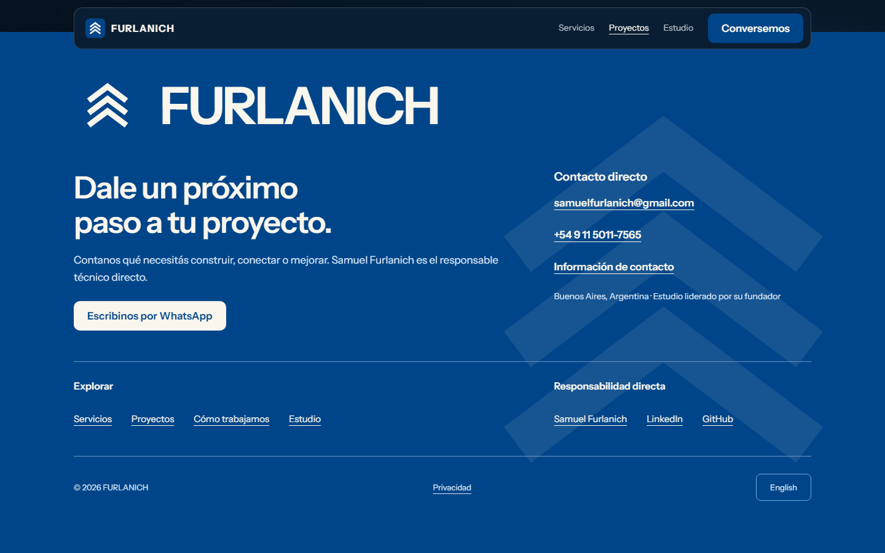

## Footer compact

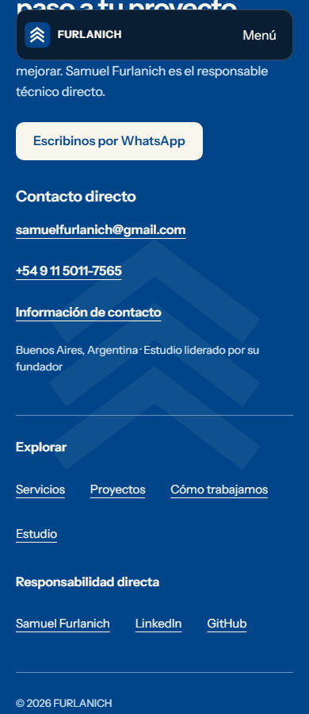

## Atlas Services

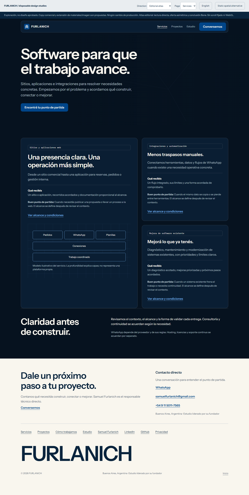

## Atlas Projects

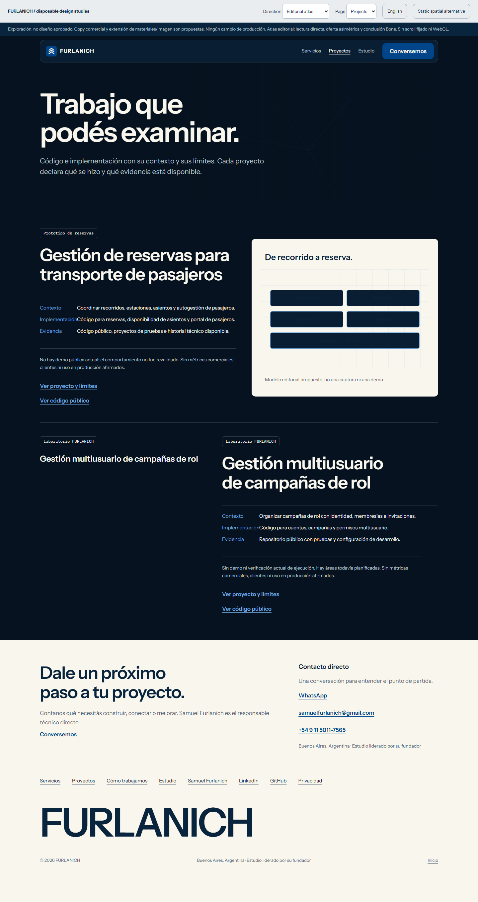

## Layers Services

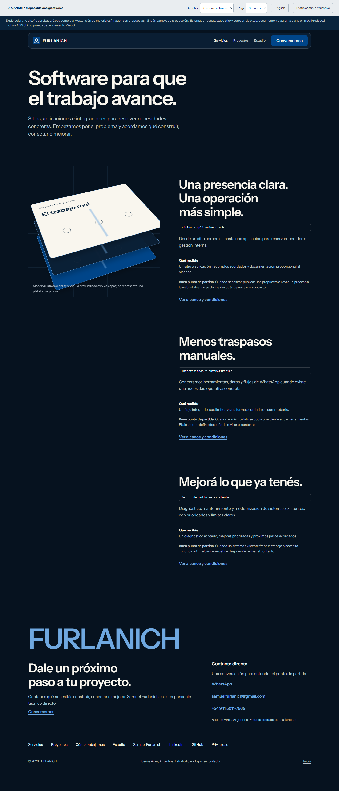

## Layers Projects

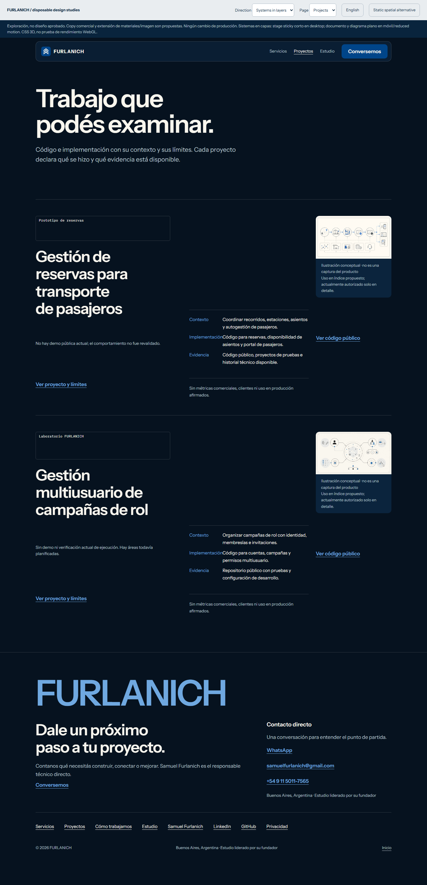

## Dossier Services

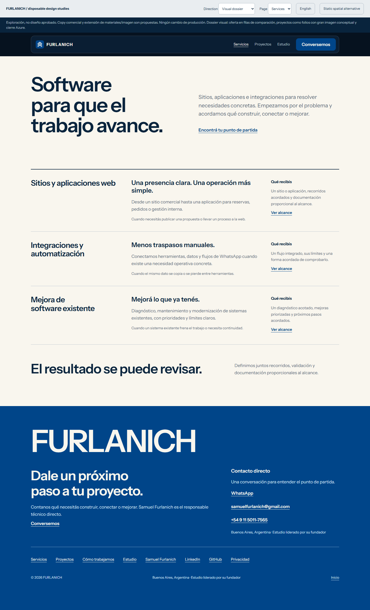

## Dossier Projects

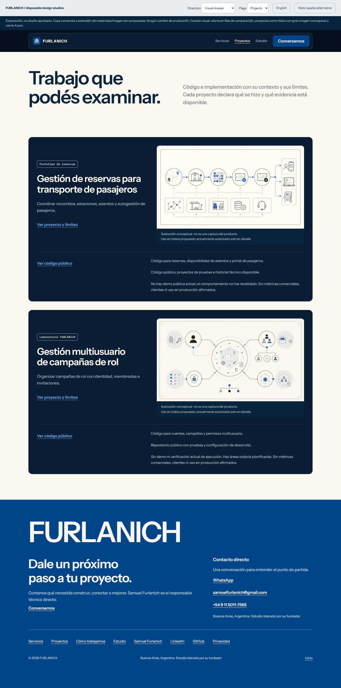
