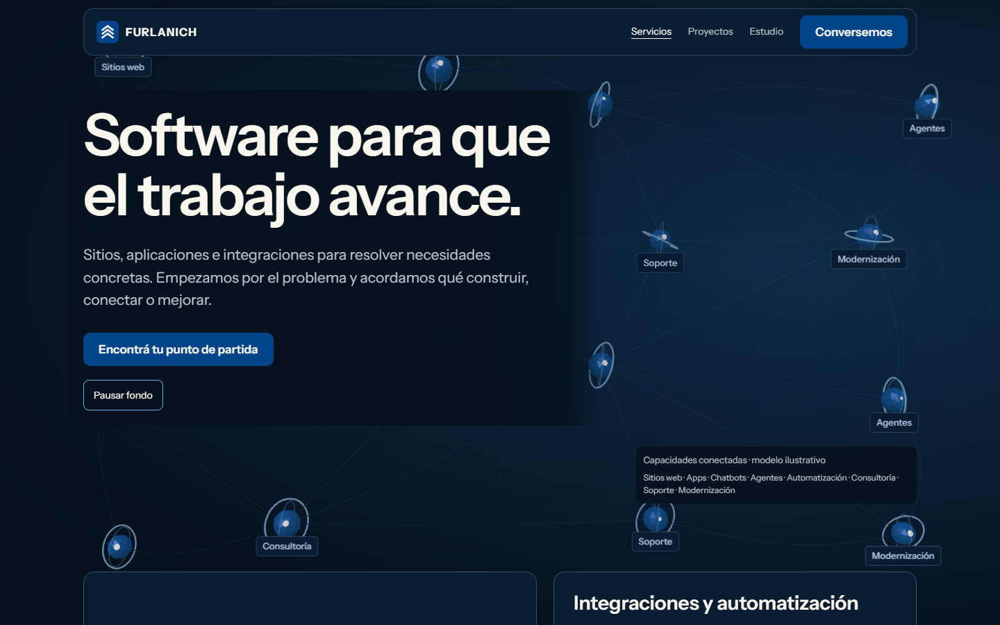
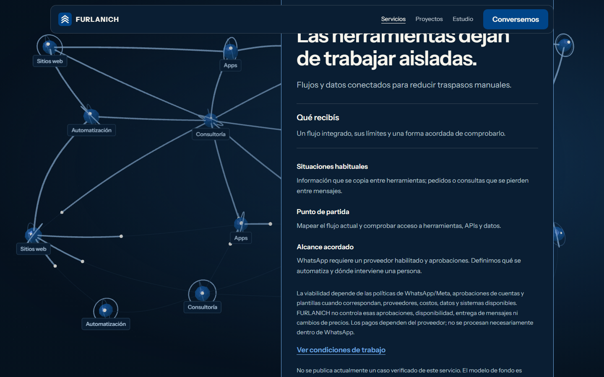
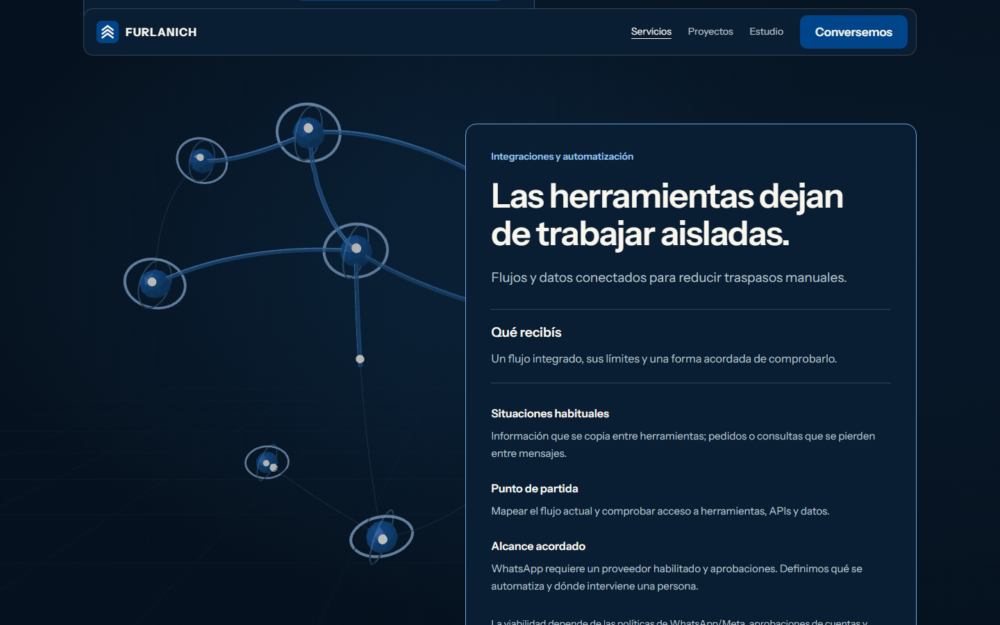
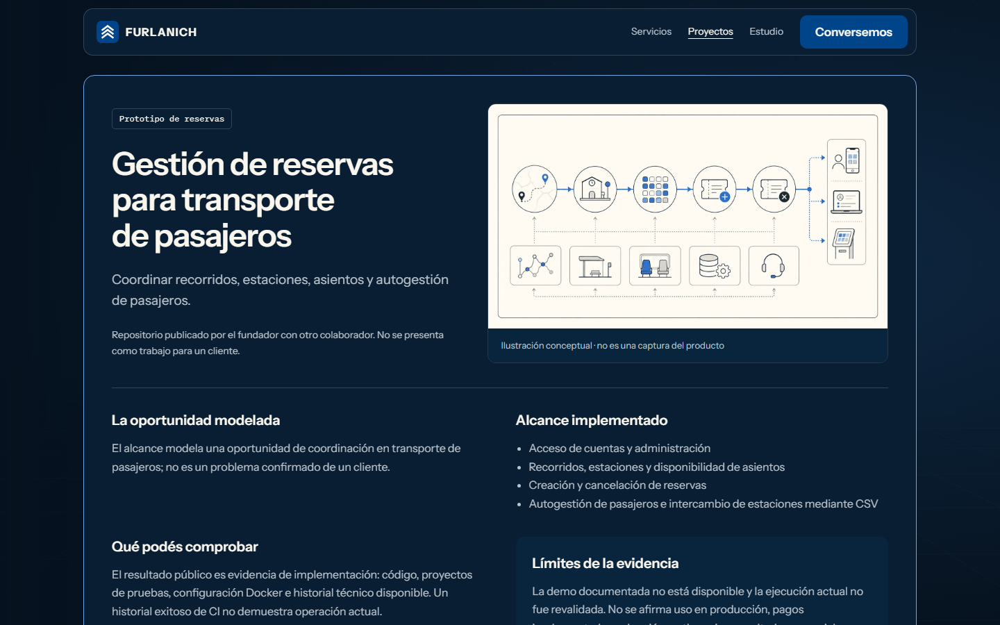

# Services, Projects and Footer — design exploration

**APPROVED Revision 5 written design — 2026-09-30.** [Specification](../../design/services-projects-footer-v1.md) · [accepted RFC](../../rfcs/services-projects-footer-redesign-v1.md) · [route-retirement audit](route-retirement-audit.md). The owner explicitly authorized ADE v2 planning and independent review after approving Revision 5. No production code is part of this package. Earlier Revision 4 references and observations below are historical exploration, not the current motion/label contract.

## Discovery and decision record

Read the product/design/architecture/governance records, current Sky Chart Home/App Bar implementation and [Aureon comparison](../aureon-comparison-2026-09-29.md). Inspect service boundaries, project evidence/permissions, route/locale consumers, protected logo geometry, existing Three runtime and direct channels. Two independent read-only fact-finding agents investigated evidence and design capabilities under Grilling's delegation guidance.

The owner chose dedicated Services/Projects and shared Footer with targeted Home/Founder alignment; Atlas service hierarchy and Dossier storytelling; complete inline projects and definitive deletion of six localized detail URLs; MPC on Founder; simplified live 3D on capable phones. Assembly plates were replaced by moving connected nodes. Revision 3 was returned for stronger nodes/paths/depth, producing Revision 4 and its written proposal `df06ca1`. The owner then requested Revision 5: nodes across the visible page, slow rotation at rest, rapid fluid motion from the very first scroll, ample connections through the page, and eight specific capability words. On 2026-09-30, after that refinement and the linked specification, the owner said: “Perfect, you can now proceed with ADE v2 planning and independent review.” Revision 5 and the linked bilingual copy are APPROVED; production acceptance remains unverified.

## Three materially different directions

| Direction | Composition and interaction | Critique and disposition |
| --- | --- | --- |
| Editorial Atlas | Asymmetric service hierarchy; direct native reading; concise dossiers; Bone conclusion; no live 3D/pinning | Buyer comprehension strongest. Services hierarchy accepted; owner requested more background impact |
| Systems in Layers | Sticky desktop spatial stage accompanies successive service chapters; reversible CSS 3D rotation; flattened mobile/static alternative; dark conclusion | A genuinely different scroll philosophy. Not selected for final text flow; connected background replaces pinned stage |
| Visual Dossier | Comparison ledger for services; large conceptual-image project folios; Azure signature/contact conclusion; no pinning | Strong image/story impact. Adapted for complete Projects dossiers and Footer; Services retains Atlas hierarchy |

The isolated `exploration.html` renders all three full alternatives with Page/Language/Direction/Static controls. Final preliminary matrix covered 36 combinations: three directions × two pages × two languages × 1440/390/320px. No page errors, missing images or horizontal overflow were observed after corrections. This is exploratory evidence, not production acceptance.

| Direction | Services | Projects |
| --- | --- | --- |
| Atlas | [Wide study](assets/gallery.md#atlas-services) | [Wide study](assets/gallery.md#atlas-projects) |
| Systems in Layers | [Wide study](assets/gallery.md#layers-services) | [Wide study](assets/gallery.md#layers-projects) |
| Visual Dossier | [Wide study](assets/gallery.md#dossier-services) | [Wide study](assets/gallery.md#dossier-projects) |

## Revision 5: full capability field — current candidate

Both pages now use 16 viewport-distributed nodes and 33 connections on desktop, or eight nodes and 13 connections on compact screens. English words are Websites, Apps, Chatbots, Agents, Automation, Consulting, Support and Modernization; Spanish equivalents and the exact semantic legend/scope sentence live in [Services](../../product/pages/services.md#revision-5-capability-words-proposed-exact-localized-copy). These do not become eight equal services or claim that either project implements them all.

Nodes/rings rotate gently at rest while label words remain upright. Scroll input immediately accelerates bounded local motion and starts path growth; connections build through the whole page and complete before Footer handoff. There is no service-boundary lane flip or delayed start. Opaque plates/reading masks protect copy. Labels remain within viewport bounds and are suppressed behind foreground content. The capability caption receives reserved space and is pointer-inert; Pause remains a normal accessible control.

Inspect [Revision 5 visual gallery and motion file locations](assets/gallery.md#revision-5-services-wide), including Projects and compact references. Live clean study: `http://127.0.0.1:4317/revision.html?page=services&lang=es&probeGpu=1&clean=1&v=5`; change page/lang for Projects/English. Remove `clean=1` to expose study selectors. Lab-only `probeGpu=1` permits software visual inspection; public runtime must reject software GPU normally.

The owner explicitly replaced zero-idle rendering with ambient rotation. Emil/Animate's frequency and performance guidance is **adapted**: cap ambient draws at 30fps wide/20fps compact, accelerate during scroll up to 60fps, and stop while paused/hidden/reduced-motion/failed or Footer-dominated. Brag pacing is **adapted** to immediate first-scroll connections rather than a delayed chapter/movie timeline. Taste/Impeccable hierarchy and clarity are **accepted** through opaque reading plates, an accessible legend and honest capability/evidence boundaries. Installed direct Three is **accepted**; batched connections reject unnecessary per-path draw calls/new libraries. Physical-device energy/frame/CWV gates remain required; lower draw count alone does not prove them.

[Revision 5 checks](evidence/index.md#revision-5-field-and-motion) cover both languages/pages at 1440/390/320px. All 12 combinations passed content/overflow, eight-word vocabulary, graph density, slow idle rotation, immediate first-scroll node movement/connection growth, complete network before Footer, ordinary Pause and Footer stop. Observed draw calls were eight desktop / six compact. Unlike Revision 4, idle frames are expected and tested. Control checks cover paused page switching, a synthetic hidden-document event, zero measured content movement on enhancement and focus retention after reduced motion. Axe reports zero detected violations in eight page/language/width cases. Resilience/no-JavaScript checks preserve content and static fallbacks.

Final self-review corrected two candidate defects: a reading-mask pseudo-element crossing narrow gutters, and a caption that could intercept Pause clicks when copy wrapped. Normal visible-control clicks and nonoverlap checks pass after spacing correction. An initial image probe treated unrequested lazy images as broken; that probe was corrected to distinguish lazy loading from failed assets. Hardware/CWV, actual background-tab/device behavior, screen-reader, cross-browser and production export remain unverified.

## Revision 4: prior selected combination, refined graph

The desktop background now uses larger faceted nodes, bright cores, clear orbits and thicker curved connections. Lower fog/grid/point prominence gives the graph a clearer role. Individual nodes move in depth and connections follow them. Scene position interpolates continuously between chapter centers instead of flipping lanes at a threshold. Approximately 100ms time-based damping settles movement at rest.

The graph supports the reading route while complete opaque dossiers keep maturity, relationship, scope, source and limitations legible. Images remain explicitly conceptual. Projects background connections do not assert project chronology, architectural dependency or delivery maturity.

Compact references: [Services hero/chapter](assets/gallery.md#revision-4-services-compact), [Projects hero/dossier](assets/gallery.md#revision-4-projects-compact). Compact geometry uses one ring per node and batched low-poly path segments; it remains scroll-responsive on eligible devices.

Footer references: [wide](assets/gallery.md#footer-wide), [compact](assets/gallery.md#footer-compact). The whole protected mark appears beside FURLANICH and as a complete low-opacity static watermark behind the Azure conclusion. The reference is a proposed placement treatment, not approval to split or deform the brand.

Revision 4 motion studies remain in the local inspection workspace as `revision-services-motion.webm` and `revision-projects-motion.webm`; they show reversible scrolling, hover and the Footer. They are software-rendered historical design evidence, not frame-time acceptance. The archived isolated preview is `http://127.0.0.1:4317/revision4.html?page=services&lang=es&probeGpu=1&v=4`. `probeGpu=1` is a lab-only software-GPU override and must not exist in the public runtime.

## Skill discovery and critique

| Skill/capability | Important recommendation | Accepted / adapted / rejected |
| --- | --- | --- |
| Brainstorming | Compare structures, close design decisions and approve a written spec before planning | Accepted; user already authorized disposable exploration; no redundant prototype-permission gate |
| GrillMe / Grilling | Interrogate unresolved decisions and delegate environmental fact finding | Accepted; evidence/capability agents investigated facts, owner closed direction and route decisions |
| Design Taste frontend | Audit incumbent design, distinctive composition, purposeful imagery and isolated enhancement | Adapted to protected Sky Chart palette/fonts/mark and existing stack; generic typography/rebrand defaults rejected |
| Emil Kowalski design engineering | Responsive, purposeful motion; test interruption and reduced motion | Accepted for scroll continuity, explicit-property hover and focus; press-scale default rejected where Home convention is color/outline |
| Impeccable | Buyer-purpose hierarchy, persuasion vs experience, rendered critique | Accepted for hierarchy/contrast; its alternate artifact/authority conventions adapted to repository owners; no competing design-system document or random rebrand |
| Figma use | Inspect incumbent foundations and fonts before designing | Accepted; existing mirror `V6FD6Sq3gqqxeMw5Si7Dnx`, Foundations `1:55` inspected; HTML/real Three selected for responsive/scroll fidelity; no Figma mutation |
| Brag | Storyboard a hook, reveal, useful highlights and conclusion | Adapted to native-scroll beats; Hyperframes launch-video runtime, soundtrack and fixed video timeline rejected as outside website scope |
| Animate / review animations | Purpose before tool; cheapest adequate mechanism; reduced motion and interruption | Accepted; CSS alternatives then existing direct Three for inspected depth; no new framework |
| Mobile-native | Capability-gated hover, retain zoom and avoid scroll traps | Accepted selectively; global overscroll/zoom disabling rejected |
| Visual QA / Playwright QA | Separate rendered judgment and repeatable behavior evidence | Accepted/adapted for isolated studies; prototype checks do not claim production acceptance |
| Architecture governance / knowledge maintenance | Consequential route/runtime changes require traceable proposals and owning records | Accepted; narrow proposed supersessions, immutable ADR/history retained |
| Three.js discovery | A dedicated skill/plugin was investigated | No dedicated Three skill or useful missing integration found; installed `three@0.186.0` supplies actual inspectable 3D; no installation required |

Conflicts are resolved by the approved Home/Header and evidence boundaries first, then the user's specific scope and requested stronger scene. Dramatic motion cannot hide content or weaken evidence limitations. Reduced-motion/static clarity outranks animation advice. Reuse of exact conceptual assets is proposed explicitly; a generated visual can communicate a model but never prove implementation. Brag contributes pacing, not runtime architecture.

## Revision 4 observed checks and their limits — historical

The saved [evidence files](evidence/index.md#rendered-matrix) record the final bilingual Chromium prototype matrix at 1440/390/320px. No page errors, missing images or horizontal overflow were detected. One H1 and complete three-service/two-dossier content were inspected. Idle and paused frames stopped; a page change retained one live canvas. Dynamic reduced motion removed the canvas; forced static retained content.

[Axe observations](evidence/index.md#accessibility) cover both languages/pages at 1440 and 320px, with no WCAG 2/2.1 A/AA violations detected inside the candidate page. Lab controls are excluded. This does not establish full accessibility or real screen-reader correctness.

[Resilience observations](evidence/index.md#resilience) include keyboard anchors, bounded hover, canvas exclusion from focus, one-context switching, reduced-motion changes, Save-Data, unsupported WebGL, optional-module failure, default software-GPU rejection and context-loss suppression. Complete no-JavaScript snapshots have real page content in both languages. [Fluidity observations](evidence/index.md#fluidity) inspect a four-pixel crossing of the former chapter boundary: continuous phase/position replaces the sudden lane change. Device/geometry measurements are advisory software-rendered feasibility results.

The candidate observed 27 draw calls for desktop Services, 25 for desktop Projects and 7 for compact scenes, at probe DPR 1. Hardware p95 timing, production bundle/CWV, real touch, physical-phone capability, cross-browser, screen-reader, all shared-Footer host pages and clean static export are **unverified**. Final poster assets are not yet produced. The prototype uses a simplified header and document-level context-loss suppression; production must retain the approved App Bar and implement browsing-session suppression/pause. Known static preference paths skip the engine; production must additionally gate unsupported capability before optional engine import where possible.

Commercial disclosures were restored visibly during the final self-review: service-specific approved compressed boundaries, shared agreement/AI scope and the complete existing commercial block. The proposed brief delivery wording is additive, not a replacement for those boundaries.

A targeted [control/focus check](evidence/index.md#control-focus-and-layout) caught an inherited study listener that rebuilt the DOM on motion-preference changes. Removing that redundant rebuild restored the intended transition: focused Pause remains focused as “Static background”, becomes inactive and the canvas is disposed. The passing repeat also measured unchanged hero/action/content rectangles before and after optional initialization, and confirmed all three service-specific boundaries plus the five-item commercial block. This proves those measured prototype transitions, not full production CLS/accessibility conformance.

## Review gate

The owner approved the written specification and linked bilingual copy on 2026-09-30. No production deletions or implementation have been performed. Codex authors the ADE v2 plan and an independent permitted model reviews structured findings. The reviewed plan still requires human approval before implementation; each PR requires human merge.
