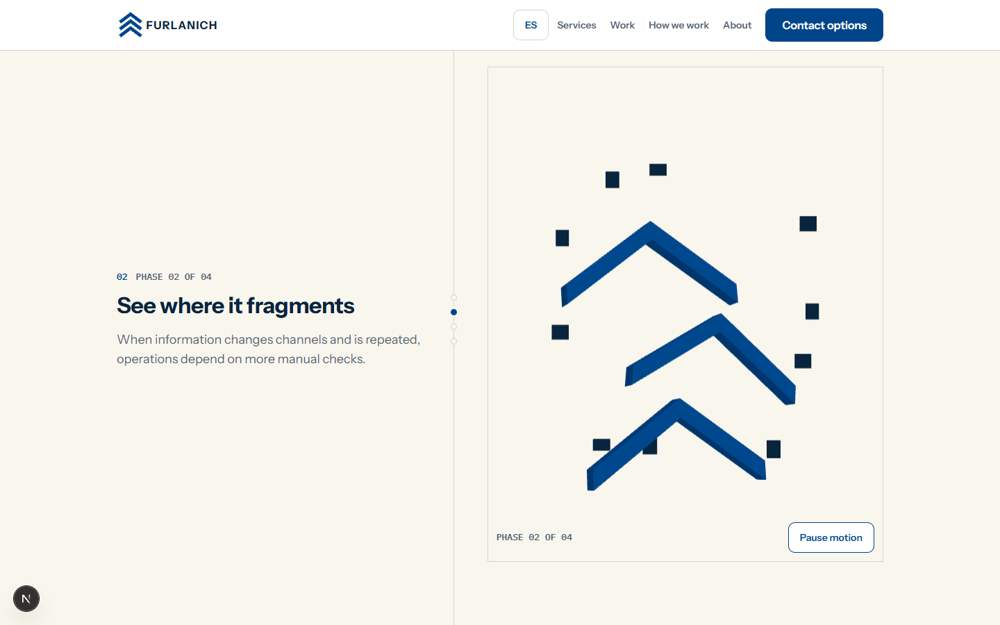
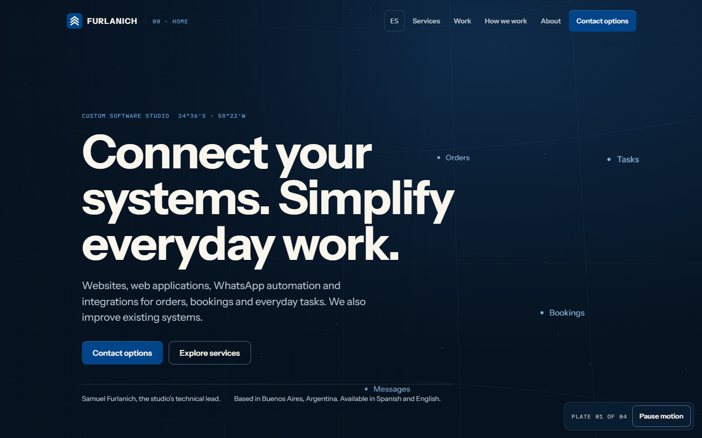
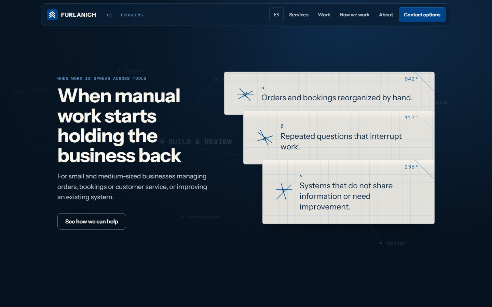
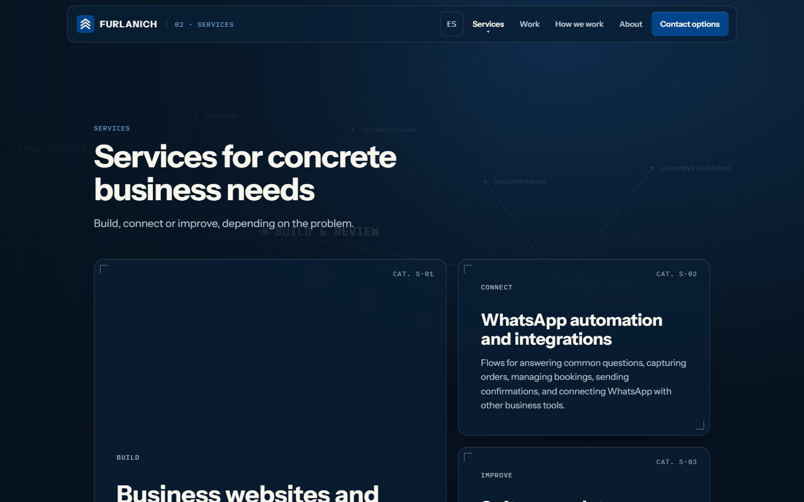
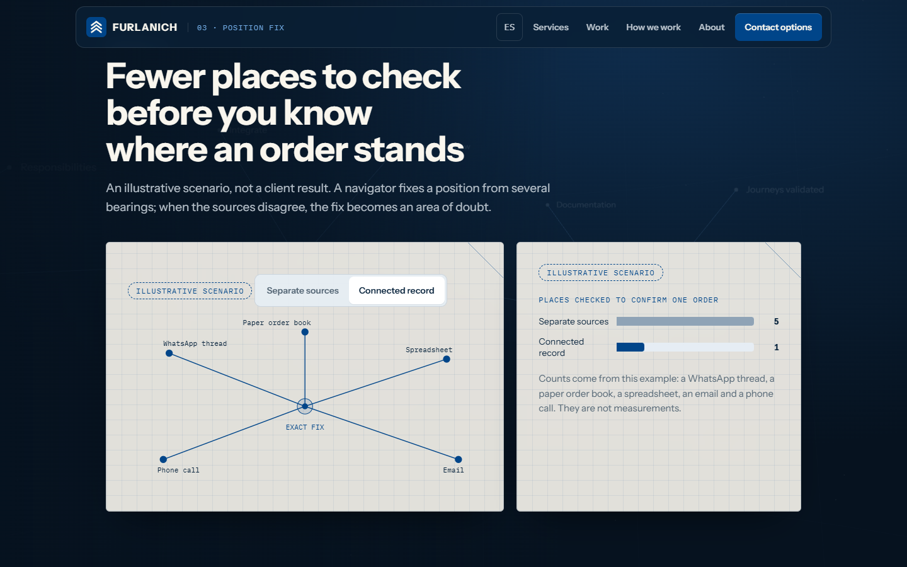
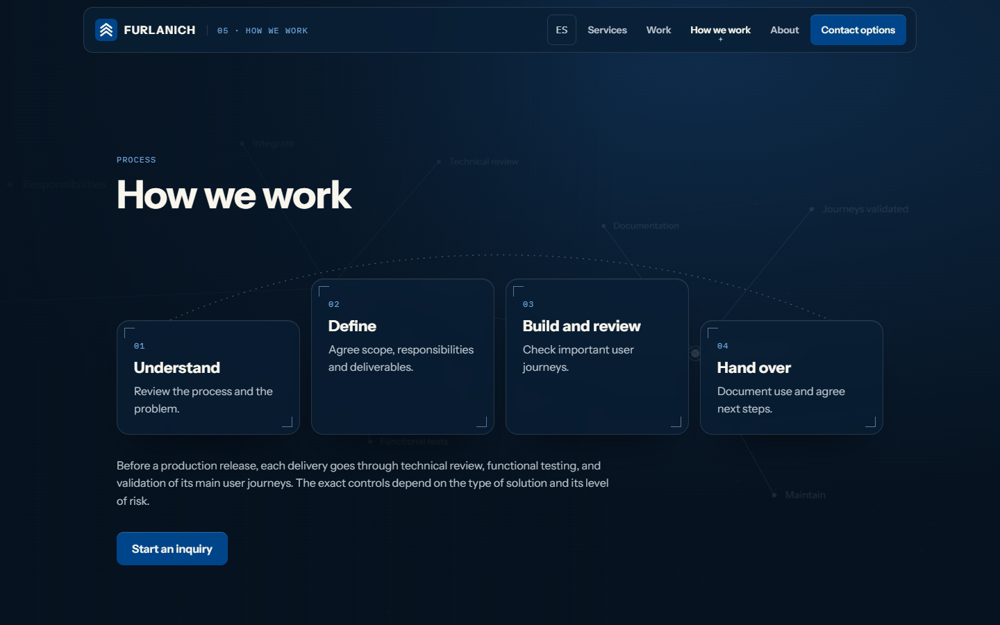
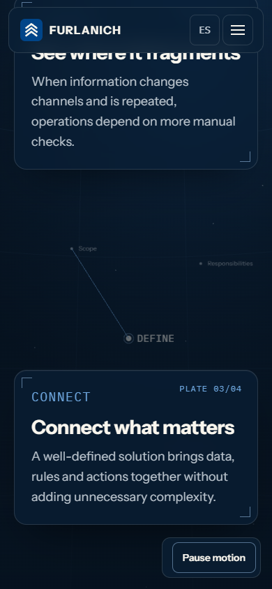
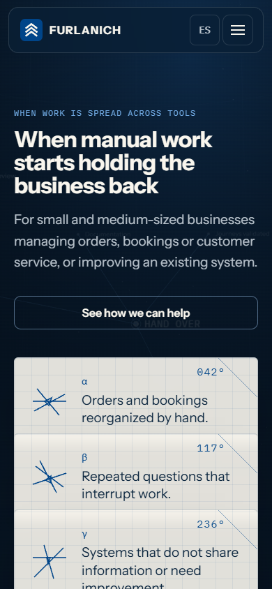
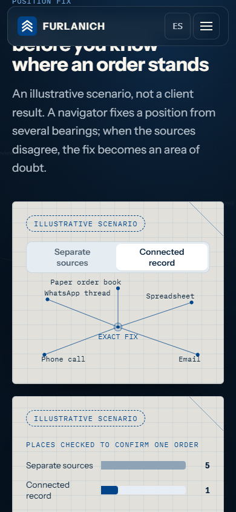

# Sky Chart direction review — Home and App Bar redesign

## Status

**PROPOSED.** This record preserves the Stage 1 design discovery and the owner's direction choice. It approves no implementation. The redesign conflicts with approved design and runtime records, so it requires the Governance PR described in [`PLAN-SKY-CHART-HOME-REDESIGN-V2`](../../plans/active/sky-chart-home-redesign-v2.md).

## Owner disposition — 2026-09-23

The repository owner reviewed three prototyped directions (A Sky Chart, B Line Map, C Deployable Sheet) and chose:

> Direction A · Sky Chart, with more personalization on sections like “When work is spread across tools”, where a style similar to C · Deployable Sheet is better. Semi-transparent cards are always preferable as long as the result is astonishing and original.

The owner also confirmed that implementation opens with a Governance PR (an RFC, then a superseding ADR where the runtime changes), and authorized use of Figma before implementation.

## Resolved direction

The world is a navigator's star atlas: the Home environment is a celestial sphere whose named stars are FURLANICH's approved process vocabulary. Two translucent materials carry the content:

- **Atlas plate:** a dark translucent surface with registration corner ticks and a plate number. It is used for chapters, Services, Proof, Process and Founder.
- **Plotting sheet:** a translucent bone vellum with a 24px plotting grid, a bearing label and a corner crease line. It translates Direction C's vellum and stepped cascade into navigation vocabulary. It is used for Problems (three cascading sheets, each with a “cocked hat” glyph: three bearings that fail to meet) and for the illustrative Position fix section.

The normative visual reference is `reference/sky-chart-reference.html` (open it directly in a browser), a self-contained HTML/Three.js prototype. It loads `three@0.186.0` from jsDelivr and the fonts from Google Fonts only for review; production self-hosts both.

## Evidence

| Capture | File |
| --- | --- |
| Current site, 1440px, chapter 02 (baseline) |  |
| Hero, 1440px |  |
| Problems plotting sheets, 1440px |  |
| Services catalogue plates, 1440px |  |
| Position fix, connected state, 1440px |  |
| Process ecliptic, 1440px |  |
| Chapter plate, 390px |  |
| Problems, 390px |  |
| Position fix, 390px |  |

Captures were produced with Playwright Chromium at 1440×900 and 390×844, using SwiftShader WebGL. The Stage 1 comparison of all three directions, with the skill log and measured contrast, was published separately to the owner and is summarized in the plan's design decisions.

## Findings carried into the plan

- Azure `#004589` measures 1.99:1 as text on the deepest environmental ground. On dark it fills areas and never carries text; a derived Azure Lit `#6FA8E0` carries links and labels (7.50:1 on `#06121F`).
- A translucent plate must stay at least 72% opaque. On translucent surfaces, secondary text uses `#B9C3CC`; Mist `#8FA3B6` falls to 3.86:1 in the worst composite.
- Canvas-rendered labels do not trigger webfont loading. Faces must be loaded explicitly before label textures are created.
- Scene labels collided with section headings after the chapter span. The environment must recede and hide labels outside that span.
- The first dark chart pair failed the normal-vision separation check (ΔE 6.7). It was replaced with a validated context/signal pair.
